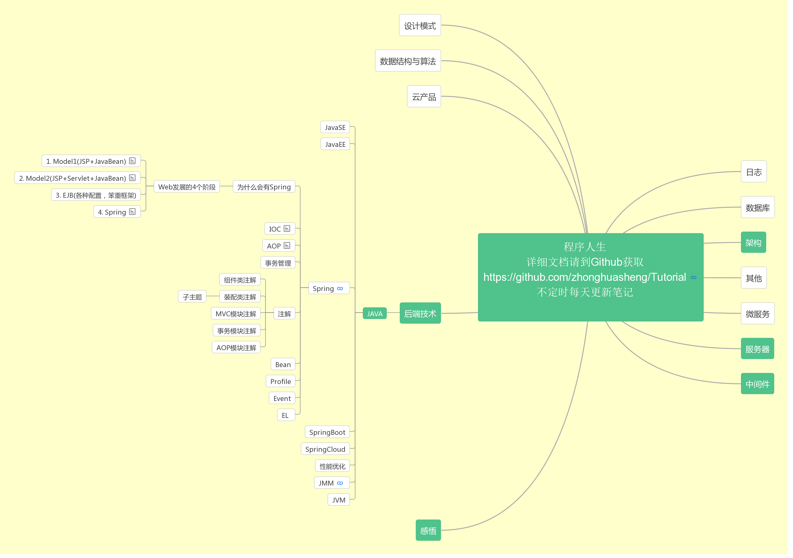

**`声明`**

该文档为本人学习的总结，有些解决方案不一定适合所有情况，取者自思；学习的资料大多来源网上、书籍、视频，如果引用，我会注明来处，若原著不喜，麻烦告知，我定删除。另外，笔记都是闲暇之余总结，很多没有成体系，所以暂时没有发布，今年会陆陆续续发出来。我写了一个自动commit的脚本，国内国外都会定时同步合并我最新的笔记并发布到Tutorial这个repository。Wiki中也有一些详细的文章，同时Issue中记录的为一些面试题，喜欢的话可以Star下，也可以Fork走作为自己笔记的一部分，总之，生活不易，希望对大家学习有帮助。祝好！！！

# 目录

| 英语 | Java | Spring大家族 | 中间件 | 数据库 | 服务器 | 架构设计 | 内功 | 网络 | 程序人生 |
|:----|:-----|:------|:------|:------|:------|:------|:------|:------|:-----|
|<a href="#英语">英语</a>|<a href="#Java基础">Basic</a> <a href="#Java虚拟机">JVM</a> <a href="#Java-Web">Web</a> |<a href="#Spring">Spring</a> <a href="#Spring-Boot">Spring Boot</a> <a href="#Spring-Cloud">Spring Cloud</a>|<a href="#Keepalived">Keepalived</a> <a href="#ActiveMQ">ActiveMQ</a> <a href="#RabbitMQ">RabbitMQ</a> <a href="#Netty">Netty</a> <a href="#MyBatis">Mybatis</a>|<a href="#MySQL">MySQL</a> <a href="#Postgresql">Postgresql</a> <a href="#Mongodb">Mongodb</a> <a href="#Redis">Redis</a>|<a href="#Tomcat">Tomcat</a> <a href="#Nginx">Nginx</a>|<a href="#原则">原则</a> <a href="#安全">安全</a> <a href="#高可用">高可用</a> <a href="#扩展性">扩展性</a> <a href="#伸缩性">伸缩性</a> <a href="#性能">性能</a> |<a href="#数据结构">数据结构</a> <a href="#算法">算法</a>|<a href="#网络">网络</a>|<a href="#软文">软文</a> <a href="#规范">规范</a> <a href="#工具">工具</a>|

# 英语
* [计算机行业常用英语积累](english/english.md)

# Java

#### `Java基础`
[Java基础](java/basic/java-basic.md)
&emsp;[JDBC基础](https://github.com/zhonghuasheng/JAVA/blob/master/jdbc/src/main/java/com/zhonghuasheng/jdbc/learn01/BasicSteps.java)
&emsp;[Java集合](java/basic/java-collection.md)
&emsp;[Java多线程系列](java/basic/java-thread.md)
&emsp;[JUC系列](java/basic/java-thread-juc.md)
&emsp;[Java IO基础](java/basic/java-io-nio.md)

#### `Java虚拟机`
[Java虚拟机概述](http://note.youdao.com/noteshare?id=04255aa8ae9ab45ed502296d57c736d3&sub=D4C06128EBBD414C91D85B7F89AB0C91)
&emsp;[Java内存模型（JMM）概述](http://note.youdao.com/noteshare?id=853bd6ff9802006899b9e0837fece691&sub=wcp1576467027359972)
&emsp;[volatile关键字解析](http://note.youdao.com/noteshare?id=b463861623604a614e0ceb2e27f4b36e&sub=ED4A85833F6F4531A65BBC382E218D32)
&emsp;[Java内存区域和对象创建及内存分配](http://note.youdao.com/noteshare?id=c5cc62733e28ed05ea252db5243ca797&sub=3386EF7F877C493DACA2FDD53BC0E0E4)
&emsp;[JVM垃圾回收机制](http://note.youdao.com/noteshare?id=210c03900e584c1001b4b16d4060dc89&sub=wcp1581062973917549)
&emsp;[JVM堆内存(heap)及垃圾回收总结](http://note.youdao.com/noteshare?id=27f16d42fea30933884b640a941e8587&sub=wcp1580995061039682)
&emsp;[Java对象的创建过程解析](http://note.youdao.com/noteshare?id=720b1f1bef16d494b767edeaf52e1eee&sub=wcp158116390844063)

#### `Java Web`
[Servlet基础](java/javaweb/servlet.md)
&emsp;[JSP基础](java/javaweb/jsp.md)

#### `Spring`
[Spring4基础知识系列](java/spring/spring.md)

#### `Spring Boot`
* [SpringBoot历史](spring-boot/0-springboot-history.md)
* [SpringBoot基础](spring-boot/1-springboot-basic.md)
* [SpringBoot统一结果处理](https://github.com/zhonghuasheng/Spring-Boot/wiki/SpringBoot%E7%BB%9F%E4%B8%80%E5%A4%84%E7%90%86%E8%BF%94%E5%9B%9E%E7%BB%93%E6%9E%9C)
* [SpringBoot统一异常处理](https://github.com/zhonghuasheng/Spring-Boot/wiki/SpringBoot%E7%BB%9F%E4%B8%80%E5%BC%82%E5%B8%B8%E5%A4%84%E7%90%86)
* [SpringBoot统计在线人数](https://github.com/zhonghuasheng/Tutorial/wiki/SpringBoot%E7%BB%9F%E8%AE%A1%E5%9C%A8%E7%BA%BF%E4%BA%BA%E6%95%B0)
* [SpringBoot + Redis + 自定义注解 + 拦截器 实现接口幂等性校验](https://github.com/zhonghuasheng/Spring-Boot/blob/master/springbootidempotence/README.md)
* [SpringBoot集成SSL，实现HTTP到HTTPS的自动跳转](/java/spring-boot/springboot-ssl.md)

#### `Spring Cloud`

# 中间件

`控制层`

#### `Keepalived`
* [Keepalived原理 + 配置 + 主从切换 + 通知](plugins/keepalived.md)

`消息&通信`
* [到底什么时候该使用MQ？](http://note.youdao.com/noteshare?id=30a11e46aaef3f00d2ecfb84692ca294&sub=wcp157828038663078)

#### `ActiveMQ`
  * [ActiveMQ](plugins/activemq.md)

#### `RabbitMQ`
  * [RabbitMQ](plugins/rabbitmq.md)
  * [RabbitMQ基础概念](http://note.youdao.com/noteshare?id=3ee2c852ecf09522bd0dd974921e415d)
  * [RabbitMQ消息发送-Exchange-fanout示例](https://github.com/zhonghuasheng/JAVA/tree/master/rabbitmq/src/main/java/com/zhonghuasheng/rabbitmq/fanout)
  * [RabbitMQ消息发送-Exchange-direct示例](https://github.com/zhonghuasheng/JAVA/tree/master/rabbitmq/src/main/java/com/zhonghuasheng/rabbitmq/direct)
  * [RabbitMQ消息发送-Exchange-topic示例](https://github.com/zhonghuasheng/JAVA/tree/master/rabbitmq/src/main/java/com/zhonghuasheng/rabbitmq/topic)
  * [RabbtiMQ延迟队列-消息延迟推送](https://www.cnblogs.com/haixiang/p/10966985.html)

#### `Netty`
*学习计划和笔记*
* [Netty学习计划和笔记](plugins/netty.md)

*入门小例子*
* [Netty核心组件介绍](http://note.youdao.com/noteshare?id=220ac83ee37543ea9d761699bf5915d8&sub=wcp157838393679928)
* [Netty入门小例子](https://github.com/zhonghuasheng/JAVA/tree/master/netty)
* [基于Netty构建简易版HTTP服务](https://github.com/zhonghuasheng/JAVA/tree/master/netty)
* [基于Netty实现一个WebSocket服务,实现消息的主动推送（聊天）](https://github.com/zhonghuasheng/JAVA/tree/master/netty)
* [基于Netty实现自定义TCP数据格式的数据接收发送](https://github.com/zhonghuasheng/JAVA/tree/master/netty)
* [基于Netty实现UDP服务](https://github.com/zhonghuasheng/JAVA/tree/master/netty)

*深入学习*

`数据访问`
#### `MyBatis`
* [MyBatis学习笔记](plugins/mybatis.md)

#### `ELK`
* TODO: [ELK](elasticsearch.md)

# 数据库
* [分库分表 如何做到永不迁移数据和避免热点](https://github.com/zhonghuasheng/Tutorial/wiki/%E5%88%86%E5%BA%93%E5%88%86%E8%A1%A8-%E5%A6%82%E4%BD%95%E5%81%9A%E5%88%B0%E6%B0%B8%E4%B8%8D%E8%BF%81%E7%A7%BB%E6%95%B0%E6%8D%AE%E5%92%8C%E9%81%BF%E5%85%8D%E7%83%AD%E7%82%B9)

### MySQL
* [MySQL](database/mysql.md)

### Postgresql

* [Postgresql](database/postgresql.md)
* [Postgresql在Linux中的安装以及常用命令](database/postgresql/postgresql_note.md)
* [解决Postgresql RDS CPU使用率过高的问题](database/postgresql/PostgreSQL_CPU_Usage_High.md)

### Mongodb
* [Mongodb学习笔记](database/mongodb.md)

### Redis
* [Redis基础知识](database/redis.md)
* [Redis使用单线程的原因](https://github.com/zhonghuasheng/Tutorial/issues/105)

# 服务器

#### `Tomcat`
* [Tomcat服务器架构](plugins/一张图了解Tomcat架构.md)
* [Tomcat如何处理一个请求](plugins/一张图了解Tomcat架构.md)
* [Tomcat安全配置建议](https://github.com/zhonghuasheng/Tutorial/wiki/Tomcat%E5%AE%89%E5%85%A8%E9%85%8D%E7%BD%AE)
* [Tomcat Access日志分析](shell/linux命令在tomcat日志中的应用.md)

#### `Nginx`
* [Nginx在CentOS中的安装](plugins/nginx.md##安装)
* [Nginx反向代理服务器搭建](plugins/nginx.md)
* [Nginx实现动静分离](plugins/nginx.md)

# 架构设计

#### `原则`
* [系统设计注意事项](architecture/系统设计注意事项.md)

#### `安全`
* [如何设计一个对外安全的接口](architecture/如何设计一个对外安全的接口.md)
* TODO[反爬虫]

#### `高可用`
* [异地多活](architecture/异地多活.md)
    * 饿了么异地多活
        * [饿了么多活技术架构及运维挑战（零）](http://note.youdao.com/noteshare?id=84b980a643b09bcce110b73ae6447e1d&sub=wcp1578047241075851)
        * [饿了么异地多活技术实现（一）-总体介绍](http://note.youdao.com/noteshare?id=90d83005bebe9192ab31753294931ab7)
        * [饿了么异地多活技术实现（二）API-Router的设计与实现](http://note.youdao.com/noteshare?id=7c9ae9f38fb899202e50013243b76003&sub=wcp1578025898948893)
        * [饿了么异地多活技术实现（三）GZS&DAL](http://note.youdao.com/noteshare?id=6f714e7c80d1a0a26918fc69e96ecb72&sub=wcp1578028147171312)
        * [饿了么异地多活技术实现（四）- 实时双向复制工具（DRC)](http://note.youdao.com/noteshare?id=d496a2af54f7677d4a4548ca8b443fb2&sub=wcp1578028121631563)
  * [数据库异地多活方案](http://note.youdao.com/noteshare?id=0132260bad28e1b7eff8237d1b71ecde&sub=wcp1578029015234777)
  * [精华 - 异地多活设计辣么难？其实是你想多了！](http://note.youdao.com/noteshare?id=4c69460527777953567bf27e301386f4&sub=80933B302262460289A6132D1D2BFA19)
  * [阿里和微博的异地多活方案 - 思考较多](http://note.youdao.com/noteshare?id=ea3f9a9d404a8493eb8671759224e672&sub=wcp1578025746271204)
* [削峰填谷](architecture/削峰填谷.md)
    * [58到家MQ如何快速实现流量削峰填谷](http://note.youdao.com/noteshare?id=5b75fab5a151731588d8c25472b52ece&sub=wcp1578276033980908)
* [使用Nginx+Redis+Tomcat实现Session的全局共享、粘性Session](http://note.youdao.com/noteshare?id=61756a339ba0bd5175ec53340ac295ae&sub=wcp1579073336527942)

#### `扩展性`
#### `伸缩性`
#### `性能`
* [20万用户同时访问一个热点Key，如何优化缓存架构？](http://note.youdao.com/noteshare?id=76894225f153d8f0c96c3318aeb90b6b)

#### `其他`
* [集群环境下日志合并方案](architecture/集群环境下日志合并方案.md)
* [数据中台架构随想](architecture/数据中台架构随想.md)
* [分布式与微服务有关系吗](https://github.com/zhonghuasheng/Tutorial/wiki/%E5%BE%AE%E6%9C%8D%E5%8A%A1%E4%B8%8E%E5%88%86%E5%B8%83%E5%BC%8F%E6%9C%89%E5%85%B3%E7%B3%BB%E5%90%97)
* TODO: [如何防止表单重复提交]()
* TODO: [Maven+Jenkis+JMeter构建可持续自动化测试部署方案]()
* 日志
    * [为什么使用log](architecture/log-note.md)
    * [深入理解JAVA日志基础](https://github.com/zhonghuasheng/Tutorial/wiki/%E6%B7%B1%E5%85%A5%E7%90%86%E8%A7%A3JAVA%E6%97%A5%E5%BF%97%E5%9F%BA%E7%A1%80)
    * [如何解决Apache Server中Catalina.out文件过大的问题 - Cronolog](tool/cronolog.md)
    * [通过查看access日志来了解系统的访问情况](shell/linux命令在tomcat日志中的应用.md)
* Linux
    * [Linux常用命令](system/linux.md)
    * [实时记录服务器CPU和内存的使用情况](system/linux.md#记录服务器CPU和内存的实时使用情况)

# 内功
#### `数据结构`

`设计模式`
* 创建型
    * [单例模式 Singleton Pattern](https://github.com/zhonghuasheng/DesignPattern/wiki/%E5%88%9B%E5%BB%BA%E5%9E%8B---%E5%8D%95%E4%BE%8B%E6%A8%A1%E5%BC%8F-Singleton-Pattern)

`结构型`
    * [代理模式 Proixy Pattern](https://github.com/zhonghuasheng/DesignPattern/wiki/%E7%BB%93%E6%9E%84%E5%9E%8B-%E4%BB%A3%E7%90%86%E6%A8%A1%E5%BC%8F-Proxy-Design-Pattern)

`行为型`
    * [解释器模式](https://github.com/zhonghuasheng/DesignPattern/wiki/%E8%A1%8C%E4%B8%BA%E5%9E%8B-%E8%A7%A3%E6%9E%90%E5%99%A8%E6%A8%A1%E5%BC%8F-Interpreter-Pattern)

#### `数据结构`
* [数据结构学习笔记](algorithm/数据结构.md)
* [数组 八种常见的排序算法](https://github.com/zhonghuasheng/JAVA/blob/master/README.md#thinking)

#### `算法`
* [Letcode](letcode/note.md)
* [拜占庭问题](https://github.com/zhonghuasheng/Tutorial/issues/48)

# 网络
* [域名](network/notes/second-level-domain.md)
* [从HTTP到HTTPS到HSTS](network/notes/HTTP_HTTPS_SSL.md)
* [DOS & DDOS的攻与防](https://github.com/zhonghuasheng/Tutorial/wiki/DOS-&-DDOS%E7%9A%84%E6%94%BB%E4%B8%8E%E9%98%B2)
* [为什么是3次握手4次挥手](https://github.com/zhonghuasheng/Tutorial/issues/21)
* [从浏览器输入URL到页面渲染都发生了什么 - 结合Tomcat架构解析](http://note.youdao.com/noteshare?id=cca91d065dc509bae387a16925efa497)
* [彻底了解Cookies](network/彻底了解cookies.md)
* [WebSocket的使用场景](http://note.youdao.com/noteshare?id=46d6403c9651f0fe41473cb11d523870&sub=wcp157847407045929)
* [Http、TCP、Socket区别和使用场景](http://note.youdao.com/noteshare?id=d045b8abde4101cb28892b3dd33f24c4&sub=wcp1578547786163252)
* [Socket粘包、拆包](http://note.youdao.com/noteshare?id=20da81a278dff7065c2ee932f1be41d6&sub=wcp1578550254412174)

### 程序人生
#### `软文`
* [最好的建议](life/coding-life.md/#最好的建议)
* [正视自己的价值](life/coding-life.md/#正视自己的价值)
* [新工程师要干的五件事情](life/coding-life.md/#新工程师要干的五件事情)

#### `规范`
* [雅虎前端34条军规](http://note.youdao.com/noteshare?id=b59d0da4f7bb2b7ba5f73129d85b1ba1)
* [Google Java Coding Style](https://google.github.io/styleguide/javaguide.html)
* [阿里巴巴代码规范](https://github.com/alibaba/p3c/blob/master/%E9%98%BF%E9%87%8C%E5%B7%B4%E5%B7%B4Java%E5%BC%80%E5%8F%91%E6%89%8B%E5%86%8C%EF%BC%88%E8%AF%A6%E5%B0%BD%E7%89%88%EF%BC%89.pdf)

#### `工具`
* [API测试工具](tool/api-testing-tool.md)
    * [SoapUI](tool/api-testing-tool.md###SoapUI)
    * [Postman](tool/api-testing-tool.md###Postman)
* [流量统计，网站分析](tool/common-tools.md)
* [日志管理工具](tool/cronolog.md)
* [Git](tool/git.md)
    * [Git](tool/git.md#Commit-Message的格式)
    * [Git](tool/git.md#Windows与Linux字符设置#解决github提交代码过慢的问题)
    * [Git](tool/git.md#拉取指定branch代码到各自单独的文件夹)
* [Intellij](tool/intellij.md)
    * [常用设置](tool/intellij.md##常用设置)
    * [常用快捷键](tool/intellij.md##快捷键)
    * [FAQ](tool/intellij.md##FAQ)
* [Maven](tool/maven.md)
* [VSCode](tool/vscode-settings.md)
* [CloudFlare免费的CDS服务]()
* [LDAP搭建和使用]()
* [常见部署方式](tool/deployment.md)
    * [蓝绿部署 Blue/Green](tool/deployment.md#蓝绿部署)
    * [金丝雀发布/灰度部署](tool/deployment.md#金丝雀发布)

<h2 align="center">技术栈</h2>

