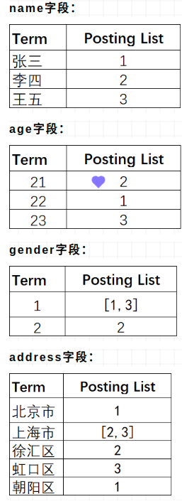
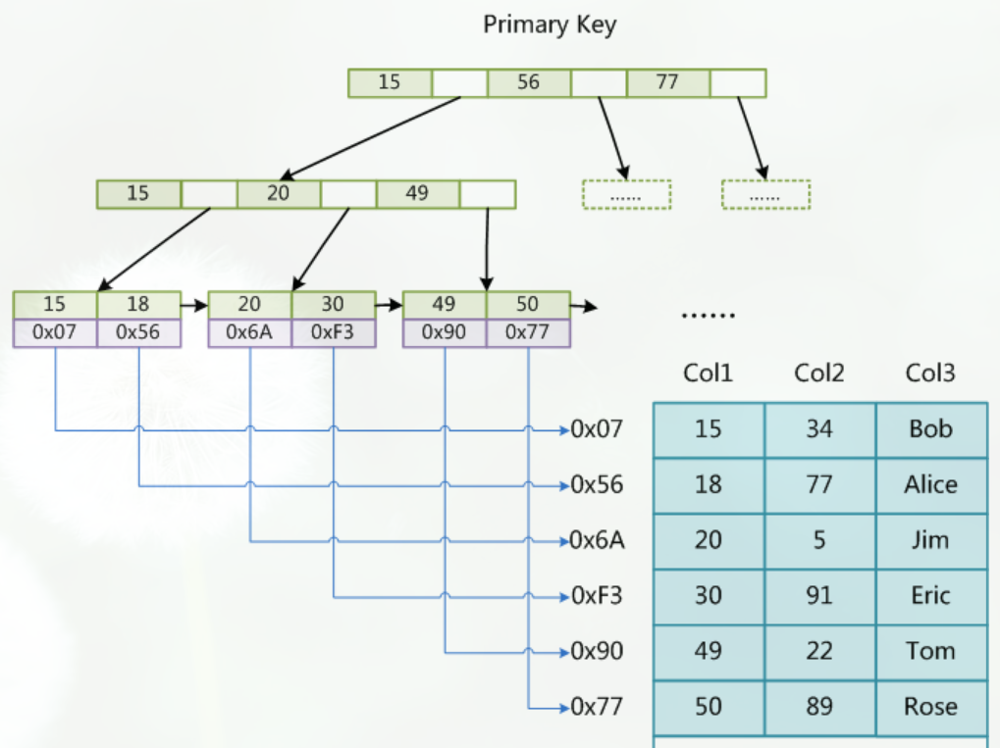

倒排索引（Inverted Index）也叫反向索引，有反向索引必有正向索引。通俗地来讲，正向索引是通过key找value，反向索引则是通过value找key。
假设有个user索引，它有四个字段：分别是name，gender，age，address。画出来的话，大概是下面这个样子，跟关系型数据库一样：
* Term（单词）：一段文本经过分析器分析以后就会输出一串单词，这一个一个的就叫做Term（直译为：单词）
* Term Dictionary（单词字典）：顾名思义，它里面维护的是Term，可以理解为Term的集合
* Term Index（单词索引）：为了更快的找到某个单词，我们为单词建立索引
* Posting List（倒排列表）：倒排列表记录了出现过某个单词的所有文档的文档列表及单词在该文档中出现的位置信息，每条记录称为一个倒排项(Posting)。根据倒排列表，即可获知哪些文档包含某个单词。（PS：实际的倒排列表中并不只是存了文档ID这么简单，还有一些其它的信息，比如：词频（Term出现的次数）、偏移量（offset）等，可以想象成是Python中的元组，或者Java中的对象）
（PS：如果类比现代汉语词典的话，那么Term就相当于词语，Term Dictionary相当于汉语词典本身，Term Index相当于词典的目录索引）
我们知道，每个文档都有一个ID，如果插入的时候没有指定的话，Elasticsearch会自动生成一个，因此ID字段就不多说了
上面的例子，Elasticsearch建立的索引大致如下：

Elasticsearch分别为每个字段都建立了一个倒排索引。比如，在上面“张三”、“北京市”、22 这些都是Term，而[1，3]就是Posting List。Posting list就是一个数组，存储了所有符合某个Term的文档ID。
只要知道文档ID，就能快速找到文档。可是，要怎样通过我们给定的关键词快速找到这个Term呢？
当然是建索引了，为Terms建立索引，最好的就是B-Tree索引（PS：MySQL就是B树索引最好的例子）。
首先，让我们来回忆一下MyISAM存储引擎中的索引是什么样的：

我们查找Term的过程跟在MyISAM中记录ID的过程大致是一样的

MyISAM中，索引和数据是分开，通过索引可以找到记录的地址，进而可以找到这条记录

在倒排索引中，通过Term索引可以找到Term在Term Dictionary中的位置，进而找到Posting List，有了倒排列表就可以根据ID找到文档了

（PS：可以这样理解，类比MyISAM的话，Term Index相当于索引文件，Term Dictionary相当于数据文件）

（PS：其实，前面我们分了三步，我们可以把Term Index和Term Dictionary看成一步，就是找Term。因此，可以这样理解倒排索引：通过单词找到对应的倒排列表，根据倒排列表中的倒排项进而可以找到文档记录）

为了更进一步理解，下面从网上摘了两张图来具现化这一过程：
