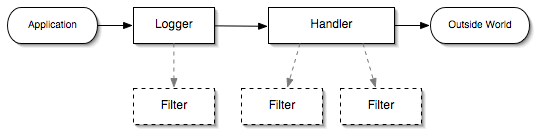

# Log

## 目录
1. 为什么要使用Log
2. Log的等级
3. 什么时候打Log
4. 打什么样的Log
5. 打Log对系统性能的影响
6. 一些日志框架
7. 使用Log时注意事项

### 为什么要使用Log

 *用途主要体现在以下方面:*

    * Install: 安装配置时记录具体的安装步骤
    * Online debug： 可以通过Log来查看一些Environment Issue
    * Collect Information: 通过日志我们可以找到系统中存在的一些漏洞，这些漏洞时平时开发中难以模拟和发现的
    * Assessment: 通过日志我们可以分析用户的行为，进而评估用户对系统保持热衷的程度，通过慢日志分析/评估用户在模块停留的时间以及系统的反应时间
    * Security: 对于一些很严格的操作我们需要记录详细的说明，比如对一些非授权的操作，银行的业务

### Log的等级

#### Java类

|Log4j slf4j |J2SE | Useage|
|:------------|:------|:------|
|trace|FINEST|输出更详细的调试信息|
|debug|FINER|比调试信息详细点|
|debug|FINE|调试信息|
|info|CONFIG|系统配置，系统运行环境信息|
|info|INFO|系统运行时信息，比如Scheduled时间|
|warn|WARNING|警告，此警告不影响系统的执行，不影响下次业务的执行|
|error|SERVER|错误，问题影响到系统的执行，并且系统不能自行恢复到正常状态|
|fatal||宕机|

#### Tomcat类
* Tomcat分5类log
    * localhost, localhost_access, manager, admin, catalina
* 每一类log分7种等级
    * SERVER > WARNING > INFO > CONFIG > FINE > FINER > FINEST

### 什么时候打Log

* 系统安装配置时，对于系统安装的参数，如jdk版本，JVM内存大小，等主要相关信息的输出，这样可以看到安装到了哪一个步骤，模块部署是否正常
* 异常捕获时输出日志，出错时的参数，特别对于prod上不能debug的环境，有时只能通过日志去猜测可能出错的原因
* scheduled job，如定时发送邮件等，这些需要在job开始前后都要记录日志，甚至中间的过程都要详细记录
* 一些敏感操作，如delete，这个时候需要记录who when delete what, pre value, current value
* 关键步骤需要打log，比如服务模块的启动

### 打什么样的Log

* error 和 warn: 出错信息或者警告的描述，相关参数的值，异常的StackTrace
* info: 输出相关信息
* debug： 相关描述，参数信息，异常的StackTrace

### 打Log对系统性能的影响

* 获取logger实例的开销
* 写文件IO开销（禁掉Tomcat中的部分日志，如localhost，manager， admin等）

### 一些日志框架
* Apache Commons Logging
    * 提供接口而非实现，通常配合着log4j来使用
* Log4j / Log4j2
* LogBack(Log4j的改良版)
* Tinylog 精简版日志框架，运行特别快，适合小项目

### 使用Log时注意事项
1. 正确的理解日志的输出级别
2. 正确的书写log的输出内容
3. 日志信息应该是简介且可描述的（建议使用自定义异常）
4. 正确的使用输出的模式
5. 尽量使用slf4j或者commons-logging等抽象日志框架，而不是具体的logging(jdk自带)、log4j、log4j2

### ELK
ELK是三款软件的组合。是一整套完整的解决方案。分别是由Logstash（收集+分析）、ElasticSearch（搜索+存储）、Kibana（可视化展示）三款软件。ELK主要是为了在海量的日志系统里面实现分布式日志数据集中式管理和查询，便于监控以及排查故障。

ElasticSearch 是一个基于 Lucene 的搜索服务器。它提供了一个分布式多用户能力的全文搜索引擎，基于 RESTful API 的 web 接口。Elasticsearch是用Java开发的，并作为Apache许可条款下的开放源码发布，是当前流行的企业级搜索引擎。设计用于云计算中，能够达到实时搜索，稳定，可靠，快速，安装使用方便。

Logstash是一个数据采集、加工处理以及传输的工具，能够将所有的数据集中处理，使不同模式和不同数据的正常化，而且数据源能够随意轻松的添加。

Kibana是一个开源的分析与可视化平台，可以使用各种不同的图表、表格、地图等kibana能够很轻易地展示高级数据分析与可视化。

Apache kafka是消息中间件的一种，是一种分布式的，基于发布/订阅的消息系统。能实现一个为处理实时数据提供一个统一、高吞吐、低延迟的平台，且拥有分布式的，可划分的，冗余备份的持久性的日志服务等特点。

`Filebeta README file`
    # Welcome to Filebeat 6.6.1
Filebeat sends log files to Logstash or directly to Elasticsearch.
## Getting Started
To get started with Filebeat, you need to set up Elasticsearch on
your localhost first. After that, start Filebeat with:
     ./filebeat -c filebeat.yml -e
This will start Filebeat and send the data to your Elasticsearch
instance. To load the dashboards for Filebeat into Kibana, run:
    ./filebeat setup -e
For further steps visit the
[Getting started](https://www.elastic.co/guide/en/beats/filebeat/6.6/filebeat-getting-started.html) guide.
## Documentation
Visit [Elastic.co Docs](https://www.elastic.co/guide/en/beats/filebeat/6.6/index.html)
for the full Filebeat documentation.
## Release notes

`common cmd`
./filebeat -e -c filebeat.yml -d "publish"

`logstash`
node {
    name => 'betas'
}

input {
    betas {
        host => "xxx"
        port => "5044"
    }
}

filter {
}

output {
    elasticsearch {
        hosts => ["xxx:9200"]
    }
}

http://www.importnew.com/16331.html