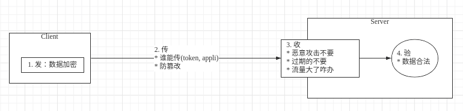

# 目录
* [前言](#前言)
* [发](#发)
  * [数据加密](#数据加密)
* [传](#传)
  * [appid+密钥](#appid+密钥授权模式的传输，不适合需要首次登陆的模式)
  * [token机制](#token机制首次认证后开绿灯)
  * [防篡改](#防篡改)
* [收](#收)
  * [限制流量](#限制流量)
  * [黑白名单](#黑白名单)
  * [时间戳机制](#时间戳机制)
* [验](#验)
  * [数据合法性验证](#数据合法性验证)

## 前言
结合参阅的几篇文章，关于接口的安全性设计，做如下总结。数据传输的过程我认为可以分为`发`、`传`、`收`、`验`四个过程，安全性的设计围绕的也是这4个过程而来。



## 发
### `数据加密`

数据在传输过程中是很容易被抓包的，如果直接传输比如通过http协议，那么用户传输的数据可以被任何人获取；所以必须对数据加密，常见的做法对关键字段加密比如用户密码直接通过md5加密；现在主流的做法是使用https协议，在http和tcp之间添加一层加密层(SSL层)，这一层负责数据的加密和解密；

现在主流的加密方式有对称加密和非对称加密:
  * `对称加密`：对称密钥在加密和解密的过程中使用的密钥是相同的，常见的对称加密算法有DES，AES；优点是计算速度快，缺点是在数据传送前，发送方和接收方必须商定好秘钥，然后使双方都能保存好秘钥，如果一方的秘钥被泄露，那么加密信息也就不安全了；
  * `非对称加密`：服务端会生成一对密钥，私钥存放在服务器端，公钥可以发布给任何人使用；优点就是比起对称加密更加安全，但是加解密的速度比对称加密慢太多了；广泛使用的是RSA算法；RSA公钥每次加密得到的结果都不一样

两种方式各有优缺点，而https的实现方式正好是结合了两种加密方式，整合了双方的优点，在安全和性能方面都比较好；对称加密和非对称加密代码实现，jdk提供了相关的工具类可以直接使用；关于https如何配置使用相对来说复杂一些，可以参考本人的之前的文章HTTPS分析与实战

## 传
### `appid+密钥(授权模式的传输，不适合需要首次登陆的模式)`
需要使用我的API的用户，你首先得到我这注册下信息，然后我发给你一个appid（或者叫appkey），然后给你个密钥，你传过来的数据中都要带这两个参数，并且把这两个参数放到body中，使用https传输，因为Body中的数据在https下是加密的。

但是不管是否全局唯一最好让生成的Id有如下属性：
  * 趋势递增：这样在保存数据库的时候，使用索引性能更好；
  * 信息安全：尽量不要连续的，容易发现规律；

关于全局唯一Id生成的方式常见的有类snowflake方式等

### `token机制(首次认证后开绿灯)`
客户端使用用户名和密码请求登录。服务端收到请求，验证用户名和密码。验证成功后，服务端会生成一个token，然后把这个token发送给客户端。客户端收到token后把它存储起来，可以放在cookie或者Local Storage（本地存储）里。客户端每次向服务端发送请求的时候都需要带上服务端发给的token。服务端收到请求，然后去验证客户端请求里面带着token，如果验证成功，就向客户端返回请求的数据。token比较容易被截取，一般会有token的过期时间，或者每隔多长时间会生成新的token，token也要考虑下加密。

### `防篡改`
数据在传输过程中经过加密，理论上就算被抓包，也无法对数据进行篡改；但是我们要知道加密的部分其实只是在外网，现在很多服务在内网中都需要经过很多服务跳转，所以这里的加签可以防止内网中数据被篡改；

数据签名使用比较多的是md5算法，常用的做法如下：
  1. 将要提交的数据先加密
  2. 将数据做一次md5摘要，也就是签名
  [200526] md5的摘要是将数据和约定的密钥一起做签名，如果单纯摘要数据，那么数据被截取后，通过md5()也可以修改签名，这样服务端就没发验证数据是否被篡改了呀
  3. 然后把摘要连同参数一起回传给服务器
  4. 服务器拿到数据后，同样的方式做一次md5摘要
  5. 两个摘要做对比，如果不相等就认为被篡改了，否则认为可信

str：参数1={参数1}&参数2={参数2}&……&参数n={参数n}$key={用户密钥};
MD5.encrypt(str + "哈哈哈，我不告诉你我多加了啥");

注意最后的用户密钥，客户端和服务端都有一份，这样会更加安全；

## 收
### `限流机制`
限流机制是为了防止恶意频繁请求造成的服务器瘫痪。
常用的限流算法包括：令牌桶限流，漏桶限流，计数器限流；
  1. 令牌桶限流（能允许刺突，但是不会爆炸，流入的请求都是在能处理的范围之内，请求多了的话就不给你牌子）
    令牌桶算法的原理是系统以一定速率向桶中放入令牌，填满了就丢弃令牌；请求来时会先从桶中取出令牌，如果能取到令牌，则可以继续完成请求，否则等待或者拒绝服务；令牌桶允许一定程度突发流量，只要有令牌就可以处理，支持一次拿多个令牌；
  2. 漏桶限流（只能匀速处理请求）
    漏桶算法的原理是按照固定常量速率流出请求，流入请求速率任意，当请求数超过桶的容量时，新的请求等待或者拒绝服务；可以看出漏桶算法可以强制限制数据的传输速度；
  3. 计数器限流（容易产生刺突）
    计数器是一种比较简单粗暴的算法，主要用来限制总并发数，比如数据库连接池、线程池、秒杀的并发数；计数器限流只要一定时间内的总请求数超过设定的阀值则进行限流；

具体基于以上算法如何实现，Google的Guava提供了RateLimiter工具类基于基于令牌桶算法：

RateLimiter rateLimiter = RateLimiter.create(5);
以上代码表示一秒钟只允许处理五个并发请求，以上方式只能用在单应用的请求限流，不能进行全局限流；这个时候就需要分布式限流，可以基于redis+lua来实现；

### `时间戳机制`
数据是很容易被抓包的，但是经过如上的加密，加签处理，就算拿到数据也不能看到真实的数据；但是有不法者不关心真实的数据，而是直接拿到抓取的数据包进行恶意请求；这时候可以使用时间戳机制，在每次请求中加入当前的时间，服务器端会拿到当前时间和消息中的时间相减，看看是否在一个固定的时间范围内比如5分钟内；这样恶意请求的数据包是无法更改里面时间的，所以5分钟后就视为非法请求了；

解密后的数据，经过签名认证后，我们拿到数据包中的客户端时间戳字段，然后用服务器当前时间去减客户端时间，看结果是否在一个区间内，伪代码如下：
```java
long interval=5*60*1000；//超时时间
long clientTime=request.getparameter("clientTime");
long serverTime=System.currentTimeMillis();
if(serverTime-clientTime>interval){
    return new Response("超过处理时长")
}
```

### `黑白名单`
* 黑名单：拒绝该ip地址发过来的请求
* 白名单：只允许该ip地址发过来的请求

## 验
### `数据合法性验证`
这个可以说是每个系统都会有的处理机制，只有在数据是合法的情况下才会进行数据处理；每个系统都有自己的验证规则，当然也可能有一些常规性的规则，比如身份证长度和组成，电话号码长度和组成等等；

合法性校验包括：常规性校验以及业务校验；
常规性校验：包括签名校验，必填校验，长度校验，类型校验，格式校验等；
业务校验：根据实际业务而定，比如订单金额不能小于0等；

# 引用
* [如何设计一个安全的对外接口](https://my.oschina.net/OutOfMemory/blog/3131916)
* [为什么RSA公钥每次加密得到的结果都不一样？](https://www.jianshu.com/p/e300f7735c87)
* [美团分布式ID方案](https://github.com/Meituan-Dianping/Leaf)
* [Web数据安全-防篡改](https://blog.csdn.net/wxgxgp/article/details/81257877)
