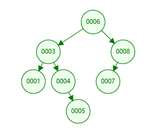
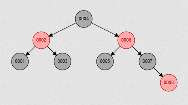

### 索引是什么
索引底层是`数据结构`，是一种`排好序`的数据结构，帮助MySQL高效获取数据。

### 索引的底层数据结构
常见的索引的存储的数据结构有如下几种
* 二叉树
* 红黑树
* B+树
* 哈希

目前数据库索引中索引的存储类型使用的最多的是哈希和B+树，我们一一来分析这几种数据结构。可在https://www.cs.usfca.edu/~galles/visualization/Algorithms.html 网站上查看这几种类型的数据结构演示示例。
* 二叉树：二叉树的特点就是左叶子节点的值小于其父节点，右叶子节点的值大于其父节点，其查找方式是二分查找。在一些业务场景中使用二叉树作为索引的存储结构会导致`单边失衡`的情况，并且树的深度无法控制。举个例子，我们经常会设计一个表的主键是自增的整数，那么如果使用二叉树，下一行记录的主键永远比上一行的大，映射到二叉树上，就会造成所有的叶子节点都在右边，数据量大了的话，就会影响到查询的效率。

    
* 红黑树：Read Black Tree，是一种自平衡的二叉树，能够解决二叉树中单边失衡的问题，但是红黑树没有解决掉树深度的问题，如果树的深度很深的话，查询的效率依然不是很高。

    
* B+树：B是指Balance，不是Binary的意思，B+树是B树的一个变种，总结来说相对于B树查询速度更快更稳定，我们这里就不做讨论。B+树中只有叶子节点存储数据，所有的叶子节点使用链表相连，非叶子节点只是起到了索引的作用，所有的查询最终都会落到叶子节点。B+树索引减少了树的深度，同时也增加了索引存储的容量。

    
* Hash：数据库对hash索引的列做hash计算，将哈希码存储在索引中，同时在哈希表中保存指向每一个数据行的指针，计算机中hash查找是基于内存地址的查找方法，将内存地址与数据值之间建立联系，因此在精准查询时速率很快，但是hash索引在范围查找时效率就很差了。例如在一些政府项目中，对公民的身份证号码建立索引的时候，就可以采用这种hash索引，具体设计时可以将身份证倒序，然后使用前缀索引，匹配前9个字符效率就很高了。

### 索引的分类
普通索引(INDEX)：最基本的索引，没有任何限制
唯一索引(UNIQUE)：与"普通索引"类似，不同的就是：索引列的值必须唯一，但允许有空值。
主键索引(PRIMARY)：它 是一种特殊的唯一索引，不允许有空值。
全文索引(FULLTEXT )：仅可用于 MyISAM 表， 用于在一篇文章中，检索文本信息的, 针对较大的数据，生成全文索引很耗时好空间。
组合索引：为了更多的提高mysql效率可建立组合索引，遵循”最左前缀“原则。

### 简述数据库索引查询过程

### 索引的最佳实践

### B树与B+树的区别
1. B树每个节点都存储数据，所有节点组成这棵树。B+树只有叶子节点存储数据（B+数中有两个头指针：一个指向根节点，另一个指向关键字最小的叶节点），叶子节点包含了这棵树的所有数据，所有的叶子结点使用链表相连，便于区间查找和遍历，所有非叶节点起到索引作用。
2. B树中叶节点包含的关键字和其他节点包含的关键字是不重复的，B+树的索引项只包含对应子树的最大关键字和指向该子树的指针，不含有该关键字对应记录的存储地址。
3. B树中每个节点（非根节点）关键字个数的范围为[m/2(向上取整)-1,m-1](根节点为[1,m-1])，并且具有n个关键字的节点包含（n+1）棵子树。B+树中每个节点（非根节点）关键字个数的范围为[m/2(向上取整),m](根节点为[1,m])，具有n个关键字的节点包含（n）棵子树。
4. B+树中查找，无论查找是否成功，每次都是一条从根节点到叶节点的路径。
