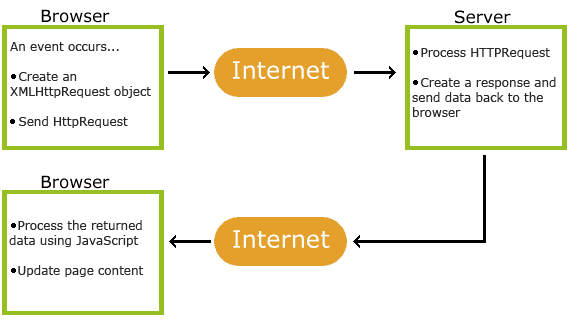

## What-是什么
```
Ajax 即“Asynchronous Javascript And XML”（异步 JavaScript 和 XML），是指一种创建交互式网页应用的网页开发技术（不是新语言）。
Ajax = 异步 JavaScript 和 XML 或者是 HTML（标准通用标记语言的子集）。
Ajax 是一种用于创建快速动态网页的技术。
Ajax 是一种在无需重新加载整个网页的情况下，能够更新部分网页的技术。
通过在后台与服务器进行少量数据交换，Ajax 可以使网页实现异步更新。这意味着可以在不重新加载整个网页的情况下，对网页的某部分进行更新。
传统的网页（不使用 Ajax）如果需要更新内容，必须重载整个网页页面。
```

## 工作原理

