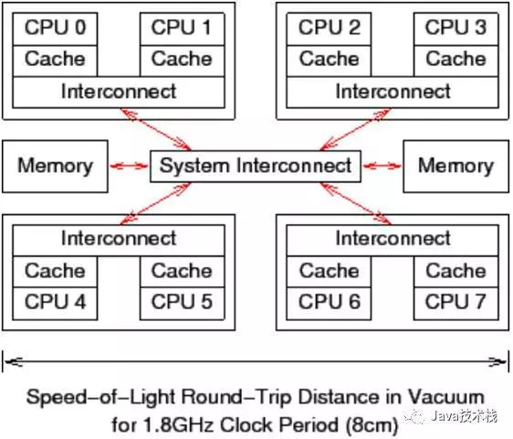

# 目录
* [什么是CAS](#什么是CAS)
* [Unsafe类解读](#Unsafe类解读)

## 什么是CAS
> CAS算法
CAS（Compare And Swap，即比较再交换）。jdk5增加了并发包java.util.concurrent.*,其下面的类使用CAS算法实现了区别于synchronouse同步锁的一种乐观锁。JDK 5之前Java语言是靠synchronized关键字保证同步的，这是一种独占锁，也是是悲观锁。

> 对CAS算法的理解
对CAS的理解，CAS是一种无锁算法，CAS有3个操作数，内存值V，旧的预期值A，要修改的新值B。当且仅当预期值A和内存值V相同时，将内存值V修改为B，否则什么都不做。
CAS比较与交换的伪代码可以表示为：
```java
do{
    备份旧数据；
    基于旧数据构造新数据；
}while(!CAS( 内存地址，备份的旧数据，新数据 ))
```
假设有t1，t2线程同时更新同一变量56的值，因为t1和t2线程都同时去访问同一变量56，所以他们会把主内存的值完全拷贝一份到自己的工作内存空间，所以t1和t2线程的预期值都为56。假设t1在与t2线程竞争中线程t1能去更新变量的值，而其他线程都失败。（失败的线程并不会被挂起，而是被告知这次竞争中失败，并可以再次发起尝试）。t1线程去更新变量值改为57，然后写到内存中。此时对于t2来说，内存值变为了57，与预期值56不一致，就操作失败了（想改的值不再是原来的值）。
就是指当两者进行比较时，如果相等，则证明共享数据没有被修改，替换成新值，然后继续往下运行；如果不相等，说明共享数据已经被修改，放弃已经所做的操作，然后重新执行刚才的操作。容易看出 CAS 操作是基于共享数据不会被修改的假设，采用了类似于数据库的commit-retry 的模式。当同步冲突出现的机会很少时，这种假设能带来较大的性能提升。
> CAS算法的优缺点
CAS（比较并交换）是`CPU指令级`的操作，只有一步原子操作，所以非常快。而且CAS避免了请求操作系统来裁定锁的问题，不用麻烦操作系统，直接在CPU内部就搞定了。但CAS就没有开销了吗？不！有cache miss的情况。一个8核CPU计算机系统，每个CPU有cache（CPU内部的高速缓存，寄存器），管芯内还带有一个互联模块，使管芯内的两个核可以互相通信。在图中央的系统互联模块可以让四个管芯相互通信，并且将管芯与主存连接起来。数据以“缓存线”为单位在系统中传输，“缓存线”对应于内存中一个 2 的幂大小的字节块，大小通常为 32 到 256 字节之间。当 CPU 从内存中读取一个变量到它的寄存器中时，必须首先将包含了该变量的缓存线读取到 CPU 高速缓存。同样地，CPU 将寄存器中的一个值存储到内存时，不仅必须将包含了该值的缓存线读到 CPU 高速缓存，还必须确保没有其他 CPU 拥有该缓存线的拷贝。刷新不同CPU缓存的开销，因此也就是说CAS有开销。锁操作比 CAS 操作更加耗时，是因为锁操作的数据结构中需要两个原子操作（lock+update）。



* CAS的缺点有以下几个方面：
    * ABA问题
    如果某个线程在CAS操作时发现，内存值和预期值都是A，就能确定期间没有线程对值进行修改吗？答案未必，如果期间发生了 A -> B -> A 的更新，仅仅判断数值是 A，可能导致不合理的修改操作。针对这种情况，Java 提供了 AtomicStampedReference 工具类，通过为引用建立类似版本号（stamp）的方式，来保证 CAS 的正确性。
    * 循环时间长开销大
    CAS中使用的失败重试机制，隐藏着一个假设，即竞争情况是短暂的。大多数应用场景中，确实大部分重试只会发生一次就获得了成功。但是总有意外情况，所以在有需要的时候，还是要考虑限制自旋的次数，以免过度消耗 CPU。
    * 只能保证一个共享变量的原子操作

## Unsafe类解读

## 什么是CAS
1. 什么是CAS操作
CAS(compare-and-swap)直译即比较并交换，提供原子化的读改写能力，是Java 并发中所谓 lock-free 机制的基础。
CAS的思想很简单：三个参数，一个当前内存值V、旧的预期值A、即将更新的值B，当且仅当预期值A和内存值V相同时，将内存值修改为B并返回true，否则什么都不做，并返回false。
可能会有面试官问 CAS 底层是如何实现的，在JAVA中,CAS通过调用C++库实现，由C++库再去调用CPU指令集。不同体系结构中，cpu指令还存在着明显不同。比如，x86 CPU 提供 cmpxchg 指令；而在精简指令集的体系架构中，（如“load and reserve”和“store conditional”）实现的，在大多数处理器上 CAS 都是个非常轻量级的操作，这也是其优势所在。
* CAS的缺点有以下几个方面：
    * ABA问题
    如果某个线程在CAS操作时发现，内存值和预期值都是A，就能确定期间没有线程对值进行修改吗？答案未必，如果期间发生了 A -> B -> A 的更新，仅仅判断数值是 A，可能导致不合理的修改操作。针对这种情况，Java 提供了 AtomicStampedReference 工具类，通过为引用建立类似版本号（stamp）的方式，来保证 CAS 的正确性。
    * 循环时间长开销大
    CAS中使用的失败重试机制，隐藏着一个假设，即竞争情况是短暂的。大多数应用场景中，确实大部分重试只会发生一次就获得了成功。但是总有意外情况，所以在有需要的时候，还是要考虑限制自旋的次数，以免过度消耗 CPU。
    * 只能保证一个共享变量的原子操作

## JUC原子类
### JUC原子类介绍
根据修改的数据类型，可以将JUC包中的原子操作类可以分为4类。
1. 基本类型: AtomicInteger, AtomicLong, AtomicBoolean ;
2. 数组类型: AtomicIntegerArray, AtomicLongArray, AtomicReferenceArray ;
3. 引用类型: AtomicReference, AtomicStampedRerence, AtomicMarkableReference ;
4. 对象的属性修改类型: AtomicIntegerFieldUpdater, AtomicLongFieldUpdater, AtomicReferenceFieldUpdater 。
这些类存在的目的是对相应的数据进行原子操作。所谓原子操作，是指操作过程不会被中断，保证数据操作是以原子方式进行的。

> 原理解读（以AtomicInteger为例）
AtomicInteger位于java.util.concurrent.atomic包下，是对int的封装，提供原子性的访问和更新操作，其原子性操作的实现是基于CAS。
* CAS操作
* value使用了volatile修饰


2. AtomicInteger原理浅析
```java
public class AtomicInteger extends Number implements java.io.Serializable {
    private static final long serialVersionUID = 6214790243416807050L;

    // setup to use Unsafe.compareAndSwapInt for updates
    private static final Unsafe unsafe = Unsafe.getUnsafe();
    private static final long valueOffset;

    static {
        try {
            valueOffset = unsafe.objectFieldOffset
                (AtomicInteger.class.getDeclaredField("value"));
        } catch (Exception ex) { throw new Error(ex); }
    }

    private volatile int value;
}
```
从 AtomicInteger 的内部属性可以看出，它依赖于Unsafe 提供的一些底层能力(CAS操作，通过内存偏移地址修改变量值)，进行底层操作；如根据valueOffset代表的该变量值在内存中的偏移地址，从而获取数据的。
变量value用volatile修饰，保证了多线程之间的内存可见性。
下面以getAndIncrement为例，说明其原子操作过程
```java
public final int getAndIncrement() {
    return unsafe.getAndAddInt(this, valueOffset, 1);
}
//unsafe.getAndAddInt
public final int getAndAddInt(Object var1, long var2, int var4) {
    int var5;
    do {
        var5 = this.getIntVolatile(var1, var2);
    } while(!this.compareAndSwapInt(var1, var2, var5, var5 + var4));

    return var5;
}
```

假设线程1和线程2通过getIntVolatile拿到value的值都为1，线程1被挂起，线程2继续执行
线程2在compareAndSwapInt操作中由于预期值和内存值都为1，因此成功将内存值更新为2
线程1继续执行，在compareAndSwapInt操作中，预期值是1，而当前的内存值为2，CAS操作失败，什么都不做，返回false
线程1重新通过getIntVolatile拿到最新的value为2，再进行一次compareAndSwapInt操作，这次操作成功，内存值更新为3
> Unsafe
* Unsafe类是在sun.misc包下，不属于Java标准。但是很多Java的基础类库，包括一些被广泛使用的高性能开发库都是基于Unsafe类开发的，比如Netty、Hadoop、Kafka等。
* 使用Unsafe可用来直接访问系统内存资源并进行自主管理，Unsafe类在提升Java运行效率，增强Java语言底层操作能力方面起了很大的作用。
* Unsafe可认为是Java中留下的后门，提供了一些低层次操作，如直接内存访问、线程调度等。
* 官方并不建议使用Unsafe。

###

# 引用
* 什么是CAS https://www.jianshu.com/p/ab2c8fce878b
* 浅谈AtomicInteger实现原理 https://www.jianshu.com/p/cea1f9619e8f