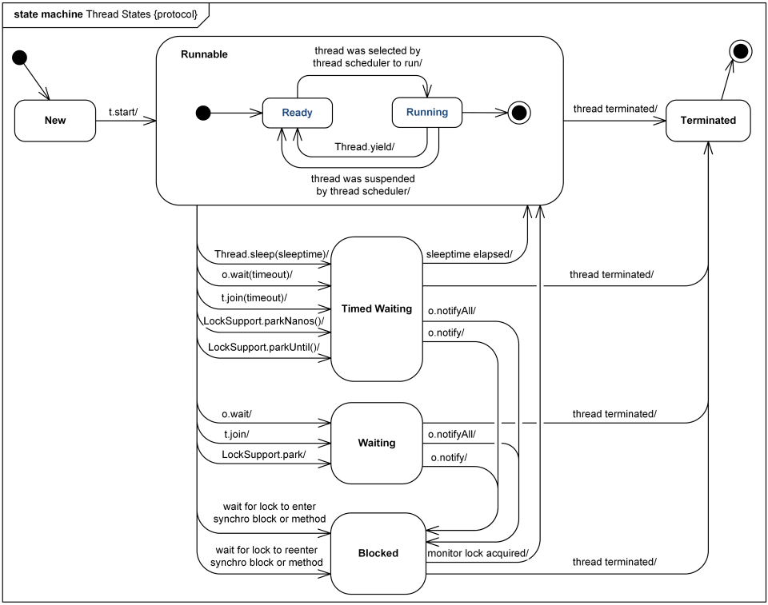

# 目录
* [基础概念](#基础概念)
    * [进程与线程](#进程与线程)
    * [单线程与多线程](#单线程与多线程)
    * [实现线程的4中方式](#实现线程的4中方式)
        * [thread.start()和runnable.run()的区别](#thread.start()和runnable.run()的区别)
        * [Thread和Runnable的异同](#Thread和Runnable的异同)
    * [线程的基本操作](#线程的基本操作)
    * [线程的优先级与守护线程](#线程的优先级与守护线程)
    * [线程的状态与转换](#线程的状态与转换)
    * [synchronized关键字](#synchronized关键字)
    * [实例锁与全局锁](#实例锁与全局锁)
    * [wait和notify](#wait和notify)

## 基础概念

### 进程与线程
`进程（Process）`是计算机中的程序关于某数据集合上的一次运行活动，是系统进行资源分配和调度的基本单位，是操作系统结构的基础。 在当代面向线程设计的计算机结构中，进程是线程的容器。程序是指令、数据及其组织形式的描述，进程是程序的实体。是计算机中的程序关于某数据集合上的一次运行活动，是系统进行资源分配和调度的基本单位，是操作系统结构的基础。程序是指令、数据及其组织形式的描述，进程是程序的实体。进程之间通过TCP/IP的端口来实现相互交互。

`线程（thread）`是操作系统能够进行运算调度的最小单位。它被包含在进程之中，是进程中的实际运作单位。一条线程指的是进程中一个单一顺序的控制流，一个进程中可以并发多个线程，每条线程并行执行不同的任务，多个线程共享本进程的资源。线程的通信就比较简单，有一大块共享的内存，只要大家的指针是同一个就可以看到各自的内存。

`小结`：
1. 进程要分配一大部分的内存，而线程只需要分配一部分栈就可以了
2. 一个程序至少有一个进程,一个进程至少有一个线程
3. 进程是资源分配的最小单位，线程是程序执行的最小单位
4. 一个线程可以创建和撤销另一个线程，同一个进程中的多个线程之间可以并发执行

`并发`： 对于单核cpu来说，多线程并不是同时进行的，操作系统将时间分成了多个时间片，大概均匀的分配给线程，到达某个线程的时间段，该线程运行，其余时间待命，这样从微观上看，一个线程是走走停停的，宏观感官上，在某一时刻似乎所有线程都在运行。并发是针对时间片段来说的，在某个时间段内多个线程处于runnable到running之间，但每个时刻只有一个线程在running，这叫做并发。

### 单线程与多线程
单线程就是进程中只有一个线程。单线程在程序执行时，所走的程序路径按照连续顺序排下来，前面的必须处理好，后面的才会执行。
```java
// 单线程实例
public class SingleThread {
    public static void main(String[] args) {
        System.out.println("Hello World");
    }
}
```

多个线程组成的程序称为多线程程序。常见的多线程程序如：GUI应用程序、I/O操作、网络容器等。

### 实现线程的4中方式
1. 继承Thread类
2. 实现Runnable接口
3. 实现Callable接口(有返回值)
4. 通过线程池来实现ExecuteService

```java
public class NewThreadThread {

    public static void main(String[] args) {
        new NewThread().start();
    }
}

// 继承自Thread类
class NewThread extends Thread {

    @Override
    public void run() {
        System.out.println("Thread running");
    }
}
```
```java
public class NewThreadRunnable {

    public static void main(String[] args) {
        // run方法运行
        new NewRunnable().run();

        // start方法运行
        NewRunnable newRunnable = new NewRunnable();
        Thread thread = new Thread(newRunnable);
        thread.start();
        // 输出
        /**
         * main running
         * Thread-0 running
         */
    }
}

// 实现runnable接口
class NewRunnable implements Runnable {

    @Override
    public void run() {
        System.out.println(Thread.currentThread().getName() + " running");
    }
}
```
```java
public class NewThreadCallable {

    public static void main(String[] args) throws InterruptedException, ExecutionException {
        Callable newCallable = new NewCallable();
        FutureTask futureTask = new FutureTask(newCallable);
        Thread thread = new Thread(futureTask);
        thread.start();
        Object result = futureTask.get();
        System.out.println(String.valueOf(result));

        Callable<Integer> newCallable2 = new NewCallable2();
        FutureTask<Integer> task = new FutureTask(newCallable2);
        new Thread(task).start();
        Integer i = task.get();
        System.out.println(i);
    }
}
// 实现Callable接口
class NewCallable implements Callable {

    @Override
    public Object call() throws Exception {
        return "Hello World";
    }
}

class NewCallable2 implements Callable<Integer> {

    @Override
    public Integer call() throws Exception {
        return 1;
    }
}
```
```java
public class NewThreadExecutorService {

    public static void main(String[] args) throws ExecutionException, InterruptedException {
        ExecutorService pool = Executors.newFixedThreadPool(5);
        for (int i = 0; i < 10; i++) {
            pool.execute(new Runnable() {
                @Override
                public void run() {
                    System.out.println(Thread.currentThread().getName());
                }
            });
        }
        pool.shutdown();
    }
}
```
#### Thread和Runnable的异同
* Thread 和 Runnable 的相同点：都是“多线程的实现方式”。
* Thread 和 Runnable 的不同点：
    * Thread 是类，而Runnable是接口；Thread本身是实现了Runnable接口的类。我们知道“一个类只能有一个父类，但是却能实现多个接口”，因此Runnable具有更好的扩展性。此外，Runnable还可以用于“资源的共享”。即，多个线程都是基于某一个Runnable对象建立的，它们会共享Runnable对象上的资源（变量）。通常，建议通过“Runnable”实现多线程！

#### thread.start()和runnable.run()的区别
Thread类继承了Runnable接口，调用start()方法会启动一个新的线程来执行相应的run()方法；run()方法和普通的成员方法一样，可以被重复调用，会在当前线程中执行该方法，而不会启动新的线程。(参考上面通过实现Runnable接口来实现新线程)

### 线程的状态与转换
线程共包括以下5种状态。
1. 新建状态(New): 创建了线程对象但尚未调用start()方法时的状态。
2. 就绪状态(Runnable): 也被称为“可执行状态”。线程对象被创建后，其它线程调用了该对象的start()方法，从而来启动该线程。例如，thread.start()。处于就绪状态的线程，随时可能被CPU调度执行。
3. 阻塞状态(Blocked): 阻塞状态是线程因为某种原因放弃CPU使用权，暂时停止运行。直到线程进入就绪状态，才有机会转到运行状态。阻塞的情况分三种：
    (01) 等待阻塞 -- 通过调用线程的wait()方法，让线程等待某工作的完成。
    (02) 同步阻塞 -- 线程在获取synchronized同步锁失败(因为锁被其它线程所占用)，它会进入同步阻塞状态。
    (03) 其他阻塞 -- 通过调用线程的sleep()或join()或发出了I/O请求时，线程会进入到阻塞状态。当sleep()状态超时、join()等待线程终止或者超时、或者I/O处理完毕时，线程重新转入就绪状态。
4. 等待状态(Waiting)：线程处于等待状态，处于该状态标识的当前线程需要等待其他线程做出一些特定的操作来唤醒自己。
5. 超时等待状态(Time Waiting)：超时等待状态，与Waiting不同，在等待指定的时间后会自行返回。
6. 终止状态(Terminated): 线程执行完了或者因异常退出了run()方法，该线程结束生命周期。


### 线程的优先级与守护线程
> 线程的优先级
Java中的线程优先级的范围是1～10，默认的优先级是5，10极最高。线程的优先级具有以下特性：
`概率性`: “高优先级线程”被分配CPU的概率高于“低优先级线程”
`随机性`: 根据时间片轮循调度，能够并发执行,无论是是级别相同还是不同，线程调用都不会绝对按照优先级执行，每次执行结果都不一样，调度算法无规律可循，所以线程之间不能有先后依赖关系。无时间片轮循机制时，高级别的线程优先执行，如果低级别的线程正在运行时，有高级别线程可运行状态，则会执行完低级别线程，再去执行高级别线程。如果低级别线程处于等待、睡眠、阻塞状态，或者调用yield()函数让当前运行线程回到可运行状态，以允许具有相同优先级或者高级别的其他线程获得运行机会。因此，使用yield()的目的是让相同优先级的线程之间能适当的轮转执行。但是，实际中无法保证yield()达到让步目的，因为让步的线程还有可能被线程调度程序再次选中。结论：yield()从未导致线程转到等待/睡眠/阻塞状态。在大多数情况下，yield()将导致线程从运行状态转到可运行状态，但有可能没有效果。
> 用户线程与守护线程
在Java中有两类线程：User Thread(用户线程)、Daemon Thread(守护线程)
用个比较通俗的比如，任何一个守护线程都是整个JVM中所有非守护线程的保姆。只要当前JVM实例中尚存在任何一个非守护线程没有结束，守护线程就全部工作；只有当最后一个非守护线程结束时，守护线程随着JVM一同结束工作。Daemon的作用是为其他线程的运行提供便利服务，守护线程最典型的应用就是 `GC (垃圾回收器)`，它就是一个很称职的守护者。User和Daemon两者几乎没有区别，唯一的不同之处就在于虚拟机的离开：如果 User Thread已经全部退出运行了，只剩下Daemon Thread存在了，虚拟机也就退出了。 因为没有了被守护者，Daemon也就没有工作可做了，也就没有继续运行程序的必要了。
值得一提的是，守护线程并非只有虚拟机内部提供，用户在编写程序时也可以自己设置守护线程。下面的方法就是用来设置守护线程的。
```java
// 设定 daemonThread 为 守护线程，default false(非守护线程)
daemonThread.setDaemon(true);

// 验证当前线程是否为守护线程，返回 true 则为守护线程
daemonThread.isDaemon();
```
这里有几点需要注意：
1. thread.setDaemon(true)必须在thread.start()之前设置，否则会跑出一个IllegalThreadStateException异常。你不能把正在运行的常规线程设置为守护线程。
2. 在Daemon线程中产生的新线程也是Daemon的。
3. 不要认为所有的应用都可以分配给Daemon来进行服务，比如读写操作或者计算逻辑。

*那么守护线程的作用是什么？*
举例， GC垃圾回收线程：就是一个经典的守护线程，当我们的程序中不再有任何运行的Thread,程序就不会再产生垃圾，垃圾回收器也就无事可做，所以当垃圾回收线程是JVM上仅剩的线程时，垃圾回收线程会自动离开。它始终在低级别的状态中运行，用于实时监控和管理系统中的可回收资源。
应用场景：（1）来为其它线程提供服务支持的情况；（2） 或者在任何情况下，程序结束时，这个线程必须正常且立刻关闭，就可以作为守护线程来使用；反之，如果一个正在执行某个操作的线程必须要正确地关闭掉否则就会出现不好的后果的话，那么这个线程就不能是守护线程，而是用户线程。通常都是些关键的事务，比方说，数据库录入或者更新，这些操作都是不能中断的。
JVM 程序在什么情况下能够正常退出？
The Java Virtual Machine exits when the only threads running are all daemon threads.
上面这句话来自 JDK 官方文档，意思是：如果 JVM 中没有一个正在运行的非守护线程，这个时候，JVM 会退出。换句话说，守护线程拥有自动结束自己生命周期的特性，而非守护线程不具备这个特点

### 线程的基本操作
* thread.start()线程启动运行
* thread.run()在当前线程中运行run方法
* Thread.currentThread()获取当前线程，getName()获取名字

### synchronized关键字
> synchronized方法
```java
public synchronized void foo() {
    System.out.println("synchronized methoed");
}
```
> synchronized代码块
```java
public void foo() {
    synchronized (this) {
        System.out.println("synchronized methoed");
    }
}
```
* synchronized代码块中的this是指当前对象。也可以将this替换成其他对象，例如将this替换成obj，则foo2()在执行synchronized(obj)时就获取的是obj的同步锁。
* synchronized代码块中XXClass.class是指这个类，新建多个实例来访问同步方法或同步代码块也会被阻塞
* synchronized代码块可以更精确的控制冲突限制访问区域，有时候表现更高效率。
> synchronized关键字使用原则
1. 当一个线程访问一个对象的synchronized方法或者synchronized代码块时，其他线程对该对象的该synchronized方法或者synchronized代码块的访问将被阻塞。
2. 当一个线程访问一个对象的synchronized方法或者synchronized代码块时，其他线程对该对象的非synchronized方法的访问将不会被阻塞。
3. 当一个线程访问一个对象的synchronized方法或者synchronized代码块时，其他线程对该对象的其他synchronized方法或代码块的访问将会被阻塞。

### 实例锁与全局锁
> 实例锁：锁在某一个实例对象上。如果该类是单例，那么该锁也具有全局锁的概念。实例锁对应的就是synchronized关键字。
```java
synchronized(this) synchronized(obj)
public synchronized void foo()
```
> 全局锁：该锁针对的是类，无论实例多少个对象，那么线程都共享该锁。全局锁对应的就是static synchronized（或者是锁在该类的class或者classloader对象上）。
```java
synchronized(XXXClass.class)
public static synchronized void foo()
```
> 例子
```java
pulbic class Something {
    public synchronized void isSyncA(){}
    public synchronized void isSyncB(){}
    public static synchronized void cSyncA(){}
    public static synchronized void cSyncB(){}
}
```
假设，Something有两个实例x和y。分析下面4组表达式获取的锁的情况。
1. x.isSyncA()与x.isSyncB() 不能同时访问。实例锁，访问两个同步方法的对象是同一个对象x
2. x.isSyncA()与y.isSyncA() 能同时访问。实例锁，访问同一个同步方法的对象是两个不同的对象，实例锁不是同一个
3. x.cSyncA()与y.cSyncB() 不能同时访问。因为cSyncA()和cSyncB()都是static类型，x.cSyncA()相当于Something.isSyncA()，y.cSyncB()相当于Something.isSyncB()，因此它们共用一个同步锁，不能被同时反问。
4. x.isSyncA()与Something.cSyncA() 可以被同时访问。因为isSyncA()是实例方法，x.isSyncA()使用的是对象x的锁；而cSyncA()是静态方法，Something.cSyncA()可以理解对使用的是“类的锁”。因此，它们是可以被同时访问的。
```java
public class SynchronizedLockExample {

    public static void main(String[] args) {
        SynchronizedLock x = new SynchronizedLock();
        // x.syncA()与x.syncB()
        new Thread(()-> {
            try {
                x.syncA();
            } catch (InterruptedException e) {
                e.printStackTrace();
            }
        }, "Threadx ").start();
        new Thread(()-> {
            try {
                x.syncB();
            } catch (InterruptedException e) {
                e.printStackTrace();
            }
        }, "Thready ").start();
        /** 实例锁。不能同时访问
         * Threadx 0
         * Threadx 1
         * Threadx 2
         * Thready 0
         * Thready 1
         * Thready 2
         */
        // x.syncA()与y.syncA()
        SynchronizedLock y = new SynchronizedLock();
        SynchronizedLock y2 = new SynchronizedLock();
        new Thread(() -> {
            try {
                y.syncA();
            } catch (InterruptedException e) {
                e.printStackTrace();
            }
        }, "Thready1").start();
        new Thread(() -> {
            try {
                y2.syncA();
            } catch (InterruptedException e) {
                e.printStackTrace();
            }
        }, "Thready2").start();
        /**实例锁。可以同时访问，实例不是同一个对象锁
         * Thready10
         * Thready20
         * Thready21
         * Thready11
         * Thready22
         * Thready12
         */
        // x.syncC()与y.syncD()
        SynchronizedLock x1 = new SynchronizedLock();
        SynchronizedLock y3 = new SynchronizedLock();
        new Thread(()-> {
            try {
                x1.syncC();
            } catch (InterruptedException e) {
                e.printStackTrace();
            }
        }, "Threadx1 ").start();
        new Thread(()-> {
            try {
                y3.syncD();
            } catch (InterruptedException e) {
                e.printStackTrace();
            }
        }, "Thready3 ").start();
        /** 全局锁。不能同时访问，static synchronized修饰的方法是全局静态的，与实例无关
         * Threadx1 0
         * Threadx1 1
         * Threadx1 2
         * Thready3 0
         * Thready3 1
         * Thready3 2
         */
        // x.syncA与SynchronizedLock.syncD
        SynchronizedLock x3 = new SynchronizedLock();
        new Thread(()-> {
            try {
                x3.syncA();
            } catch (InterruptedException e) {
                e.printStackTrace();
            }
        }, "Theradx3").start();
        new Thread(() -> {
            try {
                SynchronizedLock.syncD();
            } catch (InterruptedException e) {
                e.printStackTrace();
            }
        }, "Threadstatic ").start();
        /** 可以同时访问。x.syncA是实例锁，SynchronizedLock.syncD是全局锁
         * Theradx30
         * Threadstatic 0
         * Theradx31
         * Threadstatic 1
         * Theradx32
         * Threadstatic 2
         */
    }
}

class SynchronizedLock {

    public synchronized void syncA() throws InterruptedException {
        for (int i = 0; i < 3; i++) {
            System.out.println(Thread.currentThread().getName() + i);
            Thread.sleep(1000);
        }
    }

    public synchronized void syncB() throws InterruptedException {
        for (int i = 0; i < 3; i++) {
            System.out.println(Thread.currentThread().getName() + i);
            Thread.sleep(1000);
        }
    }

    public static synchronized void syncC() throws InterruptedException {
        for (int i = 0; i < 3; i++) {
            System.out.println(Thread.currentThread().getName() + i);
            Thread.sleep(1000);
        }
    }

    public static synchronized void syncD() throws InterruptedException {
        for (int i = 0; i < 3; i++) {
            System.out.println(Thread.currentThread().getName() + i);
            Thread.sleep(1000);
        }
    }
}
```

### wait和notify
> wait, notify, notifyAll
在Object.java中，定义了wait(), notify()和notifyAll()等接口。wait()的作用是让当前线程进入等待状态，同时，wait()也会让当前线程释放它所持有的锁。而notify()和notifyAll()的作用，则是唤醒当前对象上的等待线程；notify()是唤醒单个线程，而notifyAll()是唤醒所有的线程。

Object类中关于等待/唤醒的API详细信息如下：
* notify() -- 唤醒在此对象监视器上等待的单个线程。
* notifyAll() -- 唤醒在此对象监视器上等待的所有线程。
* wait() -- 让当前线程处于“等待(阻塞)状态”，“直到其他线程调用此对象的 notify() 方法或 notifyAll() 方法”，当前线程被唤醒(进入“就绪状态”)。
* wait(long timeout) -- 让当前线程处于“等待(阻塞)状态”，“直到其他线程调用此对象的 notify() 方法或 notifyAll() 方法，或者超过指定的时间量”，当前线程被唤醒(进入“就绪状态”)。
* wait(long timeout, int nanos) -- 让当前线程处于“等待(阻塞)状态”，“直到其他线程调用此对象的 notify() 方法或 notifyAll() 方法，或者其他某个线程中断当前线程，或者已超过某个实际时间量”，当前线程被唤醒(进入“就绪状态”)。
```java
public class NotifyExample {

    public static void main(String[] args) {
        Notify notify = new Notify();
        new Thread(()-> {
            synchronized (notify) {
                while (notify.flag) {
                    System.out.println("User A");
                    try {
                        notify.wait();
                    } catch (InterruptedException e) {
                        e.printStackTrace();
                    }
                }
            }
            notify.call();
            synchronized (notify) {
                notify.notifyAll();
            }
        }, "User A").start();

        new Thread(()-> {
            synchronized (notify) {
                while (notify.flag) {
                    System.out.println("User B");
                    try {
                        notify.wait();
                    } catch (InterruptedException e) {
                        e.printStackTrace();
                    }
                }
            }
            notify.call();
            synchronized (notify) {
                notify.notifyAll();
            }
        }, "User B").start();
        /**
         * Begin to call
         * User A calling 0%
         * User B
         * User A calling 50%
         * User A calling 100%
         * End to call
         * Begin to call
         * User B calling 0%
         * User B calling 50%
         * User B calling 100%
         * End to call
         */
    }
}

class Notify {
    public boolean flag = false;
    public void call() {
        flag = true;
        System.out.println("Begin to call");
        for (int i = 0; i < 101; i+=50) {
            System.out.println(Thread.currentThread().getName() + " calling " + i + "%");
            try {
                Thread.sleep(100);
            } catch (InterruptedException e) {
                e.printStackTrace();
            }
        }
        System.out.println("End to call");
        flag = false;
    }
}
```
> 注意事项
* “当前线程”在调用wait()时，必须拥有该对象的同步锁。该线程调用wait()之后，会释放该锁；然后一直等待直到“其它线程”调用对象的同步锁的notify()或notifyAll()方法。然后，该线程继续等待直到它重新获取“该对象的同步锁”，然后就可以接着运行。, synchronized(obj)，否则会出现`java.lang.IllegalMonitorStateException`
* 调用notify时也需要获得该对象的“同步锁”，jdk中的注释：
```md
This method should only be called by a thread that is the owner of this object's monitor. A thread becomes the owner of the  object's monitor in one of three ways:
1. By executing a synchronized instance method of that object. 通过获得该对象的同步锁
2. By executing the body of a {@code synchronized} statement that synchronizes on the object. 在该对象的同步代码块中执行
3. For objects of type {@code Class,} by executing a synchronized static method of that class. 通过执行全局锁的方法
```
* Only one thread at a time can own an object's monitor.

> 为什么notify(), wait()等函数定义在Object中，而不是Thread中
Object中的wait(), notify()等函数，和synchronized一样，会对“对象的同步锁”进行操作。
wait()会使“当前线程”等待，因为线程进入等待状态，所以线程应该释放它锁持有的“同步锁”，否则其它线程获取不到该“同步锁”而无法运行！
OK，线程调用wait()之后，会释放它锁持有的“同步锁”；而且，根据前面的介绍，我们知道：等待线程可以被notify()或notifyAll()唤醒。现在，请思考一个问题：notify()是依据什么唤醒等待线程的？或者说，wait()等待线程和notify()之间是通过什么关联起来的？答案是：依据“对象的同步锁”。
负责唤醒等待线程的那个线程(我们称为“唤醒线程”)，它只有在获取“该对象的同步锁”(这里的同步锁必须和等待线程的同步锁是同一个)，并且调用notify()或notifyAll()方法之后，才能唤醒等待线程。虽然，等待线程被唤醒；但是，它不能立刻执行，因为唤醒线程还持有“该对象的同步锁”。必须等到唤醒线程释放了“对象的同步锁”之后，等待线程才能获取到“对象的同步锁”进而继续运行。

总之，notify(), wait()依赖于“同步锁”，而“同步锁”是对象锁持有，并且每个对象有且仅有一个！这就是为什么notify(), wait()等函数定义在Object类，而不是Thread类中的原因。

### 线程的让步yeild
* Yield是一个静态的原生(native)方法
* Yield告诉当前正在执行的线程把运行机会交给线程池中拥有相同优先级的线程。
* Yield不能保证使得当前正在运行的线程迅速转换到可运行的状态，它仅能使一个线程从运行状态转到可运行状态，而不是等待或阻塞状态

```java
public class YieldExample {

    public static void main(String[] args) {
        Yeild yeild = new Yeild();
        new Thread(yeild::call, "yeild1 ").start();
        new Thread(yeild::call, "yeild2 ").start();
        new Thread(yeild::call, "yeild3 ").start();
        new Thread(yeild::call, "yeild4 ").start();
        new Thread(yeild::call, "yeild5 ").start();
        new Thread(yeild::call, "yeild6 ").start();
        new Thread(yeild::call, "yeild7 ").start();
        new Thread(yeild::call, "yeild8 ").start();
        new Thread(yeild::call, "yeild9 ").start();
        new Thread(yeild::call, "yeild0 ").start();
    }
}

class Yeild {

    public synchronized void call() {
        for (int i = 0; i < 20; i++) {
            System.out.println(Thread.currentThread().getName() + i);
            if(i % 4 == 0) {
                Thread.yield();
            }
        }
    }
}
```
> yeild和wait的区别
wait()的作用是让当前线程由“运行状态”进入“等待(阻塞)状态”的同时，也会释放同步锁。而yield()的作用是让步，它也会让当前线程离开“运行状态”。它们的区别是：
1. wait()是让线程由“运行状态”进入到“等待(阻塞)状态”，而yield()是让线程由“运行状态”进入到“就绪状态”。
2. wait()是会线程释放它所持有对象的同步锁，而yield()方法不会释放锁。

### 线程的休眠sleep
sleep() 定义在Thread.java中。
sleep() 的作用是让当前线程休眠，即当前线程会从“运行状态”进入到“休眠(阻塞)状态”。sleep()会指定休眠时间，线程休眠的时间会大于/等于该休眠时间；在线程重新被唤醒时，它会由“阻塞状态”变成“就绪状态”，从而等待cpu的调度执行。
> sleep() 与 wait()的比较
我们知道，wait()的作用是让当前线程由“运行状态”进入“等待(阻塞)状态”的同时，也会释放同步锁。而sleep()的作用是也是让当前线程由“运行状态”进入到“休眠(阻塞)状态”。但是，wait()会释放对象的同步锁，而sleep()则不会释放锁。

### 生产者消费者问题

https://www.cnblogs.com/skywang12345/
https://www.cnblogs.com/walixiansheng/p/9588603.html
https://segmentfault.com/u/niteip/articles?sort=vote
https://www.cnblogs.com/qq1290511257/p/10645106.html
https://www.cnblogs.com/developer_chan/p/10391365.html
Java多线程中的钩子线程https://www.exception.site/java-concurrency/java-concurrency-hook-thread