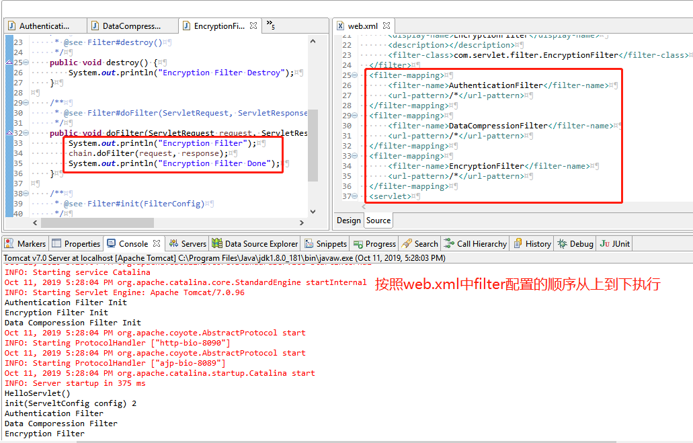

# Servlet

## 目录
* [Servlet简介](#Servlet简介)
* [Servlet环境配置](#Servlet环境配置)
* [Servlet生命周期](#Servlet生命周期)
* [Servlet表单处理](#Servlet表单处理)
* [Servlet过滤器](#Servlet过滤器)
* [Servlet监听器](#Servlet监听器)

## Servlet简介
Servlet是运行在Web服务器或应用服务器上的程序，是介于HTTP Client和数据库或者应用程序之间的中间层。从实现上来讲，Servlet只用来扩展基于HTTP协议的Web服务器。

## Servlet环境配置
Servlet不是Java平台标准版的组成部分，需要为编译器指定Servlet类的路径。
```
我的电脑-> 属性-> 高级-> 环境变量-> 更新CLASSPATH（apache-tomcat-xxx/common\lib\servlet-api.jar）
```

## Servlet生命周期
Servlet 生命周期可被定义为从创建直到毁灭的整个过程。以下是 Servlet 遵循的过程：
* Servlet 通过调用 init () 方法进行初始化。
* Servlet 调用 service() 方法来处理客户端的请求。Servlet容器处理由多个线程产生的多个请求，每个线程执行一个单一的Servlet实例的doService方法。
* Servlet 通过调用 destroy() 方法终止（结束）。
* 最后，Servlet 是由 JVM 的垃圾回收器进行垃圾回收的。

## Servlet表单处理
* doGet方法处理get请求，doPost方法处理post请求
* 读取表单数据
    * getParameter()
    * getParameterValues()
    * getParameterNames()
* 转发和重定向
    * request.getRequestDispatcher(".../xx.jsp").forwared(request, response);
    * response.sendRedirect("xxxx")

## Servlet过滤器
* 作用：可以实现用户在访问某个资源之前，对访问的请求和响应进行拦截


## Servlet监听器
* 作用：可以在事情发生的前后做一些必要的处理
* Listener的三大作用域request, session ServletContext
* Servlet八大监听器和与之对应的Event

<table>
  <tr><th align="left">Listener接口</th><th align="left">Event类</th></tr>
  <tr><td>ServletContextListener</td><td>ServletContextEvent</td></tr>
  <tr><td>ServletContextAttributeListener</td><td>ServletContextAttributeEvent</td></tr>
  <tr><td>HttpSessionListener</td><td rowspan="2">HttpSessionEvent</td></tr>
  <tr><td>HttpSessionActivationListener</td></tr>
  <tr><td>HttpSessionAttributeListener</td><td rowspan="2">HttpSessionBindingEvent</td></tr>
  <tr><td>HttpSessionBindingListener</td></tr>
  <tr><td>ServletRequestListener</td><td>ServletRequestEvent</td></tr>
  <tr><td>ServletRequestAttributeListener</td><td>ServletRequestAttributeEvent</td></tr>
</table>

`eg`
```java
public class MySessionListener implements HttpSessionListener {

	public void sessionCreated(HttpSessionEvent se) {
		HttpSession hs=se.getSession();
		System.out.println(hs.getId());
	}

	public void sessionDestroyed(HttpSessionEvent se) {
		System.out.println("Session Destoryed");
	}
}
```