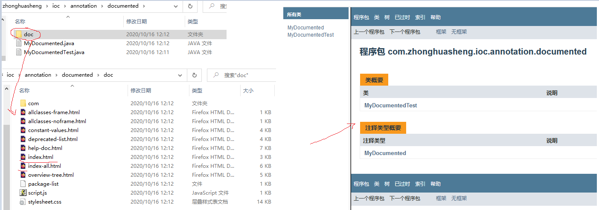

### 相关问题
* 为什么要引入注解
* 元注解有哪些
* Spring常用的注解有哪些
* SpringBoot常用注解有哪些
* SpringCloud常用注解有哪些

#### 为什么要引入注解
注解是JDK1.5引入的功能。注解可以看作是对类和方法的扩展标识，这些标识可以在编译，类加载，运行时被读取，并执行相应的处理。在注解之前，我们只能通过xml配置的方式来做。由于XML的配置诸多不便，并且配置和代码分离，不便于代码阅读，慢慢的注解就替代了xml配置的方式。

#### 元注解有哪些

元注解是负责对其它注解进行说明的注解，自定义注解时可以使用元注解。Java 5 定义了 4 个注解，分别是 @Documented、@Target、@Retention 和 @Inherited。Java 8 又增加了 @Repeatable 和 @Native 两个注解
* `@Documented`

@Documented 是一个标记注解，没有成员变量。用 @Documented 注解修饰的注解类会被 JavaDoc 工具提取成文档。默认情况下，JavaDoc 是不包括注解的，但如果声明注解时指定了 @Documented，就会被 JavaDoc 之类的工具处理，所以注解类型信息就会被包括在生成的帮助文档中。使用`javadoc -d doc MyAnnotation.java XXXX.java`就生成了javadoc了
```java
@Documented
@Target({ ElementType.TYPE, ElementType.METHOD })
public @interface MyDocumented {
    public String value() default "这是@Documented注解";
}
// Target为什么要加个ElementType.TYPE，是因为生成javadoc的时候你得知道是哪个类啊
@MyDocumented
public class DocumentedTest {
    /**
        * 测试document
        */
    @MyDocumented
    public String Test() {
        return "C语言中文网Java教程";
    }
}

javac MyDocumented.java DocumentedTest.java
javadoc -d doc MyDocumented.java DocumentedTest.java
```


* `@Target`

@Target 注解用来指定一个注解的使用范围，即被 @Target 修饰的注解可以用在什么地方。@Target 注解有一个成员变量（value）用来设置适用目标，value 是 java.lang.annotation.ElementType 枚举类型的数组，下表为 ElementType 常用的枚举常量:
```
PACKAGE 用于包
TYPE 用于类、接口（包括注解类型）或enum声明
CONSTRUCTOR 用于构造方法
METHOD 用于方法
FIELD 用于成员变量（包括枚举常量）
LOCAL_VARIABLE 用于局部变量
PARAMETER 用于类型参数（JDK1.8新增）
```

* `@Retention`

@Retention用于描述注解的生命周期，也就是该注解被保留的时间长短。@Rentention注解中的成员变量value用来设置保留策略，value是java.lang.annotation.RententionPolicy枚举类型，RententionPolicy有3个枚举常量：
```
SOURCE 在源文件中有效，当Java文件编译成class文件的时候，注解被遗弃
CLASS 在class文件中有效， 但jvm加载class文件时被遗弃，这是默认的生命周期
RUNTIME 在运行时有效，注解不仅被保存到class文件中，jvm加载class文件之后，仍然存在
这3个生命周期分别对应于：Java源文件 -> .class文件 -> 内存中的字节码
```

* `@Inherited`

@Inherited是一个标记注解，用来指定该注解可以被继承。使用@Inherited注解的Class类，表示这个注解可以被用于该Class类的子类。

* `@Repeatable`

@Repeatable注解是Java8新增的，解决了在方法，变量或者类上重复使用注解的问题
```java
@Target(ElementType.METHOD)
@Retention(RetentionPolicy.RUNTIME)
public @interface Values {
    Value[] value();
}

@Target(ElementType.METHOD)
@Retention(RetentionPolicy.RUNTIME)
@Repeatable(Values.class)
public @interface Value {
    String value() default "value";
}

public class AnnotationClass {

    @Value("hello") // 这里通过反射获取方法的注解class是Values，而不是Value
    @Value("world")
    public void test(String var1, String var2) {
        System.out.println(var1 + " " + var2);
    }
}
```

* `@Native`

使用@Native注解修饰的成员变量，便是可以被本地代码引用

#### Spring常用的注解有哪些

* 声明bean的注解
    * @Component 组件，没有明确的角色。作用及范围：把对象加载到spring容器中，最基础的存在，很多的注解都是继承它的，只有一个属性值，默认值是“
    * @Controller 在展示层使用，控制器的声明。作用及范围：作用在控制器上的注解，与Service一样，业务领域区分。可以返回string跳转jsp,ftl,html等模板页面，也可以返回实体对象
    * @RestController 在展示层使用，返回的是JSON格式的数据。等同于@Controller + @ResponseBody
    * @Service 在业务逻辑层使用。作用及范围：一般用于service层的注解，继承了Component组件，本质上一样，方便做业务范围区分而已。
    * @Repository 在数据访问层使用。作用及范围：作用于dao层的注解，很多经常用JPA的同学都清楚这个东西，与Service本质上一样，业务领域上区别而已
    ```
    @Repository(value="userDao")注解是告诉Spring，让Spring创建一个名字叫“userDao”的UserDaoImpl实例。当Service需要使用Spring创建的名字叫“userDao”的UserDaoImpl实例时，就可以使用@Resource(name = "userDao")注解告诉Spring，Spring把创建好的userDao注入给Service即可。
    ```
* 注入bean的注解
    * @Autowired 作用及范围：它可以对类成员变量、方法及构造函数进行标注，完成自动装配的工作，其实就是获取容器中的对象。通过@Autowired的使用来消除set,get方法。
    ```
    注意事项：
    在使用@Autowired时，首先在容器中查询对应类型的bean
    如果查询结果刚好为一个，就将该bean装配给@Autowired指定的数据
    如果查询的结果不止一个，那么@Autowired会根据名称来查找。
    如果查询的结果为空，那么会抛出异常。解决方法时，使用required=false
    ```
    * @Resource 由JSR-250提供，根据名称进行自动装配的，一般会指定一个name属性，可以作用在变量、setter方法上。
    * @Inject 由JSR-330提供需要导入javax.inject.Inject;实现注入，根据类型byType进行自动装配的，如果需要按名称进行装配，则需要配合@Named，可以作用在变量、setter方法、构造函数上。很少用。
* java配置类相关注解
    * @Configuration 声明当前类为配置类，相当于xml形式的Spring配置。用于定义配置类，可替换xml配置文件，被注解的类内部包含有一个或多个被@Bean注解的方法
    * @Bean 注解在方法上，声明当前方法的返回值为一个bean, 替代xml的方式。@Bean：Spring的@Bean注解用于告诉方法，产生一个Bean对象，然后这个Bean对象交给Spring管理。产生这个Bean对象的方法Spring只会调用一次，随后这个Spring将会将这个Bean对象放在自己的IOC容器中。SpringIOC 容器管理一个或者多个bean，这些bean都需要在@Configuration注解下进行创建，在一个方法上使用@Bean注解就表明这个方法需要交给Spring进行管理。
    ```
    @Configuration
    public class AppConfig {
        // 未指定bean 的名称，默认采用的是 "方法名" + "首字母小写"的配置方式
        @Bean
        public MyBean myBean(){
            return new MyBean();
        }
    }

    public class MyBean {

        public MyBean(){
            System.out.println("MyBean Initializing");
        }
    }
    ```
        * @Scope注解设置Spring容器如何新建Bean实例
            * Singleton 默认模式，单例，一个Spring容器中只有一个bean实例
            * Protetype 每次调用新建一个bean
            * Request（web项目中，给每个http request新建一个bean）
            * Session（web项目中，给每个http session新建一个bean）
            * GlobalSession（给每个global http session新建一个bean实例）
        * @PostConstruct由JSR-250提供，在构造函数执行完之后执行，等价于xml中bean配置的的initMethod
        * @PreDestory由JSR-250提供，在Bean销毁之前执行，等价于xml中bean配置的destroyMethod
     * @ComponentScan用于对Component进行扫描，替代xml的方式。作用及范围：扫描当前类下面的所有对象，为什么说Component是最基础的东西，就是要给这个注解扫描，非常巧妙的设计，可以扫描多个包。
    * @WishlyConfiguration为@Configuration与@ComponentScan的组合注解，用的很少
* 切面（AOP）相关注解
    * @Aspect声明一个切面（类上），使用@After，@Before，@Around定义建言（advice），可直接将拦截规则（切点）作为参数。在java配置类中使用@EnableAspectJAutoProxy注解开启Spring对AspectJ代理的支持（类上）
        * @After在方法执行之后执行（方法上）
        * @Before在方法执行前执行（方法上）
        * @Around在方法执行之前与之后执行（方法上）
        * @PointCut声明切点
* 环境切换
    * @Profile通过设定Environment的ActiveProfiles来设定当前context需要使用的配置环境（类或者方法上）
    ```java
    @PropertySource("classpath:/user.properties")
    @Configuration
    public class MainConfigOfProfile implements EmbeddedValueResolverAware{

        @Profile("test")
        @Bean("testUser")
        public User testUser()  {
        User a =new User();
            return a;
        }

        @Profile("dev")
        @Bean("devUser")
        public User devUser()  {
        User a =new User();
            return a;
        }
    }
    ```
    * @Conditional使用此注解定义激活bean的条件，通过实现Condition接口，并重写matches方法，从而决定该bean是否被实例化（方法上）
    ```java
    @Configuration
    public class BeanConfig {

        //只有一个类时，大括号可以省略
        //如果WindowsCondition的实现方法返回true，则注入这个bean    
        @Conditional({WindowsCondition.class})
        @Bean(name = "bill")
        public Window window(){
            return new Window();
        }

        //如果LinuxCondition的实现方法返回true，则注入这个bean
        @Conditional({LinuxCondition.class})
        @Bean("linux")
        public Linex linux(){
            return new Linex();
        }
    }
    ```
* 配置注解
    * @Value注解
        ```java
        @Value("normal")
        private String normal; // 注入普通字符串

        @Value("#{systemProperties['os.name']}")
        private String systemPropertiesName; // 注入操作系统属性

        @Value("#{ T(java.lang.Math).random() * 100.0 }")
        private double randomNumber; //注入表达式结果

        @Value("#{beanInject.another}")
        private String fromAnotherBean; // 注入其他Bean属性：注入beanInject对象的属性another，类具体定义见下面

        @Value("classpath:com/hry/spring/configinject/config.txt")
        private Resource resourceFile; // 注入文件资源

        @Value("http://www.baidu.com")
        private Resource testUrl; // 注入URL资源
        ```
    * @PropertySource加载配置文件（类上）
    ```java
    @PropertySource(value = {"classpath:test.properties"})
    @Component
    @ConfigurationProperties(prefix = "test")
    public class Test {
        private Integer id;
        private String lastName;
    }
    ```

* 异步相关
    * @EnableAsync 配置在类上，开启对异步任务的支持
    * @Async在实际执行的bean方法使用该注解来申明其是一个异步任务（方法上或类上的所有方法都将异步，需要@EnableAsync开启异步任务）
* 定时任务
    * @EnableScheduling 配置在类上，开启计划任务的支持
    * @Scheduled声明这是一个任务，包括cron, fixDelay, fixRate等类型，用于方法上，需要先开启计划任务的支持
* Enable*注解
    * @EnableAspectJAutoProxy开启对AspectJ自动代理的支持
    * @EnableAsync开启异步方法的支持
    * @EnableScheduling开启计划任务的支持
    * @EnableWebMvc开启Web MVC的配置支持
    * @EnableConfigurationProperties开启对@ConfigurationProperties注解配置Bean的支持
    * @EnableJpaRepositories开启对SpringData JPA Repository的支持
    * @EnableTransactionmanagement开启注解式事务的支持
    * @EnableCaching开启注解式的缓存支持
* 持久层注解
    * @TableField(value="数据表字段", exist=true/false) 表示该属性为数据库表字段
    * @TableName：数据库表相关
    * @TableId：表主键标识
    * @JsonIgnore：作用是json序列化时将Java bean中的一些属性忽略掉,序列化和反序列化都受影响
    * @JsonProperty用于将参数中的字段转换为DTO的字段
    * @Transactional：声明式事务注解，注解在方法上
    ```
    Spring框架的事务基础架构代码将默认地 只 在抛出运行时和unchecked exceptions时才标识事务回滚。 也就是说，当抛出个RuntimeException 或其子类例的实例时。（Errors 也一样 - 默认地 - 标识事务回滚。）从事务方法中抛出的Checked exceptions将 不 被标识进行事务回滚。
    1 让checked例外也回滚：在整个方法前加上@Transactional(rollbackFor=Exception.class)
    2 让unchecked例外不回滚： @Transactional(notRollbackFor=RunTimeException.class)
    3 不需要事务管理的(只查询的)方法：@Transactional(propagation=Propagation.NOT_SUPPORTED)
    注意： 如果异常被try｛｝catch｛｝了，事务就不回滚了，如果想让事务回滚必须再往外抛try｛｝catch｛throw Exception｝。
    ```
* 其他注解
    * @CrossOrigin用于class和method上用来支持跨域请求
    * @ExceptionHandler用于方法级别，声明对Exception的处理逻辑
    * @ControllerAdvice全局异常处理，全局数据绑定，全局数据预处理
    ```java
    @ControllerAdvice
    public class MyGlobalExceptionHandler {
        @ExceptionHandler(Exception.class)
        public ModelAndView customException(Exception e) {
            ModelAndView mv = new ModelAndView();
            mv.addObject("message", e.getMessage());
            mv.setViewName("error");
            return mv;
        }
    }

    @ControllerAdvice
    public class MyGlobalExceptionHandler {
        @ModelAttribute(name = "md")
        public Map<String,Object> mydata() {
            HashMap<String, Object> map = new HashMap<>();
            map.put("gender", "女");
            return map;
        }
    }
    ```

#### 常用注解有哪些

* Hibernate Validator 参考文章 https://zhuanlan.zhihu.com/p/194097505
```
在程序开发中，经常要对数据进行校验后再进行业务处理。如果在业务代码中进行Bean的字段校验，会使得代码变的非常繁琐。JSR303 - Bean Validation[JSR Java Specification Requests]为JavaBean的验证定义了相关的元数据模型和API。
This JSR will define a meata-data model and API for JavaBeanTM validation, with overrides and extended meta-data through the use of XML validateion descriptors. 在Java8之后，又推出JSR380 - Bean Validation 2.0。
JSR是Java Specification Requests的缩写，意思是Java 规范提案。是指向JCP(Java Community Process)提出新增一个标准化技术规范的正式请求。任何人都可以提交JSR，以向Java平台增添新的API和服务。JSR已成为Java界的一个重要标准。
Hibernate Validator是Bean Validation的实现，Hibernate Validator内置了JSR303/JSR380中的所有的constraint[约束，限制]的实现，还额外定义了很多自定义的constraint。
```
* 导入依赖 spring-boot-starter-web中集成了Hibernate Validator工具，无需额外引用。
* maven依赖 hibernate-validator
* Bean Validation中内置的constraint
```
@Null 元素必须为null
@NotNull 元素不能为null
@NotBlank 元素不能为null且不能为空，用于string
@NotEmpty 元素不能为null且不能为空集合
@Length 元素字符串长度必须在指定的范围内 @Length(min=1, max = 20, message = "xxx")
@Negative  元素必须是负数
@NegativeOrZero 元素必须是负数或者0
@Positive 元素必须是正数
@PositiveOrZero 元素必须是正数或者0
@Size 元素集合大小在指定范围@Size(min = 1, max = 5, message = "")。支持字符串数组，Collection, Map, Array
@Min 元素最小整数值， value是long类型，可用于int long
@Max 元素最大整数值, value是long类型，可用于int long
@DecimalMin 元素是decimal类型，最小值
@DecimalMax 元素是decimal类型，最大值
@Digits 元素必须为一个指定格式的数字 @Digits(integer=, fraction=) integer指定整数精度，fraction指定小数精度。可用于Double, Intger, Decimal
    @Digits(integer=10, fraction=0)
    private Double double1 = 0.0;
@AssertFalse 元素必须为false
@AssertTrue 元素必须为true，可用于用户同意条款
@Email 元素必须是电子邮箱地址 @Email(regexp = "^[^@\s]+@[^@\s]+\.[^@\s]+$") 使用的是微软官方给出的电子邮箱校验正则表达式
@Pattern 元素必须符合正则表达式
@Past 元素必须是过去的日期 获取的是服务器时间 SystemClock(ZoneId.systemDefault()) <
@PastOrPresent 元素必须是过去的日期或者现在 <=
@Future 元素必须是将来的日期
@FutureOrPresent 元素必须是将来日期或者现在
@Range 元素必须在合适的范围内 @Range(min=, max, message)
@SafeHtml 判断字符串是否是安全的html Validate a rich text value provided by the user to ensure that it contains no malicious code, such as embedded <script> elements
@URL 判断string是否是url RegexpURLValidator中使用正则表达式判断
@CreditCardNumber 判断信用卡搁置
@CodePointLength
@UniqueElements Collection中是否有重复的object
@DurationMin 间隔的最小时间，可指定到day, hour minute...
@DurationMax 间隔的最大时间，可指定到day, hour minute...
```
* Hibernate的两种校验策略
    * 普通模式：会校验完所有的属性，然后返回所有的验证失败信息（默认）
    * 快速失败返回模式：有一个校验失败就返回
```java
@Configuration
public class ValidatorConfiguration {
    @Bean
    public Validator validator(){
        ValidatorFactory validatorFactory = Validation.byProvider( HibernateValidator.class )
                .configure()
                .addProperty( "hibernate.validator.fail_fast", "true" )
                .buildValidatorFactory();
        Validator validator = validatorFactory.getValidator();

        return validator;
    }
}
```
```java
@RequestMapping("/demo2")
public void demo2(@RequestBody @Valid DemoModel demo, BindingResult result){
    if(result.hasErrors()){
        for (ObjectError error : result.getAllErrors()) {
            System.out.println(error.getDefaultMessage());
        }
    }
}
```

* Spring
    * @NotEmpty 用在集合类上面 加了@NotEmpty的String类、Collection、Map、数组，是不能为null或者长度为0的(String Collection Map的isEmpty()方法)
    * @NotBlank只用于String,不能为null且trim()之后size>0
    * @NotNull:不能为null，但可以为empty,没有Size的约束
    * @Size(min = 1,max = 10,message = "姓名长度必须为1到10") 
      private String name;
    * @Past过去的时间
    * @Future 将来的时间
    * @ConditionalOnProperty(prefix="xxx", name={"yyy"}, havingValue="zzz") xxx为配置文件中的前缀，yyy为配置文件名字，havingVaue是与配置的值进行对比，返回true则配置类生效，反之失效
* SpringCloud
    * @SpringBootApplication是Sprnig Boot项目的核心注解,目的是开启自动配置
    * @EnableDiscoveryClient注解基于spring-cloud-common依赖，并且在classpath中实现
    * @EnableEurekaClient注解基于spring-cloud-netflix依赖，只能在eureka中使用
    * @EnableEurekaServer 把当前微服务标记为Eureka注册中心 接收其他微服务的注册
    * @LoadBalanced:　　该注解写在配置RestTemplate的配置类方法上来启动ribbon负载均衡
    * @EnableFeignClients:　　写在主程序上来支持feign
    * @HystrixCommand（fallbackMethod=“你的方法”）
    * @EnableCircuitBreaker :　　启用对Hystrix熔断机制的支持
    * @FeignClient(value="服务名",fallbackFactory=实现FallbackFactory的类.class):　　实现服务降级
    * @EnableHystrixDashboard: 　　加在主程序上启动服务监控
    * @FeignClient（value=“服务名”）:　　写在接口上 来调用远程服务
    * @EnableZuulProxy:　　写在主程序上启动zuul路由访问功能
* @Valid 用于参数中包含对象，对内部对象的校验
```
class A {
    @Valid  这样会校验b中的参数，级联校验
    B b;
}
```
* 返回值
    * @JsonIgnore 返回值过滤掉某个值
### 参考文章
* http://m.biancheng.net/view/7009.html