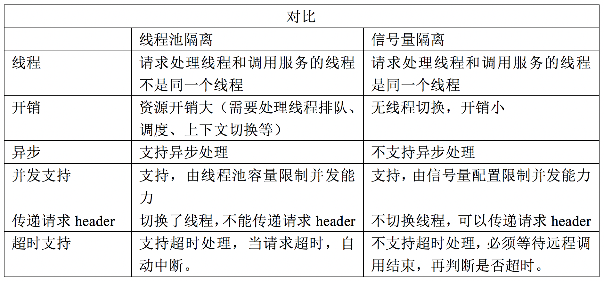

## 目录
* [要解决什么问题](#问题产生)
* [实现原理和基本特性](#实现原理和基本特性)
* [SpringCloud Hystrix是如何实现隔离、熔断、降级的？]()
* [熔断配置](#熔断配置)

## 问题产生
问题产生： 雪崩效应是一种因服务提供者的不可用导致服务调用者的不可用,并将不可用逐渐放大的过程

Hystrix是一个用于处理分布式系统的延迟和容错的开源库，在分布式系统中，服务间的调用不可避免会失败，比如超时、异常等。Hystrix能保证在一个依赖出问题的情况下，不会导致整体服务的失败，避免级联故障。Hystrix 熔断机制是如何保证的？当失败的情况达到预定的阈值（5秒失败20次）或达到一定的失败率，会打开断路器，拒绝所有请求，直到服务恢复正常为止。

## 实现原理和基本特性
Hystrix是Netflix开源的一个限流熔断的项目，主要有以下功能：
1. 隔离（`线程池隔离`和`信号量隔离`）: 限制调用分布式服务资源的使用，通过线程池隔离或者信号量隔离来保证当某一个服务请求响应异常的时候，不会影响其他服务。使用线程池隔离或信号量隔离的目的是将各依赖服务的访问交由独立的线程池来处理，会为每个依赖服务创建一个线程池，当自己的资源用完了，直接返回失败而不是占用别人的资源。
    ```
    > 线程池方式：
    优点：
    1. 使用线程池隔离可以完全隔离各个请求
    2. 线程可以被回收用来接收新的请求，并且不用新建线程，可以加快请求的速度
    3. 独立的线程池提高了并发性
    缺点：
    线程池隔离增加了系统资源如CPU的开销，每隔命令涉及到系统调度和上下文切换
    > 信号量方式：
    使用一个原子计数器来记录当前有多少线程在运行，当请求进来时先判断计数器的数值，若超过设置的最大线程池个数则拒绝该请求；若不超过则通行，计数器+1，请求返回成功后计数器-1。信号量模式下任务由当前线程直接处理，不涉及到线程切换，自然也就没有超时控制。TryableSemaphoreActual类中使用AtomicInteger（Unsafe.cas来保证）来计数
    ```

    
2. 熔断：熔断机制是应对雪崩效应的一种微服务链路保护机制，当微服务链路的某个服务出错不可用或者响应时间太长，会进行服务的降级，进而熔断该节点微服务的调用，快速返回错误的响应信息。当一定时间内，异常请求比例（请求超时、网络故障、服务异常等）达到阀值时，启动熔断器，熔断器一旦启动，则会停止调用具体服务逻辑，通过fallback快速返回托底数据，保证服务链的完整。
熔断有自动恢复机制，如：当熔断器启动后，每隔5秒，尝试将新的请求发送给服务提供者，如果服务可正常执行并返回结果，则熔断器半开，允许定量服务请求，如果调用都成功，则认为恢复了，关闭熔断器；如果仍旧调用失败，则继续返回托底数据，熔断器持续开启状态。熔断机制使用的是@HystrixCommand注解。
    ```
    熔断器是位于线程池之前的组件，用户请求某一服务之后，Hystrix会先经过熔断器，此时如果熔断器是打开，则说明已经熔断，直接进行降级处理；如果熔断器是关闭的状态，则会继续将请求发到对应的线程池。
    熔断器状态：
    1. closed： 熔断器关闭状态 - 所有请求返回成功
    2. open: 熔断器打开状态 - 调用次数累计达到阈值或者比例，熔断器打开，服务直接返回错误
    3. half open: 熔断器半开状态 - 默认时间过后，进入半熔断状态，允许定量服务请求，如果调用都成功，则认为恢复了，关闭熔断器；否则打开熔断器
    ```
3. 降级：服务降级，将服务的级别降低，原本的服务时返回一个业务的正确的结果，现在服务出现了问题，但是又得有个返回值，因此服务端会自己准备一个fallBack的回调，返回一个缺省值，这样总比直接挂掉要强。使用时在方法的注解@HystrixCommand(fallbackMethod=xxxMethod)
    ```
    可能出现服务降级的情况：
    1. 程序运行异常
    2. 服务超时
    3. 服务熔断触发服务降级
    4. 服务隔离中线程池或信号量跑满也会导致服务降级
    ```
4. 请求缓存：高并发场景下，通过请求缓存来减少服务器的压力。SpringClound Hystrix中有两种方式来实现，一种是重写HystrixCommand下的getCacheKey()方法，另外一种是使用注解。注解有三个
    * @CacheResult： 注解在方法上，表示该方法开启缓存，默认情况下方法的所有参数都作为缓存key
    * @CacheKey：注解在方法上，指定缓存的key
    * @CacheRemove：注解在方法上，该注解用来让请求的缓存失效，失效的缓存根据定义的key决定

## 熔断配置
* 全局配置
```
circuitBreaker.sleepWindowInMilliseconds：监控时间
circuitBreaker.requestVolumeThreshold：失败次数
circuitBreaker.errorThresholdPercentage：失败率
```
* 方法级别的配置
```java

@RestController
public class HiController {

    @GetMapping("/hystrix")
    @HystrixCommand(fallbackMethod = "fallbackMethod", commandProperties = {
        // 设置超时时间，默认1秒
        @HystrixProperty(name = "execution.isolation.thread.timeoutInMilliseconds", value = "1000"),
        // 监控时间，默认5秒
        @HystrixProperty(name = "circuitBreaker.sleepWindowInMilliseconds", value = "5000"),
        // 失败次数，默认20次
        @HystrixProperty(name = "circuitBreaker.requestVolumeThreshold", value = "20"),
        // 失败了，默认50%
        @HystrixProperty(name = "circuitBreaker.errorThresholdPercentage", value = "50")
    })
    public String sayHi() {
/*      // 1. 容错，此处逻辑抛出异常，会走熔断方法
        int i = 3 / 0;*/
        // 2. 响应超时熔断
        try {
            Thread.sleep(2000);
        } catch (InterruptedException e) {

        }
        return "hi";
    }

    /**
     * 熔断方法
     * @return String
     */
    private String fallbackMethod() {
        return "熔断了";
    }
}
```
