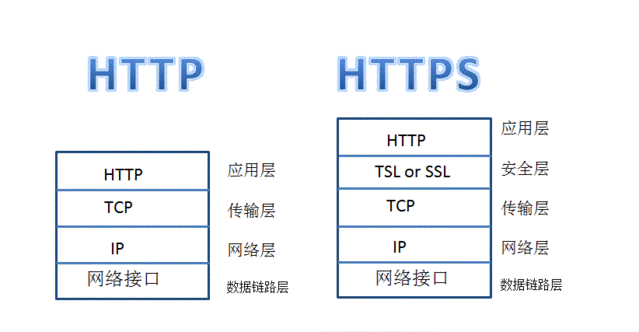
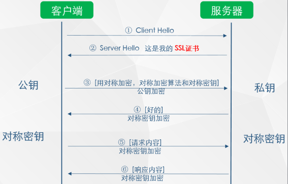

### HTTP是什么，为什么需要HTTPS
HTTP中文命名为超文本传输协议是客户端和服务器必须以能够进行通信实现基本通信协议，它涵盖了诸如请求和响应，会话，缓存，身份验证等内容。HTTP协议以明文形式在浏览器和服务器之间传输信息，允许信息通过的网络查看传输的信息。互联网已经深入到每个人的日常生活，社交通讯、工作办公、休闲购物、娱乐游戏、投资理财，繁华的背后，也存在着一些网络诈骗、网络谣言、网络虚假信息等违法行为，已经严重影响互联网经济的正常发展，让人们在依赖互联网的同时，质疑互联网安全，畏惧互联网交易。解决互联网安全问题就需要对传输的信息进行加密处理，因此就有了SSL（Secure Socket Layer安全套接字层）

HTTP+加密+认证+完整性保护=HTTPS
HTTPS不是应用层的一种新协议，只是HTTP通信接口部分用SSL和TLS协议代替而已。

### HTTPS提供了什么
* 安全。HTTPS能有效防止中间人攻击
    针对SSL的中间人攻击方式主要有两类，分别是SSL劫持攻击和SSL剥离攻击

    * SSL劫持攻击
    SSL劫持攻击即SSL证书欺骗攻击，攻击者为了获得HTTPS传输的明文数据，需要先将自己接入到客户端和目标网站之间；在传输过程中伪造服务器的证书，将服务器的公钥替换成自己的公钥，这样，中间人就可以得到明文传输带Key1、Key2和Pre-Master-Key，从而窃取客户端和服务端的通信数据；

    但是对于客户端来说，如果中间人伪造了证书，在校验证书过程中会提示证书错误，由用户选择继续操作还是返回，由于大多数用户的安全意识不强，会选择继续操作，此时，中间人就可以获取浏览器和服务器之间的通信数据

    * SSL剥离攻击
    这种攻击方式也需要将攻击者设置为中间人，之后见HTTPS范文替换为HTTP返回给浏览器，而中间人和服务器之间仍然保持HTTPS服务器。由于HTTP是明文传输的，所以中间人可以获取客户端和服务器传输数据
* 防止流量劫持。针对 http 插入广告，甚至针对 http 强制跳转到其他网页，并且已经可以控制哪些时间段跳转，每个设备跳转几次，以增强隐蔽性。
* 信任。在 chrome 68 以上的浏览器中，http 已经被标注为不安全，如果用户浏览网站时有这样的提示，会对网站产生不好的影响。

* HTTPS访问过程

    HTTPS在进行数据传输之前会与网站服务器和Web浏览器进行一次握手，在握手时确定双方的加密密码信息。
    1. Web 浏览器将支持的加密信息发送给网站服务器；

    2. 网站服务器会选择出一套加密算法和哈希算法，将验证身份的信息以证书（证书发布CA机构、证书有效期、公钥、证书所有者、签名等）的形式发送给Web浏览器；

    3. 当 Web 浏览器收到证书之后首先需要验证证书的合法性，如果证书受到浏览器信任则在浏览器地址栏会有标志显示，否则就会显示不受信的标识。当证书受信之后，Web 浏览器会随机生成一串密码，并使用证书中的公钥加密。之后就是使用约定好的哈希算法握手消息，并生成随机数对消息进行加密，再将之前生成的信息发送给网站；

    4. 当网站服务器接收到浏览器发送过来的数据后，会使用网站本身的私钥将信息解密确定密码，然后通过密码解密Web浏览器发送过来的握手信息，并验证哈希是否与Web浏览器一致。然后服务器会使用密码加密新的握手信息，发送给浏览器；

    5. 最后浏览器解密并计算经过哈希算法加密的握手消息，如果与服务发送过来的哈希一致，则此握手过程结束后，服务器与浏览器会使用之前浏览器生成的随机密码和对称加密算法进行加密交换数据。

    

### HSTS(强制客户端使用HTTPS)
HSTS在用户访问时无需手动在地址栏输入HTTPS，浏览器会自动采用HTTPS进行访问，避免请求被劫持。
从 HTTP 到 HTTPS 再到 HSTS，网站的安全系数一直在上升，防止 DNS 劫持、数据泄密的力度也再加大