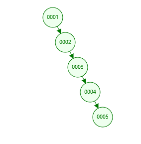
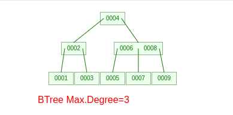

### 索引是什么
索引底层是`数据结构`，是一种`排好序`的数据结构，帮助MySQL高效获取数据。

> 索引的优缺点

* 优势：可以快速检索，减少I/O次数，加快检索速度；根据索引分组和排序，可以加快分组和排序；
* 劣势：索引本身也是表，因此会占用存储空间，一般来说，索引表占用的空间的数据表的1.5倍；索引表的维护和创建需要时间成本，这个成本随着数据量增大而增大；构建索引会降低数据表的修改操作（删除，添加，修改）的效率，因为在修改数据表的同时还需要修改索引表；

### 索引的底层数据结构
常见的索引的存储的数据结构有如下几种
* 二叉树
* 红黑树
* B+树
* 哈希

目前数据库索引中索引的存储类型使用的最多的是哈希和B+树，我们一一来分析这几种数据结构。可在https://www.cs.usfca.edu/~galles/visualization/Algorithms.html 网站上查看这几种类型的数据结构演示示例。
* 二叉树：二叉树的特点就是左叶子节点的值小于其父节点，右叶子节点的值大于其父节点，其查找方式是二分查找。在一些业务场景中使用二叉树作为索引的存储结构会导致`单边失衡`的情况，并且树的深度无法控制。举个例子，我们经常会设计一个表的主键是自增的整数，那么如果使用二叉树，下一行记录的主键永远比上一行的大，映射到二叉树上，就会造成所有的叶子节点都在右边，数据量大了的话，就会影响到查询的效率。

    
* 红黑树：Read Black Tree，是一种自平衡的二叉树，能够解决二叉树中单边失衡的问题，但是红黑树没有解决掉树深度的问题，如果树的深度很深的话，查询的效率依然不是很高。

    
* B+树：B是指Balance，不是Binary的意思，B+树是B树的一个变种，叫平衡搜索多叉树，总结来说相对于B树查询速度更快更稳定，我们这里就不做讨论。所有的记录节点都是按键值大小顺序存放在同一层的叶节点中，叶节点间用指针相连，构成双向循环链表，非叶节点（根节点、枝节点）只存放键值，不存放实际数据，非叶子节点只是起到了索引的作用，所有的查询最终都会落到叶子节点。B+树索引减少了树的深度，可以控制深度，同时也增加了索引存储的容量。

    
* Hash：数据库对hash索引的列做hash计算，将哈希码存储在索引中，同时在哈希表中保存指向每一个数据行的指针，计算机中hash查找是基于内存地址的查找方法，将内存地址与数据值之间建立联系，因此在精准查询时速率很快，但是hash索引在范围查找时效率就很差了。例如在一些政府项目中，对公民的身份证号码建立索引的时候，就可以采用这种hash索引，具体设计时可以将身份证倒序，然后使用前缀索引，匹配前9个字符效率就很高了。

### 索引的分类
* **普通索引(INDEX)**：最基本的索引，没有任何限制。`ALTER TABLE 'user' ADD INDEX index_name('col')`
* **唯一索引(UNIQUE)**：与"普通索引"类似，不同的就是：索引列的值必须唯一，但允许有空值。`ALTER TABLE 'user' ADD UNIQUE index_name('col')`
* **主键索引(PRIMARY)**：它 是一种特殊的唯一索引，不允许有空值。`ALTER TABLE 'user' ADD PRIMARY KEY pk_index('col')`
* **全文索引(FULLTEXT )**：仅可用于 MyISAM 表， 用于在一篇文章中，检索文本信息的, 针对较大的数据，生成全文索引很耗时好空间。nnoDB 1.2.x版本开始支持全文检索。`ALTER TABLE 'user' ADD FULLTEXT INDEX ft_index('col')`
* **组合索引**：为了更多的提高mysql效率可建立组合索引，遵循”最左前缀“原则。`ALTER TABLE 'user' ADD INDEX index_name('col1', 'col2', 'col3s')`

### 聚集索引与非聚集索引
聚集（clustered）索引，也叫聚簇索引。定义：数据行的物理顺序与列值（一般是主键的那一列）的逻辑顺序相同，一个表中只能拥有一个聚集索引。
非聚集（unclustered）索引。定义：该索引中索引的逻辑顺序与磁盘上行的物理存储顺序不同，一个表中可以拥有多个非聚集索引。

FULLTEXT（全文）索引，仅可用于MyISAM和InnoDB，针对较大的数据，生成全文索引非常的消耗时间和空间。对于文本的大对象，或者较大的CHAR类型的数据，如果使用普通索引，那么匹配文本前几个字符还是可行的，但是想要匹配文本中间的几个单词，那么就要使用LIKE %word%来匹配，这样需要很长的时间来处理，响应时间会大大增加，这种情况，就可使用时FULLTEXT索引了，在生成FULLTEXT索引时，会为文本生成一份单词的清单，在索引时及根据这个单词的清单来索引
全文索引的查询也有自己特殊的语法，而不能使用LIKE %查询字符串%的模糊查询语法：
`SELECT * FROM table_name MATCH(ft_index) AGAINST('查询字符串');`
* 对于较大的数据集，把数据添加到一个没有FULLTEXT索引的表，然后添加FULLTEXT索引的速度比把数据添加到一个已经有FULLTEXT索引的表快。
* 5.6版本前的MySQL自带的全文索引只能用于MyISAM存储引擎，如果是其它数据引擎，那么全文索引不会生效。5.6版本之后InnoDB存储引擎开始支持全文索引
* 在MySQL中，全文索引支队英文有用，目前对中文还不支持。5.7版本之后通过使用ngram插件开始支持中文。

### 索引的高度
聚集索引的高度决定了根据主键取数据的理论IO次数。根据非聚集索引读取数据的理论IO次数还要加上访问聚集索引的IO次数总和。实际上可能要不了这么多IO。因为索引的分支节点所在的Page因为多次读取会在mysql内存里cache住。

### 操作系统和MySQL页的大小
* 操作系统页大小: getconf PAGESIZE，看了一下linux X86系列的是4096B=4KB
* MySQL InnoDB页大小： show variables like 'innodb_page_size'; 16384B=16KB，是内存页的整数倍

### MySQL索引查询的原理
举个例子

上图是一个BTREE的结构图，简单分析下查询原理。如图所示，如以查询45的数据项为例，`第一次IO是把最上面的第一块磁盘块加载到内存缓冲区`，在内存中通过二分查找法确定45在30和60之间，所以把磁盘块锁定到当前磁盘块的P2指针，然后通过P2指针的磁盘地址把第二块磁盘加载到内容，这样发生第二次IO，再一次的二分查找确定45在40到50之间，所以通过第二块磁盘的P2指针对应的磁盘地址进行第三次IO，加载第三块磁盘到内存中，最后在内存中通过二分查找找到45，由于在内存中的速度非常快，所以耗时可以忽略不计，到此为止，本次查询结束，共进行了三次磁盘IO。在真实的存储过程中，三层的BTREE可以表示上百万的数据，这样也就说明如果有上百万的数据，不使用索引，将会进行百万次的IO，但是使用索引只需要三次就可以，性能将有很大的提升。

这里有个注意点，就是作为索引的字段越小，每个磁盘块将存储的索引越多，也就是说如果数据量一定的条件下，索引字段越小，可能数的深度越小，查询效率越高，如果树只有一层的时候将成为线性表。
### 索引的最佳实践
#### 什么时候要使用索引？
1. 主键自动建立唯一索引；
2. 经常作为查询条件在WHERE或者ORDER BY 语句中出现的列要建立索引；
3. 作为排序的列要建立索引；
4. 查询中与其他表关联的字段，外键关系建立索引
5. 高并发条件下倾向组合索引；
6. 用于聚合函数的列可以建立索引，例如使用了max(column_1)或者count(column_1)时的column_1就需要建立索引

#### 什么时候不要使用索引？
1. 经常增删改的列不要建立索引；
2. 有大量重复的列不建立索引；
3. 表记录太少不要建立索引。只有当数据库里已经有了足够多的测试数据时，它的性能测试结果才有实际参考价值。如果在测试数据库里只有几百条数据记录，它们往往在执行完第一条查询命令之后就被全部加载到内存里，这将使后续的查询命令都执行得非常快--不管有没有使用索引。只有当数据库里的记录超过了1000条、数据总量也超过了MySQL服务器上的内存总量时，数据库的性能测试结果才有意义。
4. 如果一个表中没有显示的指定索引，MySQL会默认选取第一个不允许为NULL的唯一索引，如果还没有则使用InnoDB内置的ROWID作为索引。

#### 索引失效的情况：
1. 在组合索引中不能有列的值为NULL，如果有，那么这一列对组合索引就是无效的。
2. 在一个SELECT语句中，索引只能使用一次，如果在WHERE中使用了，那么在ORDER BY中就不要用了。
3. LIKE操作中，'%aaa%'不会使用索引，也就是索引会失效，但是‘aaa%’可以使用索引。
4. 在索引的列上使用表达式或者函数会使索引失效，例如：select * from users where YEAR(adddate)<2007，将在每个行上进行运算，这将导致索引失效而进行全表扫描，因此我们可以改成：select * from users where adddate<’2007-01-01′。其它通配符同样，也就是说，在查询条件中使用正则表达式时，只有在搜索模板的第一个字符不是通配符的情况下才能使用索引。
5. 在查询条件中使用不等于，包括<符号、>符号和！=会导致索引失效。特别的是如果对主键索引使用！=则不会使索引失效，如果对主键索引或者整数类型的索引使用<符号或者>符号不会使索引失效。（经erwkjrfhjwkdb同学提醒，不等于，包括&lt;符号、>符号和！，如果占总记录的比例很小的话，也不会失效）
6. 在查询条件中使用IS NULL或者IS NOT NULL会导致索引失效。
7. 字符串不加单引号会导致索引失效。更准确的说是类型不一致会导致失效，比如字段email是字符串类型的，使用WHERE email=99999 则会导致失败，应该改为WHERE email='99999'。
8. 在查询条件中使用OR连接多个条件会导致索引失效，除非OR链接的每个条件都加上索引，这时应该改为两次查询，然后用UNION ALL连接起来。
9. 如果排序的字段使用了索引，那么select的字段也要是索引字段，否则索引失效。特别的是如果排序的是主键索引则select * 也不会导致索引失效。
10. 尽量不要包括多列排序，如果一定要，最好为这队列构建组合索引；

#### 索引的创建
1. 尽量扩展索引，不要新建索引，因为索引过多会导致写入速度变慢。
2. 建有索引的列别参与计算，因为BTREE中存的都是表中的字段值，如果需要先计算再比较的话成本还是比较大的。
#### 索引的使用
1. 最左匹配原则
这个原则非常重要，我们建立索引的时候根据业务场景建立合适的索引。mysql索引匹配会从左向右一直匹配直到遇到范围查询才停止，比如id=1 and phone=15652635684 and time>1562565855，如果建立索引的顺序为（id,phone,time）则time用不到索引，但是如果顺序为（id,time,phone）则都可以用到。索引的最左前缀和和B+Tree中的“最左前缀原理”有关，举例来说就是如果设置了组合索引<col1,col2,col3>那么以下3中情况可以使用索引：col1，<col1,col2>，<col1,col2,col3>，其它的列，比如<col2,col3>，<col1,col3>，col2，col3等等都是不能使用索引的。
2. =和in查询中可以乱序，不需要考虑最左匹配原则，mysql的查询优化器会进行自动优化
3. 使用短索引。索引字段尽量选择区分度高的字段，因为重复值越多，扫描的记录数就越多，比如性别类型为0和1，这种的重复就很高，不建议这种类型加索引，因为加了也没有多大提高。例如在一些政府项目中，对公民的身份证号码建立索引的时候，就可以采用这种hash索引，具体设计时可以将身份证倒序，然后使用前缀索引，匹配前9个字符效率就很高了。对串列进行索引，如果可能应该指定一个前缀长度。例如，如果有一个CHAR(255)的 列，如果在前10 个或20 个字符内，多数值是惟一的，那么就不要对整个列进行索引。短索引不仅可以提高查询速度而且可以节省磁盘空间和I/O操作。

### B树与B+树的区别
1. B树每个节点都存储数据，所有节点组成这棵树。B+树只有叶子节点存储数据（B+数中有两个头指针：一个指向根节点，另一个指向关键字最小的叶节点），叶子节点包含了这棵树的所有数据，所有的叶子结点使用链表相连，便于区间查找和遍历，所有非叶节点起到索引作用。
2. B树中叶节点包含的关键字和其他节点包含的关键字是不重复的，B+树的索引项只包含对应子树的最大关键字和指向该子树的指针，不含有该关键字对应记录的存储地址。
3. B树中每个节点（非根节点）关键字个数的范围为[m/2(向上取整)-1,m-1](根节点为[1,m-1])，并且具有n个关键字的节点包含（n+1）棵子树。B+树中每个节点（非根节点）关键字个数的范围为[m/2(向上取整),m](根节点为[1,m])，具有n个关键字的节点包含（n）棵子树。
4. B+树中查找，无论查找是否成功，每次都是一条从根节点到叶节点的路径。

