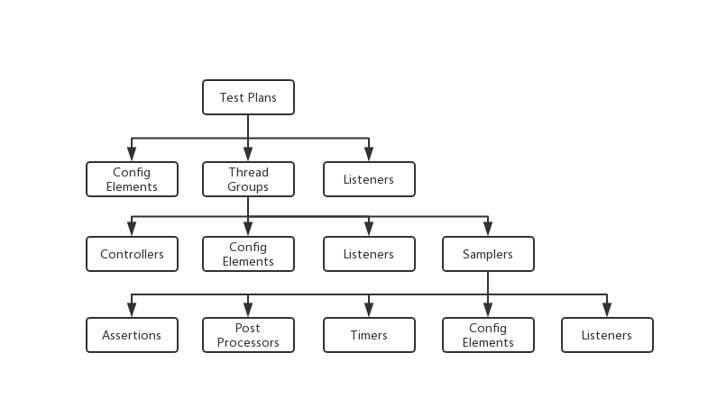

# JMeter笔记

## JMeter特性
* 开源
* 友好的GUI，测试结果方便查看
* 支持各种测试方法、多种协议：Web（HTTP/HTTPS/SOAP）、数据库（JDBC/LDAP）、Mail（POP3）
* 支持远程分布式测试

## JMeter测试组件及关系

* 测试计划(Test Plan)
    * 测试计划包含的所有内容都按照从上到下的顺序执行，或者按照测试计划中定义的顺序执行。测试计划以.jmx扩展文件的形式保存。
* 线程组(Thread Group)
    * 一个测试计划中至少包含一个测试的线程组
    * 线程组是测试的起点
    * 线程中可以设置线程数、加速时间（Ramp-up：在n秒内启动这些线程）、执行测试的次数
* 控制器(Controllers)
    * 分为两大类：采集器和控制器
    * 采集器：Samplers in JMeter allows JMeter to send different types of requests to a server. Samplers are the actual requests, JMeter sends to the web server under test. Each sampler (except Test Action) generates one or more sample results.
        * JMeter中采集器服务的请求列表：FTP/HTTP/JDBC/Java/JMS/JUnit/LDAP/Mail/TCP
    * 逻辑控制器：逻辑控制器可以控制线程中采集器处理顺序的流程
        * 逻辑控制器列表：IF控制器/while控制器/Switch控制器/ForEach控制器...
* 监听器(Listeners)
    * A listener is a component that shows the results of the samples. The results can be shown in a tree, tables, graphs or simply written to a log file.
* 计时器(Timers)
    * 在网站或应用程序上执行任何操作时，它们自然会有暂停和延迟。 这些可以使用计时器(Timers)进行模拟。JMeter发送请求时不会在每个采样器/请求之间应用延迟。 如果在服务器上执行负载/压力测试没有指定延迟，它将会超载。 这可能不完全是我们想要的。可以添加一个计时器元素，该元素允许您定义在每个请求到达时间等待的终止。
* 配置元素(Configuratin Elements)
    * Config elements in JMeter are used to configure or modify the sampler requests made to the server. These elements are added at the same or higher level of the samplers that we want to configure.
* 预处理器元素(Pre-Processor Elements)
    * 预处理器元素用于在采集器发出请求之前修改样本请求的设置，或更新未从响应文本中提取的变量。
* 后处理器元素(Post-Processor Elements)
    * 后处理器最常用于处理响应数据

## JMeter函数
JMeter函数可以称为特殊值，可以填充测试树中任何Sampler或其他元素的字段。

例如：${__time(dd MM YYYY HH mm ss)}

## JMeter常用测试计划

### JMeter数据库测试计划
可用于数据库的性能测试。
1. 添加一个测试计划，然后添加一个Thread Group
2. 在Thread Group中，添加一个JDBC Request的Sampler和JDBC Connection Configuration的配置器
3. 将响应的JDBC jar放到jmeter lib下
4.  填写相关的sql，数据库信息等

### JMeter Web测试计划
可用于测试页面的响应时间。
1. 添加一个测试计划，然后添加一个Thread Group
2. 在Thread Group中，添加一个HTTP Request的Sampler和View Result Tree的Listener
3. 在HTTP Request中填写相关信息

### JMeter FTP测试
参考https://www.yiibai.com/jmeter/jmeter-ftp-test-plan.html

### JMeter测试Message Queue
JMeter可以测试消息队列的吞吐量，也可以单独测试subscriber/publisher的性能

### JMeter分布式测试