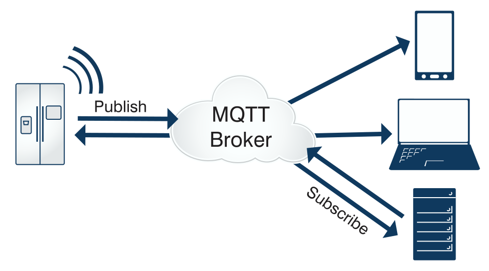

### 学习思路
1. 什么是MQTT？使用场景
2. 常用的开源产品有哪些？
3. JAVA集成MQTT

* MQTT 介绍
> 简述
MQTT（Message Queuing Telemetry Transport，消息队列遥测传输协议），是一种基于发布/订阅（publish/subscribe）模式的"轻量级"通讯协议，该协议构建于TCP/IP协议上，由IBM在1999年发布。MQTT最大优点在于，可以以极少的代码和有限的带宽，为连接远程设备提供实时可靠的消息服务。作为一种低开销、低带宽占用的即时通讯协议，使其在物联网、小型设备、移动应用等方面有较广泛的应用。

MQTT是一个基于客户端-服务器的消息发布/订阅传输协议。MQTT协议是轻量、简单、开放和易于实现的，这些特点使它适用范围非常广泛。在很多情况下，包括受限的环境中，如：机器与机器（M2M）通信和物联网（IoT）。其在，通过卫星链路通信传感器、偶尔拨号的医疗设备、智能家居、及一些小型化设备中已广泛使用。

> 设计规范

由于物联网的环境是非常特别的，所以MQTT遵循以下设计原则：
1. 精简，不添加可有可无的功能；
2. 发布/订阅（Pub/Sub）模式，方便消息在传感器之间传递；
3. 允许用户动态创建主题，零运维成本；
4. 把传输量降到最低以提高传输效率；
5. 把低带宽、高延迟、不稳定的网络等因素考虑在内；
6. 支持连续的会话控制；
7. 理解客户端计算能力可能很低；
8. 提供服务质量管理；
9. 假设数据不可知，不强求传输数据的类型与格式，保持灵活性。

> 主要特性

MQTT协议工作在低带宽、不可靠的网络的远程传感器和控制设备通讯而设计的协议，它具有以下主要的几项特性：
1. 使用发布/订阅消息模式，提供一对多的消息发布，解除应用程序耦合。
这一点很类似于XMPP，但是MQTT的信息冗余远小于XMPP，,因为XMPP使用XML格式文本来传递数据。
2. 对负载内容屏蔽的消息传输。
3. 使用TCP/IP提供网络连接。
主流的MQTT是基于TCP连接进行数据推送的，但是同样有基于UDP的版本，叫做MQTT-SN。这两种版本由于基于不同的连接方式，优缺点自然也就各有不同了。
4. 有三种消息发布服务质量：
"至多一次"，消息发布完全依赖底层TCP/IP网络。会发生消息丢失或重复。这一级别可用于如下情况，环境传感器数据，丢失一次读记录无所谓，因为不久后还会有第二次发送。这一种方式主要普通APP的推送，倘若你的智能设备在消息推送时未联网，推送过去没收到，再次联网也就收不到了。
"至少一次"，确保消息到达，但消息重复可能会发生。
"只有一次"，确保消息到达一次。在一些要求比较严格的计费系统中，可以使用此级别。在计费系统中，消息重复或丢失会导致不正确的结果。这种最高质量的消息发布服务还可以用于即时通讯类的APP的推送，确保用户收到且只会收到一次。
5. 小型传输，开销很小（固定长度的头部是2字节），协议交换最小化，以降低网络流量。
这就是为什么在介绍里说它非常适合"在物联网领域，传感器与服务器的通信，信息的收集"，要知道嵌入式设备的运算能力和带宽都相对薄弱，使用这种协议来传递消息再适合不过了。
6. 使用Last Will和Testament特性通知有关各方客户端异常中断的机制。
Last Will：即遗言机制，用于通知同一主题下的其他设备发送遗言的设备已经断开了连接。
Testament：遗嘱机制，功能类似于Last Will。

> MQTT协议实现方式

实现MQTT协议需要客户端和服务器端通讯完成，在通讯过程中，MQTT协议中有三种身份：发布者（Publish）、代理（Broker）（服务器）、订阅者（Subscribe）。其中，消息的发布者和订阅者都是客户端，消息代理是服务器，消息发布者可以同时是订阅者。

MQTT传输的消息分为：主题（Topic）和负载（payload）两部分：
Topic，可以理解为消息的类型，订阅者订阅（Subscribe）后，就会收到该主题的消息内容（payload）；
payload，可以理解为消息的内容，是指订阅者具体要使用的内容。

> 网络传输与应用消息

MQTT会构建底层网络传输：它将建立客户端到服务器的连接，提供两者之间的一个有序的、无损的、基于字节流的双向传输。
当应用数据通过MQTT网络发送时，MQTT会把与之相关的服务质量（QoS）和主题名（Topic）相关连。

> MQTT客户端

一个使用MQTT协议的应用程序或者设备，它总是建立到服务器的网络连接。客户端可以：
1. 发布其他客户端可能会订阅的信息；
2. 订阅其它客户端发布的消息；
3. 退订或删除应用程序的消息；
4. 断开与服务器连接。 

> MQTT服务器

MQTT服务器以称为"消息代理"（Broker），可以是一个应用程序或一台设备。它是位于消息发布者和订阅者之间，它可以：
1. 接受来自客户的网络连接；
2. 接受客户发布的应用信息；
3. 处理来自客户端的订阅和退订请求；
4. 向订阅的客户转发应用程序消息。 

> MQTT协议中的订阅、主题、会话

一、订阅（Subscription）

订阅包含主题筛选器（Topic Filter）和最大服务质量（QoS）。订阅会与一个会话（Session）关联。一个会话可以包含多个订阅。每一个会话中的每个订阅都有一个不同的主题筛选器。

二、会话（Session）

每个客户端与服务器建立连接后就是一个会话，客户端和服务器之间有状态交互。会话存在于一个网络之间，也可能在客户端和服务器之间跨越多个连续的网络连接。

三、主题名（Topic Name）

连接到一个应用程序消息的标签，该标签与服务器的订阅相匹配。服务器会将消息发送给订阅所匹配标签的每个客户端。

四、主题筛选器（Topic Filter）

一个对主题名通配符筛选器，在订阅表达式中使用，表示订阅所匹配到的多个主题。

五、负载（Payload）

消息订阅者所具体接收的内容。
> MQTT协议中的方法

MQTT协议中定义了一些方法（也被称为动作），来于表示对确定资源所进行操作。这个资源可以代表预先存在的数据或动态生成数据，这取决于服务器的实现。通常来说，资源指服务器上的文件或输出。主要方法有：

（1）Connect。等待与服务器建立连接。
（2）Disconnect。等待MQTT客户端完成所做的工作，并与服务器断开TCP/IP会话。
（3）Subscribe。等待完成订阅。
（4）UnSubscribe。等待服务器取消客户端的一个或多个topics订阅。
（5）Publish。MQTT客户端发送消息请求，发送完成后返回应用程序线程。

> MQTT协议数据包结构

在MQTT协议中，一个MQTT数据包由：固定头（Fixed header）、可变头（Variable header）、消息体（payload）三部分构成。MQTT数据包结构如下：

（1）固定头（Fixed header）。存在于所有MQTT数据包中，表示数据包类型及数据包的分组类标识。
（2）可变头（Variable header）。存在于部分MQTT数据包中，数据包类型决定了可变头是否存在及其具体内容。
（3）消息体（Payload）。存在于部分MQTT数据包中，表示客户端收到的具体内容。

> MQTT固定头

固定头存在于所有MQTT数据包中，其结构如下：

> MQTT数据包类型

位置：Byte 1中bits 7-4。

相于一个4位的无符号值，类型、取值及描述如下：

> 标识位

位置：Byte 1中bits 3-0。

在不使用标识位的消息类型中，标识位被作为保留位。如果收到无效的标志时，接收端必须关闭网络连接：

（1）DUP：发布消息的副本。用来在保证消息的可靠传输，如果设置为1，则在下面的变长中增加MessageId，并且需要回复确认，以保证消息传输完成，但不能用于检测消息重复发送。

（2）QoS：发布消息的服务质量，即：保证消息传递的次数

Ø00：最多一次，即：<=1

Ø01：至少一次，即：>=1

Ø10：一次，即：=1

Ø11：预留

（3）RETAIN： 发布保留标识，表示服务器要保留这次推送的信息，如果有新的订阅者出现，就把这消息推送给它，如果设有那么推送至当前订阅者后释放。 5.1.3 剩余长度（Remaining Length）

地址：Byte 2。

固定头的第二字节用来保存变长头部和消息体的总大小的，但不是直接保存的。这一字节是可以扩展，其保存机制，前7位用于保存长度，后一部用做标识。当最后一位为1时，表示长度不足，需要使用二个字节继续保存。例如：计算出后面的大小为0
5.2 MQTT可变头

MQTT数据包中包含一个可变头，它驻位于固定的头和负载之间。可变头的内容因数据包类型而不同，较常的应用是作为包的标识：

很多类型数据包中都包括一个2字节的数据包标识字段，这些类型的包有：PUBLISH (QoS > 0)、PUBACK、PUBREC、PUBREL、PUBCOMP、SUBSCRIBE、SUBACK、UNSUBSCRIBE、UNSUBACK。
5.3 Payload消息体

Payload消息体位MQTT数据包的第三部分，包含CONNECT、SUBSCRIBE、SUBACK、UNSUBSCRIBE四种类型的消息：

（1）CONNECT，消息体内容主要是：客户端的ClientID、订阅的Topic、Message以及用户名和密码。
（2）SUBSCRIBE，消息体内容是一系列的要订阅的主题以及QoS。
（3）SUBACK，消息体内容是服务器对于SUBSCRIBE所申请的主题及QoS进行确认和回复。
（4）UNSUBSCRIBE，消息体内容是要订阅的主题。