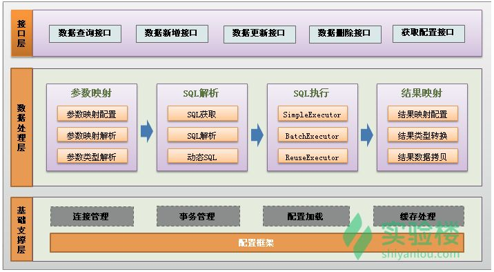
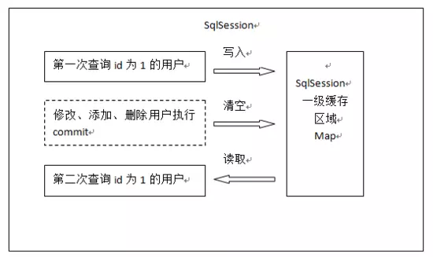
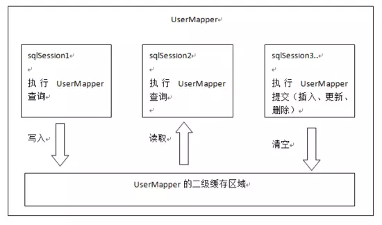

### 学习计划
* Java ORM 框架 - Hibernate 与 MyBatis 对比 https://blog.csdn.net/Ro_bot/article/details/64124608
* MyBatis为什么在国内相当流行? https://www.zhihu.com/question/50729231
* 重点文章！！！Mybatis教程-实战看这一篇就够了 http://note.youdao.com/noteshare?id=25025129f785447c34196db07db5a9d4&sub=wcp1579140042868307
* MyBatis系列 https://yq.aliyun.com/album/128/?spm=a2c4e.11154792.blogalbumarticle.139.2dfc40dfUImMg8&p=1
* 重点文章 MyBatis缓存使用 http://note.youdao.com/noteshare?id=1780272626a866407a67843498bbbee2&sub=wcp1579159232777506
* SpringBoot与MyBatis整合 https://blog.csdn.net/a905793674/article/details/82051777
* Spring Boot + Mybatis + Redis二级缓存 https://zhuanlan.zhihu.com/p/27726873
* MyBatis示例 https://github.com/homejim/mybatis-examples
* mybatis源码的中文注释以及mybatis的使用和源码解析 https://github.com/homejim/mybatis-cn
* 【Java进阶】实现自己的ORM框架 https://blog.csdn.net/liyazhou0215/article/details/77431561
* MyBatis Plus（简称MP）是一个 Mybatis 的增强工具，在 Mybatis 的基础上只做增强不做改变，为简化开发、提高效率而生

### 学习笔记
* 【关注点】针对高级查询，Mybatis需要手动编写SQL语句，以及ResultMap。而Hibernate有良好的映射机制，开发者无需关心SQL的生成与结果映射，可以更专注于业务流程。【SQL优化方面】Hibernate的查询会将表中的所有字段查询出来，这一点会有性能消耗。Hibernate也可以自己写SQL来指定需要查询的字段，但这样就破坏了Hibernate开发的简洁性。而Mybatis的SQL是手动编写的，所以可以按需求指定查询的字段。但Hibernate具有自己的日志统计。Mybatis本身不带日志统计，使用Log4j进行日志记录。【扩展性】Hibernate与具体数据库的关联只需在XML文件中配置即可，所有的HQL语句与具体使用的数据库无关，移植性很好。MyBatis项目中所有的SQL语句都是依赖所用的数据库的，所以不同数据库类型的支持不好。【优势对比】MyBatis可以进行更为细致的SQL优化，可以减少查询字段。MyBatis容易掌握，而Hibernate门槛较高。
* mybatis流行的原因很简单，就是做好了自动封装数据对象这件事，又没有搞出其他的破事，实际上在mybatis的应用场景里面，开发者要的就是自动封装，把sql查询结果转化为指定的java对象，这就够了。hibernate也可以做到这些，但是它自己给自己加了不少戏。什么缓存什么Criteria什么Lazy最后导致结果是当项目大了或者业务复杂了，除了优化业务程序和数据库，还得优化它。用mybatis只要优化业务程序和数据库就行了。用hibernate白白增加工作量还增加学习成本，问题是学了还不是必须用的。
* MyBatis 的主要思想是将程序中的大量 SQL 语句抽取出来，配置在配置文件中，以实现 SQL 的灵活配置。MyBatis 并不完全是一种 ORM 框架，它的设计思想和 ORM 相似，只是它允许直接编写 SQL 语句，使得数据库访问更加灵活。因此，准确地说，MyBatis 提供了一种“半自动化”的 ORM 实现，是一种 "SQL Mapping" 框架。

    
* API接口层：提供给外部使用的接口 API，开发人员通过这些本地 API 来操纵数据库。接口层一接收到调用请求就会调用数据处理层来完成具体的数据处理。
* 数据处理层：负责具体的 SQL 查找、SQL 解析、SQL 执行和执行结果映射处理等。它主要的目的是根据调用的请求完成一次数据库操作。
* 基础支撑层：负责最基础的功能支撑，包括连接管理、事务管理、配置加载和缓存处理，这些都是共用的东西，将他们抽取出来作为最基础的组件，为上层的数据处理层提供最基础的支撑。
*  重点文章的目录结构
    * 1.从JDBC谈起
    * 2.MyBatis介绍
    * 3.Mybaits整体架构
    * 4.快速入门（quick start）
        * 4.1.引入依赖（pom.xml）
        * 4.2.全局配置文件（mybatis-config.xml）
        * 4.3.配置Map.xml（MyMapper.xml）
        * 4.4.修改全局配置文件（mybatis-config.xml）
        * 4.5.构建sqlSessionFactory（MybatisTest.java）
        * 4.6.打开sqlSession会话，并执行sql（MybatisTest.java）
    * 5.分析
        * 5.1.引入日志依赖包（pom.xml）
        * 5.2.添加log4j.properties
        * 5.3.MyBatis使用步骤总结
    * 6.完整的CRUD操作
        * 6.1.创建UserDao接口
        * 6.2.创建UserDaoImpl
        * 6.3.编写UserDao对应的UserDaoMapper.xml
        * 6.4.添加UserDao的测试用例
        * 6.5.编写UserDao的测试用例
        * 6.7.解决数据库字段名和实体类属性名不一致的问题
    * 7.动态代理Mapper实现类
        * 7.1.思考上述CRUD中的问题
        * 7.2.使用动态代理改造CRUD
        * 7.3.完整的例子
        * 7.4.动态代理总结
    * 8.mybatis-config.xml详解
        * 8.1.properties属性读取外部资源
        * 8.2.settings设置
        * 8.3.typeAliases
        * 8.4.typeHandlers（类型处理器）
        * 8.5.plugins（插件）拦截器
        * 8.6.environments(环境)
        * 8.7.mappers
    * 9.Mapper XML文件详解
        * 9.1.CRUD标签
        * 9.2.#{}和${}
        * 9.3.面试题（#、$区别）
        * 9.4.resultMap
        * 9.5.sql片段
    * 10.动态sql
        * 10.1.if
        * 10.2.choose when otherwise
        * 10.3.where 和set
        * 10.4.foreach
    * 11.缓存
        * 11.1.一级缓存
    * 12.高级查询
        * 12.1.表关系说明
        * 12.2.一对一查询
        * 12.3.一对多查询
        * 12.4.多对多查询
        * 12.5.resultMap的继承
        * 12.6.高级查询的整理
    * 13.延迟加载
    * 14.如果sql语句中出现’<’的解决方案
        * 14.1、使用xml中的字符实体
        * 14.2、使用 ><
    * 15.Spring 集成Mybatis
        * 15.1引入spring和Mybatis相关依赖
        * 15.2配置spring配置文件
    * 16.SpringBoot 集成Mybatis
    * 17.Mybatis Generator的使用
    * 18.MyBatis整合分页插件 pageHelper
* 为什么开启二级缓存需要对PO对象序列化？开启了二级缓存后，还需要将要缓存的pojo实现Serializable接口，为了将缓存数据取出执行反序列化操作，因为二级缓存数据存储介质多种多样，不一定只存在内存中，有可能存在硬盘中，如果我们要再取这个缓存的话，就需要反序列化了。所以mybatis中的pojo都去实现Serializable接口。
* mybatis 也提供了对缓存的支持， 分为一级缓存和二级缓存。 但是在默认的情况下， 只开启一级缓存（一级缓存是对同一个 SqlSession 而言的）。
* 刷新缓存是清空这个 SqlSession 的所有缓存， 不单单是某个键。

    

    
* 一级缓存总结
    1. 在同一个 SqlSession 中, Mybatis 会把执行的方法和参数通过算法生成缓存的键值， 将键值和结果存放在一个 Map 中， 如果后续的键值一样， 则直接从 Map 中获取数据；
    2. 不同的 SqlSession 之间的缓存是相互隔离的；
    3. 用一个 SqlSession， 可以通过配置使得在查询前清空缓存；
    4. 任何的 UPDATE, INSERT, DELETE 语句都会清空缓存。
* 使用 BlockingCache 会在查询缓存时锁住对应的 Key，如果缓存命中了则会释放对应的锁，否则会在查询数据库以后再释放锁，这样可以阻止并发情况下多个线程同时查询数据
* 注意事项
    * 由于在更新时会刷新缓存， 因此需要注意使用场合：查询频率很高， 更新频率很低时使用， 即经常使用 select, 相对较少使用delete, insert, update。
    * 缓存是以 namespace 为单位的，不同 namespace 下的操作互不影响。但刷新缓存是刷新整个 namespace 的缓存， 也就是你 update 了一个， 则整个缓存都刷新了。
    * 最好在 「只有单表操作」 的表的 namespace 使用缓存， 而且对该表的操作都在这个 namespace 中。 否则可能会出现数据不一致的情况。

* list in
    * XXXMapper.java中 getXXX(@Param("ids") List<Long> ids)
    * XXXMapper.xml中：
        ```
        SELECT a, b, c FROM table WHERE id IN
        <foreach item="id" collection="ids" open="(" close=")" separator=",">
          #{id}
        </foreach>
        ```