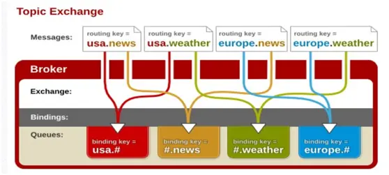

### 目录
  * [RabbitMQ基础概念](http://note.youdao.com/noteshare?id=3ee2c852ecf09522bd0dd974921e415d)
  * [RabbitMQ消息发送-Exchange-fanout示例](https://github.com/zhonghuasheng/JAVA/tree/master/rabbitmq/src/main/java/com/zhonghuasheng/rabbitmq/fanout)
  * [RabbitMQ消息发送-Exchange-direct示例](https://github.com/zhonghuasheng/JAVA/tree/master/rabbitmq/src/main/java/com/zhonghuasheng/rabbitmq/direct)
  * [RabbitMQ消息发送-Exchange-topic示例](https://github.com/zhonghuasheng/JAVA/tree/master/rabbitmq/src/main/java/com/zhonghuasheng/rabbitmq/topic)
  * [RabbtiMQ延迟队列-消息延迟推送](https://www.cnblogs.com/haixiang/p/10966985.html)

### 学习计划
* RabbitMQ的基本介绍 https://www.jianshu.com/p/79ca08116d57
    * Java 帝国之消息队列 http://note.youdao.com/noteshare?id=a143bb5e514f659bded19ae4322afea4&sub=wcp1579078065196472
* 消息的推模式和拉模式
* 消息的确认与拒绝
* 过期时间
* 死信队列
* 延迟队列
* 优先级队列
* RPC实现
* 持久化
* 生产者确认的事务机制
* 发送发确认机制
* 消息传输的保障
* RabbitMQ集群

### 学习笔记
* 消息队列（Message Queue，简称MQ），从字面意思上看，本质是个队列，FIFO先入先出，只不过队列中存放的内容是message而已。其主要用途：不同进程Process/线程Thread之间通信。
* 消息中间件（Message Queue Middleware，简称MQ）是指利用高效可靠的消息传递机制进行与平台无关的数据交流，并基于数据通信来进行分布式系统的集成。消息（Message）是指在应用间传送的数据。消息可以非常简单，比如只包含文本字符串，也可以更复杂，可能包含嵌入对象。消息队列（Message Queue）是一种应用间的通信方式，消息发送后可以立即返回，由消息系统来确保消息的可靠传递。消息发布者只管把消息发布到 MQ 中而不用管谁来取，消息使用者只管从 MQ 中取消息而不管是谁发布的。这样发布者和使用者都不用知道对方的存在。
* 消息中间件的作用：解耦、冗余（存储）、扩张性、销峰、可恢复性、顺序保证、缓冲、异步通信

    
* 基本概念
    * 生产者把消息发布到 Exchange 上，消息最终到达队列并被消费者接收，而 Binding 决定交换器的消息应该发送到那个队列。
    * Message：消息，消息是不具名的，它由消息头和消息体组成。消息体是不透明的，而消息头则由一系列的可选属性组成，这些属性包括routing-key（路由键）、priority（相对于其他消息的优先权）、delivery-mode（指出该消息可能需要持久性存储）等。
    * Publisher：消息的生产者，也是一个向交换器发布消息的客户端应用程序。
    * Exchange：交换器，用来接收生产者发送的消息并将这些消息路由给服务器中的队列。
        * Exchange分发消息时根据类型的不同分发策略有区别，目前共四种类型：direct、fanout、topic、headers 。
            * direct: 消息中的路由键（routing key）与Binding 中的 binding key完全一致，交换器就将消息发到对应的队列中。
            * fanout: fanout 交换器不处理路由键，只是简单的将队列绑定到交换器上，每个发送到交换器的消息都会被转发到与该交换器绑定的所有队列上。很像子网广播。
            * topic: topic 交换器通过模式匹配分配消息的路由键属性，将路由键和某个模式进行匹配，此时队列需要绑定到一个模式上。它将路由键和绑定键的字符串切分成单词，这些单词之间用点隔开。它同样也会识别两个通配符：符号“#”和符号“”。#匹配0个或多个单词，匹配不多不少一个单词。
    * Binding：绑定，用于消息队列和交换器之间的关联。一个绑定就是基于路由键将交换器和消息队列连接起来的路由规则，所以可以将交换器理解成一个由绑定构成的路由表。
    * Queue：消息队列，用来保存消息直到发送给消费者。它是消息的容器，也是消息的终点。一个消息可投入一个或多个队列。消息一直在队列里面，等待消费者连接到这个队列将其取走。
    * Connection：网络连接，比如一个TCP连接。
    * Channel：信道，多路复用连接中的一条独立的双向数据流通道。信道是建立在真实的TCP连接内地虚拟连接，AMQP 命令都是通过信道发出去的，不管是发布消息、订阅队列还是接收消息，这些动作都是通过信道完成。因为对于操作系统来说建立和销毁 TCP 都是非常昂贵的开销，所以引入了信道的概念，以复用一条 TCP 连接。
    * Consumer：消息的消费者，表示一个从消息队列中取得消息的客户端应用程序。
    * Virtual Host：虚拟主机，表示一批交换器、消息队列和相关对象。虚拟主机是共享相同的身份认证和加密环境的独立服务器域。每个 vhost 本质上就是一个 mini 版的 RabbitMQ 服务器，拥有自己的队列、交换器、绑定和权限机制。vhost 是 AMQP 概念的基础，必须在连接时指定，RabbitMQ 默认的 vhost 是 / 。
    * Broker：表示消息队列服务器实体。
    * 调用方实时依赖执行结果的业务场景，请使用调用，而不是MQ。


# Part3客户端开发向导
## 连接RabbitMQ
* Channel或者Connection中有个isOpen的方法用来检测是否已经处于开启状态，这个方法的返回值依赖于shutdownCause，有可能

# Part4 RabbitMQ进阶
## mandatory/immediate参数，备份交换器
* mandatory和immediate是channel.basicPublish方法中的两个参数，它们都有当消息传递过程中不可达目的地时将消息返回给生产者的功能。
* RabbitMQ提供的备份交换器(Alternate Exchange)可以将未能被交换器路由的消息（没有绑定队列或者没有匹配的绑定）存储起来，而不用返回给客户端。

### mandatory
* 当mandatory参数设为true时，交换器无法根据自身的类型和路由键找到一个符合条件的队列，那么RabbitMQ会调用Basic.Return命令将消息返回给生产者；为false时，如果出现上述情况，则消息直接被丢弃。那么生产者如何获取到没有被正确路由到合适队列的消息呢?这时候可以通过调用
channel addReturnListener 来添加 ReturnListener 监昕器实现。

### immediate
* 当参数告诉服务器如果该消息关联的队列上有消费者，则立刻投递; 如果所有匹配的队列上都没有消费者，则直接将消息返回给生产者，不用将消息存入队列而等待消费者了。RabbitMQ在3.0版本开始去掉了对immediate的支持，官方解释是此参数会影响镜像队列的性能，增加了代码的复杂度。

### 备份交换器
* 备份交换器，英文名称为 Altemate Exchange ，简称AE，或者更直白地称之为"备胎交换器"。生产者在发送消息的时候如果不设置 mandatory 参数,那么消息在未被路由的情况下将会丢失;如果设置了 mandatory 参数，那么需要添加 ReturnListener 的编程逻辑，生产者的代码将变得复杂。如果既不想复杂化生产者的编程逻辑，又不想消息丢失，那么可以使用备份交换器，这样可以将未被路由的消息存储在 RabbitMQ 中，再在需要的时候去处理这些消息。

# RabbitMQ消息的持久化
https://www.cnblogs.com/bigberg/p/8195622.html
## 什么情况下会造成消息丢失？
* 突然断电

## 哪些地方需要持久化
```java
// 队列的持久化 durable=true
channel.queueDeclare(QUEUE_NAME, true, false, false, null);
String msg = "Hello World! 你好世界！";
// 消息的持久化 MessageProperties.PERSISTENT_TEXT_PLAIN
channel.basicPublish("", QUEUE_NAME, MessageProperties.PERSISTENT_TEXT_PLAIN, msg.getBytes());
```

## 消息过载
* Producer生产的message的速度和Consumer消费的message的速度不匹配

## 死信队列（DLX）
### 什么是死信队列
DLX（dead-letter-exchange） 当消息在一个队列中变成死信之后，它会被重新publish到另外一个exchange中，这个exchange就是DLX.
### 死信队列产生的场景
* 消息被拒绝(basic.reject / basic.nack),并且requeue = false
* 消息因TTL过期
* 队列达到最大长度

## 常用命令

* List Queue
``` shell
rabbitmqctl list_queues name messages messages_ready \ messages_unacknowledged
```

* Find Queue
```
rabbitmqctl list_queues| grep hello | awk '{print $1}'
```

* Delete Queue
```
rabbitmqctl  delete_queue queueName
```