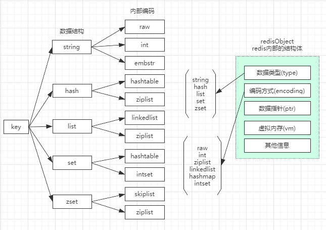
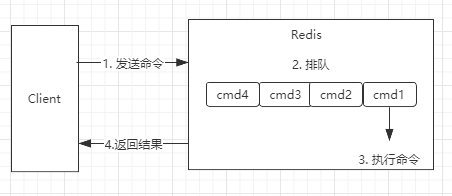
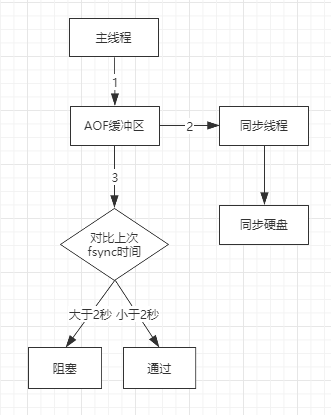
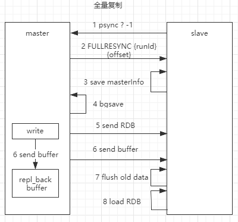
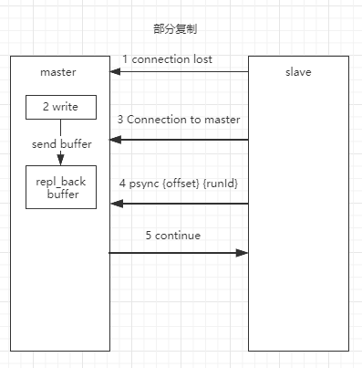
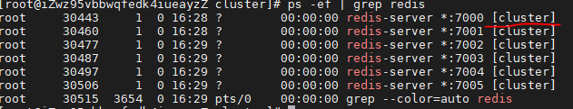
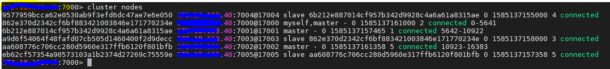

# 目录
* [学习计划](#学习计划)
* [学习笔记](#学习笔记)
* [百问](#百问)

### 学习计划
* Redis的介绍、优缺点、使用场景
* Redis入门使用 https://www.runoob.com/redis
* Redis各个数据类型及其使用场景 https://www.runoob.com/redis/redis-data-types.html
    * Redis字符串（String）https://www.runoob.com/redis/redis-strings.html
    * Redis哈希（Hash）https://www.runoob.com/redis/redis-hashes.html
    * Redis列表（List）https://www.runoob.com/redis/redis-lists.html
    * Redis集合（Set）https://www.runoob.com/redis/redis-sets.html
    * Redis有序集合（sorted set）https://www.runoob.com/redis/redis-sorted-sets.html
* Redis HyperLogLog
* Redis的发布与订阅，具体实践
* Redis事务
* Redis脚本，为什么需要脚本，能干什么
* Redis日志配置
* Redis持久化，数据备份与恢复
    * [SpringBoot + Jedis + 1主2从3哨兵 实现Redis的高可用](https://github.com/zhonghuasheng/JAVA/tree/master/springboot/springboot-redis)
* Redis常用命令
* Redis安全如何保证
* Redis性能测试
* 整理自己的RedisUtil https://www.runoob.com/redis/redis-java.html
* Redis面试题汇总
    * https://www.w3cschool.cn/redis/redis-ydwp2ozz.html
* 系列文章 https://www.cnblogs.com/jack1995/p/10915801.html

### 学习笔记
> Redis的介绍、优缺点、使用场景
  * Redis是什么： 开源的，基于键值的存储服务系统，支持多种数据类型，性能高，功能丰富
  * 特性（主要有8个特性）：
    * 速度快：官方给出的结果是10W OPS，每秒10W的读写。数据存储在内存中；使用C语言开发；Redis使用单线程，减少上下文切换。本质原因是计算机存储介质的速度，内存比硬盘优几个数量级）。MemoryCache可以使用多核，性能上优于Redis。
    * 持久化：Redis所有的数据保持在内存中，对数据的更新将异步地保存到磁盘上。断掉，宕机？ RDB快照/AOF日志模式来确保。MemoryCache不提供持久化
    * 多种数据结构：Redis提供字符串，HashTable, 链表，集合，有序集合；另外新版本的redis提供BitMaps位图，HyperLogLog超小内存唯一值计数，GEORedis3.2提供的地理位置定位。相比memocache只提供字符串的key-value结构
    * 支持多种编程语言：Java,PHP,Ruby,Lua,Node
    * 功能丰富: 发布订阅，支持Lua脚本，支持简单事务，支持pipline来提高客户端的并发效率
    * 简单：单机核心代码23000行，让开发者容易吃透和定制化；不依赖外部库；单线程模型
    * 主从复制：主服务器的数据可以同步到从服务器上，为高可用提供可能
    * 高可用、分布式：2.8版本后提供Redis-Sentinel支持高可用；3.0版本支持分布式
  * 典型应用场景：
    * 缓存系统：缓存一些数据减少对数据库的访问，提高响应速度
    * 计数器：类似微博的转发数，评论数，incr/decr的操作是原子性的不会出错
    * 消息队列系统：发布订阅的模型，消息队列不是很强
    * 排行版： 提供的有序集合能提供排行版的功能，例如粉丝数，关注数
    * 实时系统：利用位图实现布隆过滤器

> 安装
* Linux中安装
    ```
    wget http://download.redis.io/releases/redis-5.0.7.tar.gz
    tar -zxvf redis-5.0.7.tar.gz
    mv redis-5.0.7 /usr/local/redis 不需要先创建/usr/local.redis文件夹
    cd /usr/local/redis
    make
    make install
    vi redis.conf
    * bind 0.0.0.0 开发访问
    * daemonize yes 设置后台运行
    redis-server ./redis.conf 启动
    redis-cli 进入命令行，进行简单的命令操作
    vi redis.conf
    > requirepass password 修改密码
    redis-cli 再次进入cmd
    > shutdown save 关闭redis，同时持久化当前数据
    redis-server ./redis.conf 再次启动redis
    redis-cli 进入命令行
    > auth password
    将redis配置成系统服务，redis/utils中自带命令，我们只需修改参数
    /usr/local/redis/utils/./install_server.sh
    [root~ utils]# ./install_server.sh
    Welcome to the redis service installer
    Please select the redis port for this instance: [6379] 默认端口不管
    Selecting default: 6379
    Please select the redis config file name [/etc/redis/6379.conf] /usr/local/redis/redis.conf 修改配置文件路径
    Please select the redis log file name [/var/log/redis_6379.log] /usr/local/redis/redis.log 修改日志文件路径
    Please select the data directory for this instance [/var/lib/redis/6379] /usr/local/redis/data 修改数据存储路径
    Please select the redis executable path [/usr/local/bin/redis-server]
    Selected config:
    Port           : 6379
    Config file    : /usr/local/redis/redis.conf
    Log file       : /usr/local/redis/redis.log
    Data dir       : /usr/local/redis/data
    Executable     : /usr/local/bin/redis-server
    Cli Executable : /usr/local/bin/redis-cli
    chkconfig --list | grep redis 查看redis服务配置项
    redis_6379      0:off   1:off   2:on    3:on    4:on    5:on    6:off
    服务名是redis_6379
    ```
* 可执行文件说明
  * redis-server: Redis服务器，启动Redis的
  * redis-cli: Redis命令行客户端连接
  * redis-benchmark: 对Redis做性能测试
  * redis-check-aof: AOF文件修复工具
  * redis-check-dump: RDB文件检查工具
  * redis-sentinel: Sentinel服务器（2.8以后）
* 启动方式
  * redis-server: 最简单的默认启动，使用redis的默认参数
  * 动态参数启动：redis-server --port yourorderpoint
  * 配置文件的方式： redis-server configpath
  * 比较：
    * 生产环境选择配置启动；单机多实例配置文件可以选择配置文件分开
* Redis客户端返回值
  * 状态回复：ping->pong
  * 错误恢复：执行错误的回复
  * 整数回复：例如incr会返回一个整数
  * 字符串回复： get
  * 多行字符串回复：mget
* 常用配置
  * daemonize: 是否是守护进程（y/n）
  * port端口：默认是6379
  * logfile：Redis系统日志
  * dir:Redis工作目录
* 常用命令：在线练习http://try.redis.io/
    ```
    redis-cli -h x.x.x.x -p x 连接
    auth "password" 验证密码
    exit 退出
    select index 切换到指定的数据库
    keys * 显示所有key，如果键值对多不建议使用，keys会遍历所有key，可以在从节点使用;时间复杂度O(N)
    dbsize 算出所有的key的数量，只是数量;时间复杂度O(1)
    exists key key是否存在，存在返回1，不存在返回0；时间复杂度O(1)
    incr key 将key的值加一，是原子操作
    decr key 将key的值加一，会出现复数，是原子操作
    del key 删除key，删除成功返回1，失败返回0;时间复杂度O(1)
    expire key seconds 设置过期时间，过期之后就不存在了；时间复杂度O(1)
    ttl key 查看key剩余的过期时间，key不存在返回-2；key存在没设置过期时间返回-1；
    persist key 去掉key的过期时间，再查看ttl key，返回值是-1，表示key存在并且没有设置过期时间
    type key 查看类型；时间复杂度O(1)
    config get * 获取配置信息
    set key value插入值
    sadd myset 1 2 3 4 插入set
    get key获取值
    del key删除key
    cat redis.conf | grep -v "#" | grep -v "^$" 查看配置文件，去除所有的#，去除所有的空格
    setnx key value #key不存在，才设置
    set key value xx #可以存在，才设置
    set key value [exporation EX seconds | PX milliseconds] [NX|EX]
    mget key1 key2 key3 批量获取 1次mget=1次网络时间+n次命令时间;时间复杂度O(n)
    mset key1 value1 key2 value2 批量插入；时间复杂度O(n)
    n次get = n次网络时间 + n次命令时间，mget一次就能完成，省去大量的网络时间
    getset key newvalue # set key newvalue并返回旧的value
    append key value #将value追加到旧的value
    strlen key #获取value的长度，中文占2个字节
    incrbyfloat key 3.5 #增加key对应的值
    set/get/del, incr(自增1)/decr(自减1)/incrby(incrby key n自增n)/decrby
    getrange key start end #获取value从start到end的值
    setrange key index value #设置指定下标为一个新的值
    hset key field value #给key的field设置值
    hget key field #获取key的field的值
    hdel key field #删除key的field的值
    hgetall key #获取key的所有值
    hexists key field # 判断key的field是否存在
    hlen key #获取key field的数量
    hmset key field1 value1 field2 value2
    hmget key field1 field2
    hsetnx/hincrby/hdecry/hincrbyfloat
    lpush key value1 value2...valueN #从左边插入
    rpush key value1 value2...valueN #从右边插入
    linsert key before|after value newValue
    rinsert key before|after value newValue
    lpop key #从左边弹出一个item
    rpop key #从右边弹出一个item
    lrem key count value #若count等于0或者不填，表示删除所有的value值相等的item;若count>0,表示从左到右删除最多count个value相等的item;若count<0,表示从右到左，删除最多Math.abs(count)个value相等的项
    ltrim key start end #按照索引范围修剪列表，可以用来慢删除，因为全删除可能会阻塞redis
    lrang key start end #获取key中从start到end的值
    lindex key index #取第index的值
    llen key #算出列表的长度
    lset key index newValue #修改index的值为newValue
    blpop key timeout #lpop阻塞版本，timeout是阻塞时间，timeout=0表示死等，lpop会立马返回，有时候数据更新不那么及时，或者消息队列中消息未及时处理，我们可以使用这个
    brpop key timeout
    lpush + LPOP = STACK
    lpush + RPOP = QUEUE
    lpush  + ltrim = 有序的集合
    lpush + brpop = 消息队列
    sadd key value #不支持插入重复元素，失败返回0
    srem key element #删除集合中的element元素
    smembers key #查看集合元素
    sinter key1 key2 #取出相同：交集
    sdiff key1 key2 #取出key1中key2没有的元素：差集
    sunion key1 key2 #取出二者所有的元素：并集
    sdiff|sinter|sunion store key #将结果存到key中，有时候计算一次耗时
    scard key #计算集合大小
    sismember key element #判断element是否在集合中
    srandmember #返回所有元素，结果是无序的，小心使用，可能结果很大
    smembers key #获取集合中的所有元素
    spop ke #从集合中随机弹出一个元素
    scan
    SADD = Tagging
    SPOP/SRANDMEMBER = Random item
    SADD + SINTER = Social Graph
    zadd key score element #添加score和element O(logN): 使用xx和跳表的数据结构
    zrem key element #删除元素
    zscore key element #返回元素的分数
    zincrby key increScore element #增加或减少元素分数
    zcard key #返回元素的总个数
    zrank key element #获取element的排名
    zrange key start end [withscores] #返回指定索引范围内的升序元素
    zrangebyscore key minScore maxScore [withscore] #返回分数在minScore和maxScore之间的元素
    zcount key minScore maxScore #返回有序集合内在指定分数范围内的个数
    zremrangebyrank key start end #删除指定排名内的元素
    zremrangebyscore key minScore maxScore #删除指定分数内的元素
    zrevrang/zrevrange/集合间的操作zsetunion
    info replication 查看分片，能够获取到主从的数量和状态
    ```
> 数据结构和内部编码



* Reids支持5中存储的数据格式： String, Hash, List, Set, Sorted Set
  * `string`
    * redis 的 string 可以包含任何数据。比如jpg图片或者序列化的对象，最大能存储 512MB。
    * 使用场景：缓存/计数器/分布式锁...
    * 常用命令：
    * 实战：实现分布式的id生成器，可以使用incr的思路，但是实际中会比这复杂

  * `hash`
    * 是一个键值(key=>value)对集合。Redis hash 是一个 string 类型的 field 和 value 的映射表，hash 特别适合用于存储对象。
    * 实战：统计用户主页的访问量， hincrby user:1:info pageview count

  * `list`
    * Redis 列表是简单的字符串列表，按照插入顺序排序。列表最多可存储 232 - 1 元素 (4294967295, 每个列表可存储40多亿)。
    * 实战：微博按时间顺序展示消息

  * `set`
    * 是 string 类型的无序集合，不允许插入重复元素，插入重复元素失败返回0。集合是通过哈希表实现的，所以添加，删除，查找的复杂度都是 O(1)。
    * 实战：抽奖系统（量不是很大的时候）；like,star可以放到集合中；标签tag

  * `zset`
    * 有序集合：有序且无重复元素，和 set 一样也是string类型元素的集合,且不允许重复的成员。不同的是每个元素都会关联一个double类型的分数。redis正是通过分数来为集合中的成员进行从小到大的排序。zset的成员是唯一的,但分数(score)却可以重复。
    * 实战：排行榜

> Redis客户端： Java的Jedis(Socket通信)，Python的redis-py

### 瑞士军刀
> 慢查询
* 生命周期



两点说明：
  1. 慢查询发生在第3阶段，比如keys *等这些需要扫描全表的操作
  2. 客户端超时不一定慢查询，但慢查询是客户端超时的一个可能因素
* 两个配置
  * slowlog-log-slower-than=n(微秒)：命令执行时间超过x微秒，会被丢到一个固定长度的慢查询queue中；n<0表示不配置
  * slowlog-max-len: 先进先出的队列，固定长度，保存在内存中（重启redis会消失）
  * 配置方法
    * 默认值
      * config get slowlog-max-len=128
      * config get slowlog-log-slower-than=10000
    * 修改配置文件重启
    * 动态配置
      * config set slowlog-max-len 1000
      * config set slowlog-log-slower-than 1000
  * 常用命令
    * slowlog get [n]:获取慢查询队列
    * slowlog len： 获取慢查询队列的长度
    * slowlog reset: 清空慢查询队列
  * 运维经验
    * slowlog-max-len不要设置过大，默认10ms,通常设置1ms，根据QPS来设置
    * slowlog-log-slower-than不要设置过小，通常设置1000左右
    * 定期持久化慢查询

> pipeline流水线（批量操作）
当遇到批量网络命令的时候，n次时间=n次网络时间+n次命令时间。举个例子，北京到上海的距离是1300公里，光速是3万公里/秒，假设光纤传输速度是光速的2/3，也就是万公里/秒，那么一次命令的传输时间是 1300/20000*2（来回）=13毫秒，
什么是pipeline流水线，1次pipeline(n条命令)=1次网络时间+n次命令时间;pipeline命令在redis服务端会被拆分，因此pipeline命令不是一个原子的命令。注意每次pipeline携带数据量；pipeline每次只能作用在一个Redis节点上；M操作和pipeline的区别，M(mset)操作是redis的原生命令，是原子操作，pipeline不是原子操作。
```java
for(int i = 0; i < 10000; i++>) {
    jedis.hset(key, field, value); //1万次hset差不多要50秒
for(0->100) {
  Pipeline pipeline = jedis.pipelined();
  for(0->100) {
    pipeline.hset(key,field,value);
  }
  pipeline.syncAndReturnAll(); //拆分100次，每次100个命令，大概需要0.7秒
}
```

> 发布订阅：类似生产者消费者模型

* 角色：发布者（publisher)，频道(channel)，订阅者(subscriber); 发布者将消息发布到频道中，订阅者订阅相关的频道;
* API： publish/subscribe/unsubscribe
  * publish channel message : publish sohu:tv "hello world"
  * subscribe sohu:tv
  * unsubscribe [channel]
  * psubscribe [pattern] #订阅模式 sohu*

> bitmap:位图：数据量很大的时候节省存储内存，数据量小了，不节省

> hyperloglog（算法，数据结构）:
  * 极小空间完成独立数量统计，本质是个string
  * api: pfadd key element[s]:向hyperloglog添加元素  pfcount key[s]:计算hyperloglog的独立总数 pfmerge key1 key2合并

> GEO: 3.2提供的用于计算地理位置信息；数据类型是zset，可以使用zset的删除命令
  * 使用场景：微信摇一摇看附近好友
  * api:
    * geo key longitude latitude member #增加地理位置信息
    * geopos key member[n] #获取地理位置信息
    * geodist key member1 membe2 [unit] m米 km千米 mi英里 ft尺 获取两地位置的距离
    * georadius #算出指定范围内的地址位置信息的集合，语法复杂了点

### Redis持久化
* 持久化的作用：redis所有数据保存在内存中，对数据的更新将异步地保存到磁盘上。
* 主流数据库持久化实现方式：快照（MySQL Dump/Redis RDB），写日志(MySQL Binlog/Redis AOF)
* RDB:
  * 创建RDB文件（二进制文件）到硬盘中，启动后载入RDB文件到内存
  * 三种触发机制
    * save(同步) - 会产生阻塞
      * 文件策略：如存在老的RDB文件，新的替换老的，新的会先生成到一个临时文件
    * bgsave(异步) - 不会阻塞
      * 客户端执行bgsave之后，redis会使用linux的一个fork()命令生成主进程的一个子进程（fork的操作会执行一个内存页的拷贝，使用copy-on-write策略），子进程会创建RDB文件，创建完毕后将成功的消息返回给redis。fork()出来的子进程执行快的话不会阻塞主进程，否则也会阻塞redis，阻塞的实际点就是生成出来这个子进程。由于是异步，在创建的过程中还有其他命令在执行，如何保证RDB文件是最新的呢？在数据量大的时候bgsave才能突出优点。

      | 命令 | save | bgsave |
      |:-----|:-----|:-------|
      |IO类型|同步|异步|
      |阻塞|是|是（阻塞发生在fork子进程|
      |复杂度|O(n)|O(n)|
      |优点|不会消耗额外内存|不阻塞客户端命令|
      |缺点|阻塞客户端命令|需要fork,消耗内存|

    * 自动触发：多少秒内有多少changes会异步(bgsave)生成一个RDB文件，如60秒内有1W条changes，默认的规则，可以改；不是很好吧，无法控制频率；另外两条是900秒内有1条changes, 300秒内有10条changes；
    * 配置
      * dbfilename dump.rdb
      * dir ./
      * stop-writes-on-bgsave-error yes 当bgsave发生错误是停止写RDB文件
      * rdbcompression yes 采用压缩格式
      * rdbchecksum yes 采用校验和
    * 其他不能忽视的点:
      * 全量复制；debug reload；shutdown save会执行rdb文件的生成
* AOF：
  * RDB现存问题：耗时，耗性能(fork,IO)，不可控(突然宕机)
  * AOF：redis中的cmd会先刷新到缓冲区，然后更具配置AOF的策略，异步存追加到AOF文件中，发生宕机后，可以通过AOF恢复，基本上数据是完整的
  * AOF的三种策略(配置的三种属性)
    * always：来一条命令写一条；不丢失数据，IO开销较大
    * everysec：每秒把缓冲区fsync到AOF文件；丢1秒数据
    * no：操作系统决定什么时候把缓冲区同步到AOF就什么时候追加；不用配置，但是不可控，取决于操作系统
  * AOF重写
    * 如果AOF文件很大的话，恢复会很慢，AOF的重写是优化一些命名，使其变成1条，对于过期数据没必要Log,本质是把过期的没有用的，重复的过滤掉，以此减少磁盘占用量，加速恢复。极端的例子，1亿次incr，实际只需要set counter n就够了
    * 重写的两种方式
      * bgrewriteaof：异步执行，redis fork出一个子进程，然后进行AOF重写
      * AOF重写配置
        * auto-aof-rewrite-min-size: AOF文件到达多大的时候才开始重写
        * auto-aof-rewrite-percentage: AOF文件的增长率到达了多大才开始重写
  * 统计
    * aof_current_size AOF当前尺寸 字节
    * aof_base_size AOF上次重启和重写的尺寸 字节，方便自动重写判断
  * 重写触发机制(同时满足如下两条)
    * aof_current_size > auto-aof-rewrite-min-size
    * (aof_current_size - aof_base_size) / aof_base_size > auto-aof-rewrite-percentage
  * 其他配置
    * appendonly yes
    * appendfilename ""
    * appendfsync everysec
    * dir /xx
    * no-appendfsync-on-rewrite yes AOF在重启之后恢复，要权衡是否开启AOF日志追加的功能，这个时候IO很大，如果设置为yes，也就意味着在恢复之前的日志数据会丢失
* RDB & AOF最佳策略：RDB优先于AOF先启用
  * RDB：建议关掉，集中管理，在从节点开RDB
  * AOF：建议开启，每秒刷盘
  * 最佳策略：小分片（log文件分片）
* 常见问题
  * fork操作：是一个同步操作，做一个内存页的拷贝；与内存量息息相关，内存越大，耗时越长；执行info命令，有个latest_fork_usec的值，看下上次fork执行耗时
  * 进程外开销：
    * CPU：RDB AOF文件生成，属于CPU密集型操作（不要和CPU密集型应用部署在一起，减少RDB AOF频率）；内存：fork内存开销；硬盘：IO开销大，选用SSD磁盘
  * AOF追加阻塞：主线程将命令刷到AOF缓冲区，同步线程同步命令到硬盘，同时主线程会对比上次fsync的时间，如果大于2秒就阻塞主线程，否则不阻塞，主线程这么做是为了达到每秒刷盘的目的，让子线程完成AOF，以此来达到数据同步。AOF发生阻塞怎么定位：redis日志/info persistence(aof_delayed_fsync累计阻塞次数,是累计，不好分清什么时候发生阻塞)

  
  * 单机多实例部署

> Redis主从复制
* 主从复制：单机故障/容量瓶颈/QPS瓶颈；一个master可以有多个slave，一个slave只能有一个master，数据必须是单流向，从master流向slave
* 复制的配置:
  * 使用slaeof命令，在从redis中执行slave masterip:port使其成为master的从服务器，就能从master拉取数据了；执行slaveof no one清除掉不成为从节点，但是数据不清楚；
  * 修改配置， slaveof ip port / slave-read-only yes(从节点只做都操作)；配置要更改的话，要重启，所以选择的时候谨慎
* 全量复制
  * run_id(使用info server可以看到run_id),重启之后run_id就没有了，当从服务器去复制主服务器，主服务器run_id会在从服务器上做一个标识，当从服务器发现主服务器的run_id发生了变化，说明主服务器发生了变化（重启或者什么的），那么从服务器就要把主服务器的数据都同步过来
  * 偏移量：部分复制中的一个依据，后面说

  
  * 解析下上面的全量复制的过程，slave向master发送psync的命令要去master全量复制数据（PSYNC <MASTER_RUN_ID> <OFFSET>，其中?表示我不知道master的runId啊，第一次连嘛，-1表示我都要，这时候slava咱啥也不知道），master大人收到了小弟的请求之后，大方的把自己的runId/offset发了过去，小弟收到后先存下来；在master大人把自个的信息发给小弟之后，立马投入了创建快照RDB的工作，一个bgsave命令立马开工，RDB生产了就发给slave；咦，细心的我们发现你这不对啊，你master创建快照到创建完成这之间新增的数据咋办，master吭吭了两声，我在开始快照的那一刻，后期的所有写命令都额外往buffer中存了一份，来保证我给你的是完整的，当我发送完RDB之后，立马给你发buffer；slave小弟内心对master大人产生了膜拜之情，收到了RDB/buffer之后，先把自己的老数据flush掉，然后load RDB,把最新的buffer刷一遍，分分钟让自己向master看齐。
  * 开销：bgsave时间， RDB文件网络传输时间，从节点清空数据时间，从节点加载RDB的时间，可能的AOF重写时间
* 部分复制：

  
  * 解释下上面的部分复制的过程，当遇到网络抖动，那这段时间内数据在slave上就会发生丢失，那么这些数据slave是不知道的，在2.8之前redis会重新做一次全量复制，但是很显然这样做开销很大，2.8之后提出部分复制的功能；当matster发现slave连接不上的时候，master在进行写操作的时候，也会往缓冲区写，等到下一次slave连上之后，slave会发送一条pysnc {offset}{runId}的命令，其中offset是slave自己的，相当于告诉master我的偏移量是多少，master判断slave的offset在缓冲区内（缓冲区有start/end offset）就向slave发送continue命令，然后把这部分数据发送给slave；当master发现slave这个offset偏移量很大的时候，也就意味着slave丢失了很多数据，那么就进行一次全量复制
* 故障处理:
  * master/slave宕机的情况，主从模式没有实现故障的完全自动转移
  * 常见问题：
    * 读写分离：读流量分摊到从节点，可能遇到复制数据延迟，也可能读到过期的数据，从节点故障怎么办
    * 主从配置不一致：主从maxmemory不一致，可能会丢失数据；主从内存不一致
    * 规避全量复制：第一次不可避免；小主节点，低峰处理（夜间）；主节点重启后runId发生了变化
    * 规避复制风暴
      * 单机主节点复制风暴，如果是1主N从，当master重启之后，所有的slave都会发生全量复制，可想而知这样非常容易造成redis服务的不可用

> Redis Sentinel
* 主从复制高可用？
  * 手动故障转移，例如选出新的slave做master；写能力和存储能力受限；
* 架构说明
  * Redis Sentinel是一个监控redis主从以及实施故障转移的工具，sentinel不是一个是多个的（会选举出一个master sentinel），这样可以保证sentinel的高可用和公平（不是一个sentinel判断不可用就不可用），可以把Redis Sentinel看成一个redis的额外进程，用来监控reids服务的可用与不可用；客户端不再记住redis的地址，而是记录sentinel的地址，sentinel知道谁是真的master;当多个sentinel发现并确认master有问题，sentinel内部会先选出来一个领导，让这个领导来完成故障的转移（因为执行slave no noe/new master这些命令只需要一个sentinel就够了），sentinel从slave中选举一个作为master，然后通知其他的slave去新的master获取数据。sentinel可以监控多套master-slave，
* 安装配置
  * 配置开启主从节点
  * 配置开启sentinel监控主节点（sentinel是特殊的redis）：sentinel默认端口是23679
    ```
    sentinel monitor mymaster 127.0.0.1 7000 2 监控的主节点名字是mymaster，2表示2个sentinel觉得当前master有问题提才发生故障转移
    sentinel down-after-milliseconds mymaster 30000 表示30秒不通之后就停掉master
    sentinel parallel-syncs mymaster 1 表示每次并发的复制是1个在复制，这样可以减少master的压力
    sentinel failover-timeout mymaster 180000 故障转移时间
    ```
* 实现原理: redis sentinel做失败判定和故障转移
  * redis sentinel内部有三个定时任务
    * 1. 每10秒每个sentinel对master和slave执行info：可以从replication中发现slave节点，确认主从关系
    * 2. 每2秒每个sentinel通过master节点的channel交换信息（pub/sub): 什么意思呢，master节点上有个发布订阅的频道用于sentinel节点进行信息交换，利用的原理就是每个sentinel发布一个信息其他sentinel都可以收到这样一个原理，这个信息都包含当前sentinel节点的信息，以及它当前对master/slave做出的判断。这个频道是啥呢，_sentinel_:hello，这个名字内部规定的
    * 3. 每1秒每个sentinel对其他sentinel和redis执行ping操作-心跳检测，是失败判断的依据
* 主观下线和客观下线：
  * sentinel monitor <mastername> <ip> <port> <quorun> quorum是法定人数，有quorum个sentinel认为master不可用了那么master就会被客观下线
  * sentinel down-after-milliseconds <mastername> <timeout> 一个sentinel如果在timeout毫秒内没收到master的回复就做主动下线的操作
  * 主观下线：每个sentinel节点对redis节点失败都有自己的判断，这里的节点可以是master，也可以是slave
  * 客观下线：所有的sentinel节点对某个redis节点认为失败的个数达到quorum个才下线
* 领导者选举
  * 为啥要选领导者，因为只需要一个sentinel节点就能完成故障转移。怎么选举呢？
    * 每个做完主观下线的sentinel节点（就是发现某个节点不可用了，并发出了自己的判断的节点）都会向其他sentinel节点发送sentinel is-master-down-by-addr命令，要求将自己设置为领导者。那么收到这个命令的sentinel如果在之前没有同意过其他sentinel的话，就会同意这个请求，否则拒绝，换句话说每个sentinel只有一个同意票，这个同意票给第一个问自己的节点。好了，票发完了，如果这个sentinel节点发现自己拥有的票数超过sentinel集合半数并且操作quorum，那么它将成为领导者；如果此过程有多个sentinel节点成为领导者，那么过段时间将重新进行一次选举。领导者选举使用的是一个Raft算法，以上是抽象过程。所以sentinel的个数（>=3最好为奇数）和quorum的个数需要合理配置。
* 故障转移（sentinel领导者节点完成）
  * 1. 从slave节点中选举一个“合适的”节点作为新的master节点
  * 2. 对上面的slave节点执行slaveof no one命令让其成为master节点
  * 3. 向剩余的slave节点发送命令，让它们成为新的master节点的slave节点，复制规则和parallel-syncs（允许并行复制的个数）参数有关。复制的过程master是做了优化的，只需要一个RDB的生成，然后同时向slave节点发送RDB和buffer，有一定的开销，特别是网络
  * 4. 更新对原来master节点配置为slave，并保持对其“关注”，当其恢复后命令它去复制新的master节点
  * `如何选择合适的slave的节点`
    * 1. 选择slave-priority(slave节点优先级)最高的slave节点，如果存在就返回，不存在则继续。一般不配置这个参数，什么情况下配置呢，当有一台slave节点的机器配置很高，我们希望当master挂了之后它能成为新的master时，做这个设置。
    * 2. 选择复制偏移量最大的slave节点（复制的最完整），如果存在则返回，不存在则继续。
    * 3. 选择runId最小的slave节点。runId最小就是最早的slave节点，假设它复制的最多。

> 运维和开发
  * 节点运维：上下和下线
    * 机器下线：机器因为不能用了或者过保等什么原因要换机器
    * 机器性能不足：例如CPU、内存、硬盘、网络等
    * 节点自生保障：例如服务不稳定等
      * sentinel failover <masterName> 主节点主动故障转移，已经选举了sentinel领导者，所以上述过程可以省略
      * 从节点下线：临时下线还是永久下线。永久下线可能要清理掉一些配置文件，从节点下线的时候也要考虑读写分离的情况，因为这时候有可能正在读。
      * 节点上线： 主节点执行sentinel failover进行替换，从节点slaveof即可，sentinel节点可以感知

> JedisSentinelPool的实现
看源代码
* + switch-master: 切换主节点
* + convert-to-slave: 切换从节点
* + sdown：主观下线

> Redis Cluster
* 为什么需要集群
  * 并发量/
  * 数据量： 业务需要500G怎么办，机器内存是16~256G
  * 网络流量
  Redis 3.0版本提供了分布式技术
* 数据分布
  * 数据分区
  > 两种方式
  * 顺序分区
  * 哈希分区
    * 节点取余分区
      * 新增节点之后基本所有数据要产生飘逸，一般产生多倍扩容节点，飘逸量少
    * 一致性哈希分区
      * 解决了哈希分区中新增节点造成书飘逸的问题
    * 虚拟槽分区
      * 好复杂没咋懂
* 搭建集群
  * 原生安装(模拟3主3从)
    * 1. 配置开启节点 enable-sync yes
      ```
      port ${port}
      daemonize yes
      dir "/path"
      dbfilename "dump-${port}.rdb"
      logfile "${port}.log"
      cluster-enabled yes
      cluster-config-file nodes-${port}.conf #redis启动后这个nodes-port.conf会自动生成
      ```
      开启命令 redis-server redis-7000.conf / redis-server redis-7001.conf /...,
      此时开启的节点都是相互孤立的没有任何通信,
      查看当前状态
      ```shell
      127.0.0.1:7000> cluster info
      cluster_state:fail
      cluster_slots_assigned:0
      cluster_slots_ok:0
      cluster_slots_pfail:0
      cluster_slots_fail:0
      cluster_known_nodes:1
      cluster_size:0
      cluster_current_epoch:0
      cluster_my_epoch:0
      cluster_stats_messages_sent:0
      cluster_stats_messages_received:0
      ```
      显示当前是cluster状态

      
    * 2. meet(节点的握手)
      ```shell
      redis-cli -h 127.0.0.1 -p 7000 cluster meet 127.0.0.1 7001
      [root@xx cluster]# redis-cli -p 7000 cluster meet 47.x.x.16 7001
      OK
      [root@xx cluster]# redis-cli -p 7000 cluster nodes
      862e370d2342cf6bf883421003846e171770234e :7000@17000 myself,master - 0 0 0 connected
      886b6e6c29f985f7f85acb1bf548d0937918eca3 4.x.x.6:7001@17001 handshake - 0 0 0 connected

      redis-cli -h 127.0.0.1 -p 7000 cluster meet 127.0.0.1 7002
      redis-cli -h 127.0.0.1 -p 7000 cluster meet 127.0.0.1 7003
      redis-cli -h 127.0.0.1 -p 7000 cluster meet 127.0.0.1 7004
      redis-cli -h 127.0.0.1 -p 7000 cluster meet 127.0.0.1 7005
      ```
      这地方注意啊，手动配置的时候有个巨坑（坑了我1天）：在redis cluster架构中，每个redis要开发两个端口，比如一个是6379，那么另一个就是加10000之后的端口号，比如16379。16379端口是用来进行节点间通信的，也就是cluster bus集群总线，cluster bus的通信用来进行故障检测、配置更新、故障转移授权等操作。
    * 3. 指派槽
      ```xml
      redis-cli -h 127.0.0.1 -p 7000 cluster addslots {0...5461}
      redis-cli -h 127.0.0.1 -p 7001 cluster addslots {5462...10922}
      redis-cli -h 127.0.0.1 -p 7002 cluster addslots {10923...16383}
      ```
    * 4. 主从关系的分配
      ```xml
      redis-cli -h 127.0.0.1 -p 7003 cluster replicate ${node-id-7000}
      redis-cli -h 127.0.0.1 -p 7004 cluster replicate ${node-id-7001}
      redis-cli -h 127.0.0.1 -p 7005 cluster replicate ${node-id-7002}
      ```
    * 常用命令
      ```shell
      cluster notes 查看集群的node几点情况
      cluster slots 查看slots的分布
      cluster info 查看当前集群的状态，这个命令可以看到集群是否属于可用状态
      redis-cli -c -p x 注意加-c，表示集群
      ```
      
      开始的一串字符是`nodeid`, 整行表示的意识是我的nodeId是多少，哪个ip的那个端口，我是主还是从，是从的话从的谁（谁的nodeId），是主的话还能看到slots的分布情况
  * 官方工具安装
    * redis-trib.rb实现对redis集群的自动化安装
* 集群伸缩
* 客户端路由
* 集群原理
* 开发运维常见问题


* Redis 与其他 key - value 缓存产品有以下三个特点：
    * Redis支持数据的持久化，可以将内存中的数据保存在磁盘中，重启的时候可以再次加载进行使用。
    * Redis不仅仅支持简单的key-value类型的数据，同时还提供list，set，zset，hash等数据结构的存储。
    * Redis支持数据的备份，即master-slave模式的数据备份。
    * 性能极高 – Redis能读的速度是110000次/s,写的速度是81000次/s 。
    * 原子 – Redis的所有操作都是原子性的，意思就是要么成功执行要么失败完全不执行。单个操作是原子性的。多个操作也支持事务，即原子性，通过MULTI和EXEC指令包起来。
    * 丰富的特性 – Redis还支持 publish/subscribe, 通知, key 过期等等特性。
* Redis Cli中输入ping，服务端返回PONG，说明能够ping通
* Redis 总共支持四个级别：debug、verbose、notice、warning，默认为 notice
* 指定 Redis 最大内存限制maxmemory，Redis 在启动时会把数据加载到内存中，达到最大内存后，Redis 会先尝试清除已到期或即将到期的 Key，当此方法处理 后，仍然到达最大内存设置，将无法再进行写入操作，但仍然可以进行读取操作。Redis 新的 vm 机制，会把 Key 存放内存，Value 会存放在硬盘swap区
* redis-cli --raw可以避免中文乱码
* `DEL runoobkey`在以上实例中 DEL 是一个命令， runoobkey 是一个键。 如果键被删除成功，命令执行后输出 (integer) 1，否则将输出 (integer) 0
* Redis 事务可以一次执行多个命令， 并且带有以下三个重要的保证：
    * 批量操作在发送 EXEC 命令前被放入队列缓存。
    * 收到 EXEC 命令后进入事务执行，事务中任意命令执行失败，其余的命令依然被执行。
    * 在事务执行过程，其他客户端提交的命令请求不会插入到事务执行命令序列中。
* Redis事务从开始到执行会经历以下三个阶段：开始事务 -> 命令入队 -> 执行事务。单个 Redis 命令的执行是原子性的，但 Redis 没有在事务上增加任何维持原子性的机制，所以 Redis 事务的执行并不是原子性的。事务可以理解为一个打包的批量执行脚本，但批量指令并非原子化的操作，中间某条指令的失败不会导致前面已做指令的回滚，也不会造成后续的指令不做。这是官网上的说明 From redis docs on transactions: It's important to note that even when a command fails, all the other commands in the queue are processed – Redis will not stop the processing of commands.
* Redis 脚本使用 Lua 解释器来执行脚本。 Redis 2.6 版本通过内嵌支持 Lua 环境。执行脚本的常用命令为 EVAL。

* Redis SAVE 命令用于创建当前数据库的备份，该命令将在 redis 安装目录中创建dump.rdb文件，也可以指定目录` CONFIG GET dir 输出的 redis 安装目录为 /usr/local/redis/bin`。创建 redis 备份文件也可以使用命令 BGSAVE，该命令在后台执行。
* Redis 通过监听一个 TCP 端口或者 Unix socket 的方式来接收来自客户端的连接，当一个连接建立后，Redis 内部会进行以下一些操作：
    * 首先，客户端 socket 会被设置为非阻塞模式，因为 Redis 在网络事件处理上采用的是非阻塞多路复用模型。
    * 然后为这个 socket 设置 TCP_NODELAY 属性，禁用 Nagle 算法
    * 然后创建一个可读的文件事件用于监听这个客户端 socket 的数据发送
* Redis 管道技术可以在服务端未响应时，客户端可以继续向服务端发送请求，并最终一次性读取所有服务端的响应。管道技术最显著的优势是提高了 redis 服务的性能。
* Redis 分区
    * 分区是分割数据到多个Redis实例的处理过程，因此每个实例只保存key的一个子集。
    * 分区的优势：
        * 通过利用多台计算机内存的和值，允许我们构造更大的数据库。
        * 通过多核和多台计算机，允许我们扩展计算能力；通过多台计算机和网络适配器，允许我们扩展网络带宽。
    * 分区的不足：
        * 涉及多个key的操作通常是不被支持的。举例来说，当两个set映射到不同的redis实例上时，你就不能对这两个set执行交集操作。
        * 涉及多个key的redis事务不能使用。
        * 当使用分区时，数据处理较为复杂，比如你需要处理多个rdb/aof文件，并且从多个实例和主机备份持久化文件。
        * 增加或删除容量也比较复杂。redis集群大多数支持在运行时增加、删除节点的透明数据平衡的能力，但是类似于客户端分区、代理等其他系统则不支持这项特性。然而，一种叫做presharding的技术对此是有帮助的。
    * 分区类型：Redis 有两种类型分区。 假设有4个Redis实例 R0，R1，R2，R3，和类似user:1，user:2这样的表示用户的多个key，对既定的key有多种不同方式来选择这个key存放在哪个实例中。也就是说，有不同的系统来映射某个key到某个Redis服务。
        * 范围分区
            * 最简单的分区方式是按范围分区，就是映射一定范围的对象到特定的Redis实例。比如，ID从0到10000的用户会保存到实例R0，ID从10001到 20000的用户会保存到R1，以此类推。这种方式是可行的，并且在实际中使用，不足就是要有一个区间范围到实例的映射表。这个表要被管理，同时还需要各 种对象的映射表，通常对Redis来说并非是好的方法。
        * 哈希分区
            * 另外一种分区方法是hash分区。这对任何key都适用，也无需是object_name:这种形式，像下面描述的一样简单：用一个hash函数将key转换为一个数字，比如使用crc32 hash函数。对key foobar执行crc32(foobar)会输出类似93024922的整数。对这个整数取模，将其转化为0-3之间的数字，就可以将这个整数映射到4个Redis实例中的一个了。93024922 % 4 = 2，就是说key foobar应该被存到R2实例中。注意：取模操作是取除的余数，通常在多种编程语言中用%操作符实现。【当分区较多或发生变化的时候需要处理一些额外的情况】

### 其他
* Redis设置port为6379的原因

### Redis中关于密码

设置密码
redis> CONFIG SET requirepass secret_password   # 将密码设置为 secret_password

OK

redis> QUIT                                     # 退出再连接，让新密码对客户端生效

[huangz@mypad]$ redis

redis> PING                                     # 未验证密码，操作被拒绝

(error) ERR operation not permitted

redis> AUTH wrong_password_testing              # 尝试输入错误的密码

(error) ERR invalid password

redis> AUTH secret_password                     # 输入正确的密码

OK

redis> PING                                     # 密码验证成功，可以正常操作命令了

PONG

清空密码

redis> CONFIG SET requirepass ""   # 通过将密码设为空字符来清空密码

OK

redis> QUIT

$ redis                            # 重新进入客户端

redis> PING                        # 执行命令不再需要密码，清空密码操作成功

PONG

### Redis中查看所有数据库的命令
* config get databases

### I/O多路复用技术(multiplexing)
关于I/O多路复用(又被称为“事件驱动”)，首先要理解的是，操作系统为你提供了一个功能，当你的某个socket可读或者可写的时候，它可以给你一个通知。这样当配合非阻塞的socket使用时，只有当系统通知我哪个描述符可读了，我才去执行read操作，可以保证每次read都能读到有效数据而不做纯返回-1和EAGAIN的无用功。写操作类似。操作系统的这个功能通过select/poll/epoll/kqueue之类的系统调用函数来使用，这些函数都可以同时监视多个描述符的读写就绪状况，这样，多个描述符的I/O操作都能在一个线程内并发交替地顺序完成，这就叫I/O多路复用，这里的“复用”指的是复用同一个线程。

下面举一个例子，模拟一个tcp服务器处理30个客户socket。假设你是一个老师，让30个学生解答一道题目，然后检查学生做的是否正确，你有下面几个选择：1. 第一种选择：按顺序逐个检查，先检查A，然后是B，之后是C、D。。。这中间如果有一个学生卡主，全班都会被耽误。这种模式就好比，你用循环挨个处理socket，根本不具有并发能力。2. 第二种选择：你创建30个分身，每个分身检查一个学生的答案是否正确。 这种类似于为每一个用户创建一个进程或者线程处理连接。3. 第三种选择，你站在讲台上等，谁解答完谁举手。这时C、D举手，表示他们解答问题完毕，你下去依次检查C、D的答案，然后继续回到讲台上等。此时E、A又举手，然后去处理E和A。。。 这种就是IO复用模型，Linux下的select、poll和epoll就是干这个的。将用户socket对应的fd注册进epoll，然后epoll帮你监听哪些socket上有消息到达，这样就避免了大量的无用操作。此时的socket应该采用非阻塞模式。这样，整个过程只在调用select、poll、epoll这些调用的时候才会阻塞，收发客户消息是不会阻塞的，整个进程或者线程就被充分利用起来，这就是事件驱动，所谓的reactor模式。

### 什么时候适合用缓存
* 数据访问频率
    * 访问频率高，适合用缓存，效果好
    * 访问频率低，不建议使用，效果不佳
* 数据读写比例
    * 读多写少，适合缓存，效果好
    * 读少写多，不建议使用，效果不佳
* 数据一致性
    * 一致性要求低，适合缓存，效果好
    * 一致性要求高，不建议缓存，效果不佳

### Redis中的缓存穿透、缓存雪崩、缓存击穿
* 缓存穿透
```
缓存穿透，是指查询一个数据库一定不存在的数据。正常的使用缓存流程大致是，数据查询先进行缓存查询，如果key不存在或者key已经过期，再对数据库进行查询，并把查询到的对象，放进缓存。如果数据库查询对象为空，则不放进缓存。
```
1. 参数传入对象主键ID
2. 根据key从缓存中获取对象
3. 如果对象不为空，直接返回
4. 如果对象为空，进行数据库查询
5. 如果从数据库查询出的对象不为空，则放入缓存（设定过期时间）

想象一下这个情况，如果传入的参数为-1，会是怎么样？这个-1，就是一定不存在的对象。就会每次都去查询数据库，而每次查询都是空，每次又都不会进行缓存。假如有恶意攻击，就可以利用这个漏洞，对数据库造成压力，甚至压垮数据库。即便是采用UUID，也是很容易找到一个不存在的KEY，进行攻击。

小编在工作中，会采用缓存空值的方式，也就是【代码流程】中第5步，如果从数据库查询的对象为空，也放入缓存，只是设定的缓存过期时间较短，比如设置为60秒。
redisTemplate.opsForValue().set(String.valueOf(goodsId), null, 60, TimeUnit.SECONDS); // 设置过期时间

解决方案
* 接口层增加校验，如用户鉴权校验，id做基础校验，id<=0的直接拦截；
* 从缓存取不到的数据，在数据库中也没有取到，这时也可以将key-value对写为key-null，缓存有效时间可以设置短点，如30秒（设置太长会导致正常情况也没法使用）。这样可以防止攻击用户反复用同一个id暴力攻击

* 缓存雪崩
```
缓存雪崩，是指在某一个时间段，缓存集中过期失效。
```
产生雪崩的原因之一，比如在写本文的时候，马上就要到双十二零点，很快就会迎来一波抢购，这波商品时间比较集中的放入了缓存，假设缓存一个小时。那么到了凌晨一点钟的时候，这批商品的缓存就都过期了。而对这批商品的访问查询，都落到了数据库上，对于数据库而言，就会产生周期性的压力波峰。

小编在做电商项目的时候，一般是采取不同分类商品，缓存不同周期。在同一分类中的商品，加上一个随机因子。这样能尽可能分散缓存过期时间，而且，热门类目的商品缓存时间长一些，冷门类目的商品缓存时间短一些，也能节省缓存服务的资源。

其实集中过期，倒不是非常致命，比较致命的缓存雪崩，是缓存服务器某个节点宕机或断网。因为自然形成的缓存雪崩，一定是在某个时间段集中创建缓存，那么那个时候数据库能顶住压力，这个时候，数据库也是可以顶住压力的。无非就是对数据库产生周期性的压力而已。而缓存服务节点的宕机，对数据库服务器造成的压力是不可预知的，很有可能瞬间就把数据库压垮。

解决方案：
* 缓存数据的过期时间设置随机，防止同一时间大量数据过期现象发生。
* 如果缓存数据库是分布式部署，将热点数据均匀分布在不同搞得缓存数据库中。
* 设置热点数据永远不过期。

* 缓存击穿
```
缓存击穿，是指一个key非常热点，在不停的扛着大并发，大并发集中对这一个点进行访问，当这个key在失效的瞬间，持续的大并发就穿破缓存，直接请求数据库，就像在一个屏障上凿开了一个洞。
```
小编在做电商项目的时候，把这货就成为“爆款”。
其实，大多数情况下这种爆款很难对数据库服务器造成压垮性的压力。达到这个级别的公司没有几家的。所以，务实主义的小编，对主打商品都是早早的做好了准备，让缓存永不过期。即便某些商品自己发酵成了爆款，也是直接设为永不过期就好了。

解决方案
* 设置热点数据永远不过期。
* 加互斥锁，互斥锁参考代码如下：
说明：
1）缓存中有数据，直接走上述代码13行后就返回结果了
2）缓存中没有数据，第1个进入的线程，获取锁并从数据库去取数据，没释放锁之前，其他并行进入的线程会等待100ms，再重新去缓存取数据。这样就防止都去数据库重复取数据，重复往缓存中更新数据情况出现。
3）当然这是简化处理，理论上如果能根据key值加锁就更好了，就是线程A从数据库取key1的数据并不妨碍线程B取key2的数据，上面代码明显做不到这点。

* 如何解决DB和缓存一致性问题？
答：当修改了数据库后，有没有及时修改缓存。这种问题，以前有过实践，修改数据库成功，而修改缓存失败的情况，最主要就是缓存服务器挂了。而因为网络问题引起的没有及时更新，可以通过重试机制来解决。而缓存服务器挂了，请求首先自然也就无法到达，从而直接访问到数据库。那么我们在修改数据库后，无法修改缓存，这时候可以将这条数据放到数据库中，同时启动一个异步任务定时去检测缓存服务器是否连接成功，一旦连接成功则从数据库中按顺序取出修改数据，依次进行缓存最新值的修改。

### 百问
> Redis单线程为什么这么快
Redis单线程模型
快的原因有主要三点：
1. 纯内存操作：Redis是基于内存的，所有的命令都在内存中完成，内存的响应速度相比硬盘是非常快的
2. 非阻塞IO（Redis的非阻塞IO是什么样子的？）
3. 单线程避免了线程的切换和竞态消耗
其实也有不是单线程，再操作 fysnc file descriptor/close file descriptor时是另外一个线程在做

> Redis如何处理过期数据？Slave不能处理数据，那数据过期了怎么办？

> 1主2从的模式中，当master挂掉之后怎么办？
这种典型的模式就不上图了，master读写，slave1/2只读，当master挂掉之后，redis服务不可用，需要立马手动处理。两种处理方式，第一种是把master重新启动起来，不用改变现有的主从结构，缺点是什么呢，master重新启动并完成RDB/AOF的恢复是个耗时的过程，另外会造成slave1/2发生全量复制；第二种就是重新选举新的master，具体怎么做呢？选折其中一个slave，执行命令 slave no one来解除自己是从服务器的身份，使其称为一个master，注意的点是这个slave要改成读写模式；连到另一个slave，执行slave new master，让它去找master。整个过程是一个手动的过程，Redis Sentinel就是这样一个功能，自动完成切换，帅的一比。

> Redis使用注意的点
1. 由于是单线程模型，因此一次只运行一条命令
2. 拒绝长（慢）命令：keys, flushall,flushdb, slow lua script, mutil/exec, operate big value(collection)

> Redis Sentinel和Redis Cluster的区别
1、sentinel
实现高可用，但是没有分区
监控，能持续监控Redis的主从实例是否正常工作；
通知，当被监控的Redis实例出问题时，能通过API通知系统管理员或其他程序；
自动故障恢复，如果主实例无法正常工作，Sentinel将启动故障恢复机制把一个从实例提升为主实例，其他的从实例将会被重新配置到新的主实例，且应用程序会得到一个更换新地址的通知。
Redis Sentinel是一个分布式系统，可以部署多个Sentinel实例来监控同一组Redis实例，它们通过Gossip协议来确定一个主实例宕机，通过Agreement协议来执行故障恢复和配置变更。

2、cluster
redis3.0以后推出了cluster，具有Sentinel的监控和自动Failover能力，同时提供一种官方的分区解决方案


# 引用
* [Redis教程](http://runoob.com/redis)